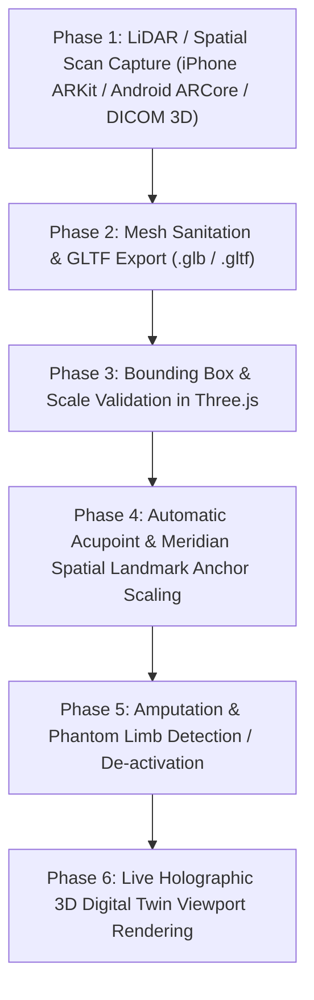

# LiDAR & Photogrammetry Scan Workflow

Follow this guide to capture, import, calibrate, and render patient-specific LiDAR spatial scans and photogrammetry 3D meshes in Pocket-Gull.

---

## Workflow Overview



---

## Step 1: Capture Patient Spatial Scan

1. **Hardware Capture**:
   - **Mobile LiDAR**: Use iPhone/iPad LiDAR (ARKit / RoomPlan / Polycam / RealityScan) or Android ARCore Depth API.
   - **Clinical 3D Scanner**: Use DICOM surface mesh extraction or handheld optical body scanner.
2. **Scan Best Practices**:
   - Ensure $360^\circ$ even illumination.
   - Patient stands in neutral T-pose or A-pose.
   - Capture continuous bounding box from vertex of head to bottom of feet.
3. **Export Format**: Save as binary `.glb` or `.gltf` with embedded texture maps.

---

## Step 2: Mesh Upload & HIPAA Sanitation

1. **Sanitize Metadata**:
   - Strip EXIF GPS geolocation tags, device identifiers, and patient identifiers from `.glb` binary headers.
2. **Ingest Mesh**:
   - Pass scan URL to `PatientStateService.setCustomModelUrl(url)` or upload via `Body3DViewerComponent`.

---

## Step 3: Bounding Box & Scale Validation in Three.js

1. In `Body3DViewerComponent`, load the mesh using `GLTFLoader`:
   ```typescript
   const loader = new GLTFLoader();
   loader.load(patientModelUrl, (gltf) => {
     const customGroup = gltf.scene;
     const box = new THREE.Box3().setFromObject(customGroup);
     const size = box.getSize(new THREE.Vector3());
     
     // Normalize patient height to standard 1.75m vertical frame
     const targetHeight = 1.75;
     const scaleFactor = targetHeight / size.y;
     customGroup.scale.set(scaleFactor, scaleFactor, scaleFactor);
     
     this.scene.add(customGroup);
   });
   ```

---

## Step 4: Automatic Acupoint & Meridian Spatial Anchor Scaling

1. **Landmark Mapping**:
   - Vertex top of head $\rightarrow$ Map to **GV-20 Baihui**.
   - Sternal notch $\rightarrow$ Map to **CV-17 Danzhong**.
   - Navel / Solar Plexus $\rightarrow$ Map to **CV-12 Zhongwan**.
   - Knee joint centers $\rightarrow$ Map to **ST-36 Zusanli**.
2. **Meridian Spline Morphing**:
   - Scale 12 Jing-Luo Meridian spline coordinates relative to the patient's custom vertex bounds.

---

## Step 5: Amputation & Phantom Limb Profiling

1. Check `PatientStateService.anatomicProfile().amputations`:
2. If an amputation is flagged (e.g. `r_shin` or `l_arm`):
   - **Ghost Wireframe Mode**: Render missing limb segment with translucent phantom purple wireframe (`opacity: 0.15`, `#8B5CF6`).
   - **AVS Auto-Prescription**: Trigger **174 Hz Anxiolytic Solfeggio + 10 Hz Alpha Binaural Pulse** for residual nerve pain neuromodulation.

---

## Step 6: Live Viewport Rendering

1. Verify rendering in `Body3DViewerComponent` with:
   - Dark Holographic Backdrop (`bg-zinc-950/95`).
   - Floating Ergonomic Camera Presets (Cranial, Visceral, Spinal, Extremities).
   - Tri-Paradigm Spatial Lens switching (Western Allopathic, TCM Eastern, Ayurvedic Prana).
