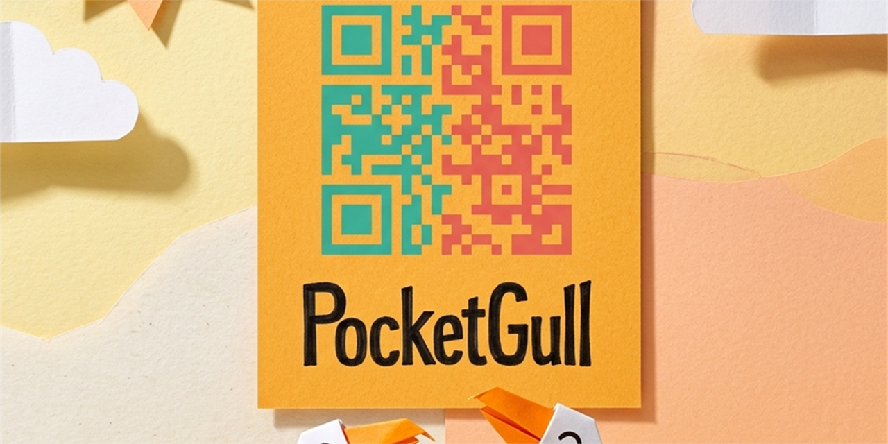
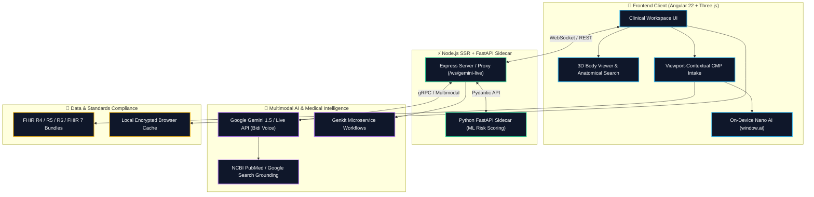
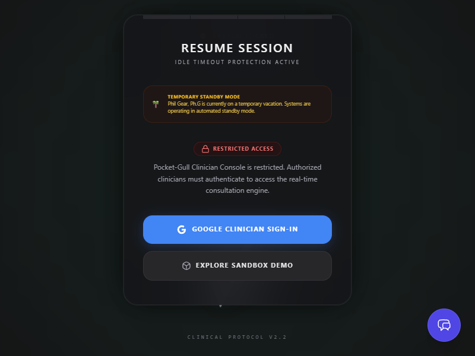
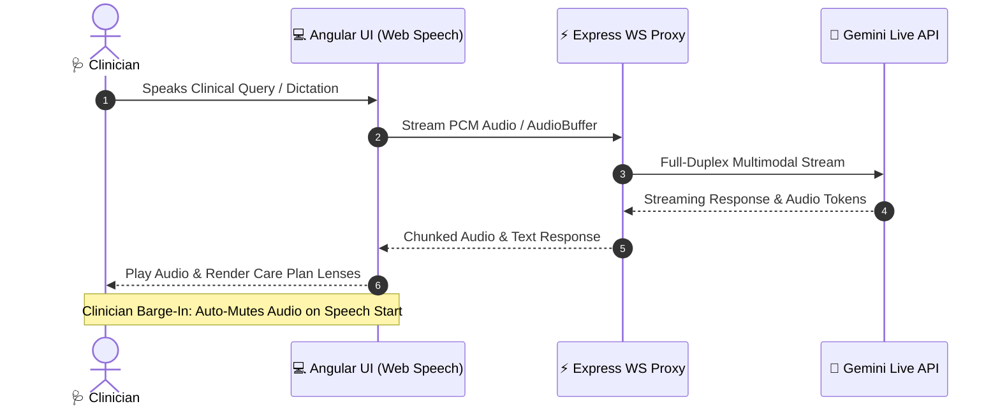
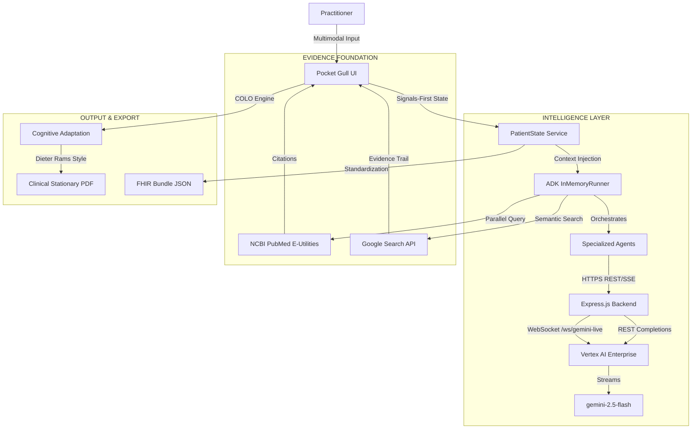
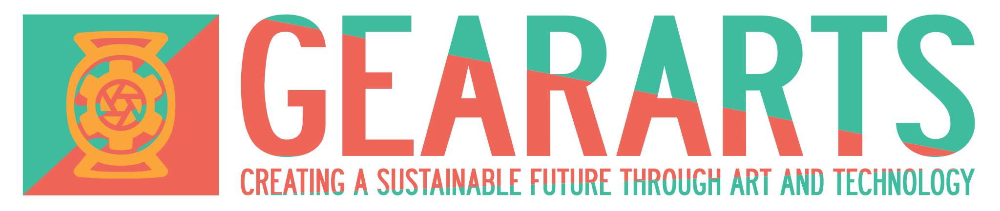

# 🕊️ POCKET GULL
**Aerial Perspective for the Clinical Ocean**

---

### PREPARED FOR
**Google Gemini Live Agent Challenge** / 2026


[](https://orcid.org/0009-0008-1372-5381)
[](https://doi.org/10.5281/zenodo.20647513)
[](https://www.acm.org/code-of-ethics)
[](https://www.ieee.org/about/corporate/governance/p7-8.html)
[](https://anitab.org)
[](https://www.pdxwit.org)
[](http://calagator.org)
[](https://oregoncarepartners.com)
[](https://www.apa.org)
[](https://www.amacad.org)


### CATEGORY
**Live Agents 🗣️** (Multimodal Synthesis & Agent Orchestration)

### VISION
*"To provide practitioners with the 'Gull's Eye View'—the ability to rise above the turbulent sea of medical data and see the clear, actionable patterns beneath."*

---



---

## 📋 THE STORY OF THE SEAGULL

In modern medicine, practitioners are often drowning in a "Sea of Information"—fragmented vitals, sprawling patient histories, and an ever-shifting tide of clinical literature. **Pocket Gull** was conceived as an aerial navigator. 

Like its namesake, the agent is **agile**, **interruptible**, and **highly observant**. It doesn't just process data; it provides **Uplift**. By synthesizing multimodal inputs (3D spatial data, voice dictation, and biometric telemetry) into a singular, high-integrity strategy, it allows the clinician to maintain perspective without losing sight of the patient.

> **Industrial Grace:** We believe medical tools should be as beautiful as they are functional. Our design language combines the clinical precision of a laboratory with the "Less, but better" philosophy of Dieter Rams.


---

## 🛠️ SCIENTIFIC RIGOR & CORE CAPABILITIES

#### 🧠 EVIDENCE-GROUNDED REASONING (EGR)
Pocket Gull eliminates "Black Box" AI anxiety. Every recommendation is anchored by an **Evidence Trail** generated through real-time integration with **Google Programmable Search** and **NCBI PubMed**. The agent doesn't just suggest; it cites.

#### 🎙️ MULTIMODAL SYNTHESIS & ORCHESTRATION
Powered by `@google/adk` and the Web Speech API. Specialized `LlmAgent` experts operate in an `InMemoryRunner` environment, maintaining **context-aware memory** of report nodes, allowing for fluid, multi-turn reasoning across voice and visual UI.

#### 📐 PRECISION 3D ANATOMICAL MODELING
Using Three.js, we provide a procedurally detailed skeletal and surface model. Severity is visualized through dynamic particle systems, translating abstract pain descriptions into **spatial clinical data**.

#### 📄 COGNITIVE LOCALIZATION (COLO)
Moving beyond simple translation, the **COLO Engine** adjusts the "Clinical Strategy" to the patient's cognitive state (Standard, Dyslexia-Friendly, Pediatric) without losing clinical accuracy, ensuring **Informed Consent** is truly inclusive.

---

## 🧩 TECHNICAL ARCHITECTURE

Pocket Gull utilizes a hybrid client-server-edge architecture designed for low-latency live consults, privacy-first offline operation, and continuous multi-lens clinical reasoning.



A highly interactive, aesthetically minimal user interface (Industrial Grace) designed for immediate clinical insight.
*For a full demonstration, press the `Demo` button in the top-right of the application to load the patient simulation.*

### Product Highlights




---

## 📃 Text Description

**What it does:**
Pocketgull is a secure digital assistant for doctors, nurses, and caregivers. It allows clinicians to speak naturally to a smart assistant while viewing a 3D model of the human body. As the clinician describes patient symptoms or taps on pain areas, the assistant instantly compiles the information, searches trusted medical literature (like PubMed), and creates a clear, structured care strategy. This reduces the time clinicians spend on documentation and helps them focus on patient care.

---

### 🔒 Security & Compliance

- **Vertex AI Enterprise Backend**: Upgraded from the developer Gemini API to regional Google Cloud Vertex AI Enterprise, with automatic ADC token resolution, regional endpoints, and custom safety thresholds.
- **Bidirectional WebSocket Live Proxy**: Secure `/ws/gemini-live` proxy route on Express with recursive camelCase↔snake_case translation for full-duplex live audio streaming.
- **Tink Envelope Cryptography & PQC**: Google Tink AEAD cryptographic envelopment for local patient records with Quantum-Safe Cryptography Kyber/Dilithium transport fallbacks for HIPAA transit compliance.
- **Draw-to-Unlock Secure Gateway**: Premium Canvas drawing pad verifying a smiley face gesture pattern, replacing the legacy numeric PIN screen. Includes WebAuthn biometric conditional UI where device-supported.
- **Security Hardening & MFA Gateways**: Firebase Google Login flow with domain whitelists and multi-factor authentication (MFA) parameters.
- **Shift-Left Pre-Commit Hook**: Husky pre-commit pipeline checking TypeScript types, running Vitest unit tests, scanning for credential/API key leaks, and verifying markdown image references.
- **IP-Based API Rate Limiting**: Custom in-memory `rateLimiter` middleware to mitigate denial-of-service and resource exhaustion on patient data endpoints.
- **CodeQL-Hardened Routes**: SSRF patching via `normalizeAndValidateModel`, path traversal prevention on static routes, and PII redaction from CI logs.

### 🤖 AI & Intelligence

- **Live AI Consult & Multi-Agent Orchestration:** Powered by `@google/adk` and the Web Speech API. Specialized `LlmAgent` experts synthesize clinical data into actionable insights through an interruptible, natural conversational UI with **context-aware memory** of recently discussed report nodes.


- **Care Plan Recommendation Engine:** A professional clinical analysis engine that synthesizes structured strategies for patient care, organized by diagnostic lenses (Overview, Interventions, Monitoring, Education). Includes **inline agent queries** directly from generated report nodes.
- **Y-BOCs Diagnostic Screener & Voice Interview:** Core clinical logic mapping obsessive-compulsive target symptom checklists and a 10-item severity rating scale. Features a hands-free voice diagnostic interview agent ("Mindful Macaw") using the Web Speech API's `speechSynthesis` and text-to-score semantic mapping.
- **Human-in-the-Loop (HITL) Cost-Benefit Matrix:** The *Treatment Matrix* dynamically tracks and visualizes the clinician's vetting decisions. Appends custom additions with green `[Added]` badges, and highlights rejected default recommendations with `line-through` styles and red `[Removed]` badges.
- **Orthomolecular Profiling & Biomarker Matrix:** Automatically extracts and visualizes biochemical markers (e.g., Magnesium, B12) from AI-generated functional protocols into a glassmorphic diagnostic dashboard.
- **Multi-Paradigm Philosophy Dashboards:** Full system support for Western, Eastern, and Ayurvedic medicine paradigms, with automated report regeneration and a secular translation engine mapping 13 world philosophies into psychological and physiological domains.
- **Offline PWA Intelligence:** Built-in `window.ai` (Gemini Nano) routing for on-device fallback and token-free local processing in the Progressive Web App.
- **WebMCP Schema Mapping:** Registered Model Context Protocol (MCP) standards schemas for seamless integration of external clinical knowledge databases.

### 🏥 Clinical UX

- **Good Samaritan Emergency Care:** Offline emergency override mode featuring a 110 BPM chest-compression metronome, BLS safety-gated Gemini Nano local routing, local FHIR-compliant EMT QR code serialization (`lean-qr`), and global telemetry suppression.
- **Calm Mode & Somatic Grounding:** Specialized paper-white sensory layout with reduced motion transitions. Overlaid with an interactive Three.js somatic particle visualizer, Zamecznik HTML5 Grounding Canvas, and a 16-second box-breathing coach.
- **3D Anatomical Search & Viewport-Contextual CMP Telemetry:** Real-time fuzzy anatomical search bar with auto-camera tracking onto 3D organ meshes (`focusOnPart`), dynamically filtering Comprehensive Metabolic Panels (CMP) and organ-specific lab values (Troponin, ALT/AST, eGFR, Fasting Glucose) alongside one-tap symptom shortcuts.
- **Cognition & Multilingual Care Plan Exports:** Seamlessly translate Care Plans into dyslexia-friendly, pediatric formats, or professionally translate them into **Spanish, German, French, Japanese, or Hindi** (aligned with global medical research exchange). Outputted to PDF using refined Dieter Rams 'carousel informatics' typography.
- **Colleague Collaboration Room (TaskFlow):** A real-time multiplayer workspace integrated directly into the patient's view for clinicians to share states, dictate notes, and chat collaboratively.
- **Hands-Free Voice Dictation & Controls:** Voice command interception during dictation allows hands-free UI control, task addition, and message composition.
- **Client-Side Barge-In Interruption:** Local `onspeechstart` barge-in tuning across clinical dialog and voice assistant panels, with instant audio muting when the clinician begins speaking.
- **Printable Clinical Stationery:** CSS Grid-optimized, multi-page physical printouts featuring Halftone body maps for visual pain hotspot diagnosis, with user-selectable toggles for clinical summaries and history.
- **Circadian UI & AVS Coregulation:** Seamless integration of continuous, time-based circadian CSS themes with the clinical interface to promote ambient rhythm alignment. Features an interactive **Circadian Tuning Dashboard** inside the standalone companion app that drives a high-performance `<canvas>` wave visualizer and Web Audio API binaural beat synthesis across presets (`indigo`, `emerald`, `violet`, `rose-earth`) and custom frequencies.
- **Multi-Paradigm Diagnostic Matrix (MDM UI):** Renders Eastern (TCM `tcmPattern`) and Ayurvedic (`ayurvedicImbalance`) parameters using themed tags within active anatomical hotspots and patient dashboards.
- **Agones Stateful Session Orchestration:** Kubernetes-native pod lifecycles managed via `@google-cloud/agones-sdk` to signal readiness, maintain health check pings, and handle graceful shutdown signals (`SIGTERM`) to safeguard active consultations.
- **IoT Smart Lighting Sync:** `AmbientLightingService` mathematically mapping UI circadian HSL values directly to local physical Philips Hue hardware to physically coregulate the clinical environment.
- **KSS Readiness Gateway:** 9-point Karolinska Sleepiness Scale integration for real-time clinician alertness checks overriding the ambient circadian theme.
- **Sentinel Gamification & Cognitive Triage:** Clinician alertness and fatigue-tracking dashboard to monitor practitioner cognitive load in high-stress triage environments.
- **Box Breathing UX:** Focused 16-second box breathing visual animations integrated into primary intake text areas to promote practitioner mindfulness.

### 📊 Visualization & Data

- **Detailed 3D Medical Imagery:** Precise anatomical selection using a Three.js-powered skeletal and surface model (including detailed procedural spine geometry) with dynamic particle systems highlighting diagnostic severity.
- **Method of Loci (Memory Palace):** Anchor clinical chat entries to spatial memory loci across the 3D anatomical model, facilitating rapid spatial recall of complex patient histories.
- **3D Anatomical Extensions:** Pluggable mesh loaders (GLTF, USDZ, OBJ) on the Three.js viewport for customized skeletal modeling.
- **Scans & Diagnostics Library:** Integrated visual gallery within the patient profile for organizing and analyzing medical imagery (e.g., MRI, X-Rays), complete with dynamic Wikimedia Commons linking.
- **FHIR-Standard Data Portability & Localized Auto-Save:** Real-time persistence with visual "Saving..." / "Saved ✔" indicators, exported via Unicode-safe Base64 encoded FHIR Bundles.
- **Smartwatch & Mobile Optimization:** Responsive Two-Column Grid UI scaling down to extremely constrained viewports (e.g., Pixel Watch 2 at 286px width) for ultra-portable clinical referencing.
- **Multi-Vendor GPU Telemetry:** Windows CIM/WMI adapters querying AMD/Intel/NVIDIA graphics, macOS system profiles, unified memory estimation, and dynamic WebGPU routing recommendations.

**Technologies Used:**
- **Framework:** Angular v22.0 (Signals-based, Zoneless), Server-Side Rendering (SSR) & Client-Side Hydration
- **Visualization:** Three.js (3D Anatomical Modeling)
- **Intelligence:** Google GenAI SDK (`gemini-2.5-flash` via Vertex AI Enterprise) & Google Agent Development Kit (`@google/adk`)
- **Research Integrations:** Google Programmable Search Engine (CSE) & NIH PubMed E-utilities
- **Export Engine:** jsPDF & FHIR Bundle standard
- **Styling:** Tailwind CSS & Dieter Rams Design System
- **Speech Control:** Web Speech API (Bi-directional voice interaction)
- **Deployment & Infrastructure:** Google Cloud Run, Express.js Backend with Vertex AI regional endpoints

**Data Sources:**
Primary inputs consist of manual demographics, biometric body map interaction, and voice-to-text dictation. Auxiliary real-time clinical context is gathered securely without persistent DB tracking using Google Programmable Search Engine API and NCBI PubMed E-utilities XML parsing algorithms. Patient state data is strictly locally persisted between active sessions.

**Findings and Learnings:**
Reflecting on the development of Pocket Gull, my commitment is to continuously embrace the complexity of multi-agent architectures and rigorous frontend performance optimization. Building this platform taught me the profound importance of balancing bleeding-edge AI orchestration—like implementing `@google/adk`'s `InMemoryRunner` to stabilize clinical generations—with the strict UX demands of a modern progressive web application. I commit to changing how I approach state management in future projects by prioritizing granular, reactive UI signals from day one, and to never settle for "good enough" when a top-tier mobile performance score (100/100 Lighthouse) is attainable through diligent layout unblocking and dynamic asset loading. Further, this project deepened my respect for CSS—from mastering viewport units (`100dvh`) to restore native scrolling on complex mobile constraints, to implementing robust `@media print` rules for structured offline clinical stationery.

---

## 📚 Documentation

Full engineering documentation is available in the [`docs/study/`](./docs/study/) directory, built with [Astro](https://astro.build).

- **[Overview](./docs/study/src/pages/index.astro)** — Product introduction, screenshots, and key metrics
- **[Architecture](./docs/study/src/pages/architecture.mdx)** — System diagram, data flow, and technology stack
- **[Features](./docs/study/src/pages/features.mdx)** — Complete feature reference by category
- **[Data & Privacy](./docs/study/src/pages/data.mdx)** — Storage model, PHI handling, and FHIR portability
- **[Responsible AI](./docs/study/src/pages/responsible-ai.mdx)** — Core principles and societal impact
- **[Dependencies & Licenses](./docs/study/src/pages/dependencies.mdx)** — Third-party compliance, import considerations, and Apache/MIT attributions
- **[Getting Started](./docs/study/src/pages/getting-started.mdx)** — Installation, development, and deployment
- **[Case Study](./docs/case_study.md)** — Professional engineering case study with benchmark results
- **[Valuation & Positioning](./docs/valuation_and_positioning.md)** — Business case, target audience, and valuation framework
- **[Design System & Avian Personas](./DESIGN.md)** — Dieter Rams design language, brand identity, and the Gull Squadron AI agent personas
- **[REST API Reference](file:///c:/Users/philg/Pocketgull/pocketgull/pocketgull_api/openapi.yaml)** — OpenAPI specification describing the external REST and WebSocket interfaces (inputs, outputs, endpoints, and schemas) of the backend service.


---

## 🤝 Contributing & Feedback

We welcome contributions and feedback from the community! Please refer to our [Contributing Guidelines](file:///c:/Users/philg/Pocketgull/pocketgull/CONTRIBUTING.md) for detailed information on:
*   **Obtaining the software**: Step-by-step instructions on cloning the repository and setting up the local environment.
*   **Providing Feedback**: How to file bug reports or request new features using our issue tracker.
*   **Contributing Code**: Guidelines on [Contribution Requirements & Coding Standards](file:///c:/Users/philg/Pocketgull/pocketgull/CONTRIBUTING.md#4-requirements-for-acceptable-contributions) and submitting pull requests.

We also expect all contributors to follow our [Code of Conduct](file:///c:/Users/philg/Pocketgull/pocketgull/CODE_OF_CONDUCT.md) to keep our community safe and welcoming. Detailed policies on data security and terms of usage are available in our [Privacy Policy](file:///c:/Users/philg/Pocketgull/pocketgull/PRIVACY.md) and [Terms of Service](file:///c:/Users/philg/Pocketgull/pocketgull/TERMS.md).

---

## 👨‍💻 Public Code Repository & Spin-Up Instructions

**Developer Profile:** [g.dev/philgear](https://g.dev/philgear)  
**Repository:** [github.com/philgear/pocketgull](https://github.com/philgear/pocketgull)

To run this project in a local development environment:

1.  **Clone the repository:**
    ```bash
    git clone https://github.com/philgear/pocketgull.git
    cd pocketgull
    ```

2.  **Install dependencies:**
    ```bash
    npm install
    ```

3.  **Run the development server:**
    ```bash
    npm run dev
    ```

4.  **Preview Production Build:**
    ```bash
    npm run build
    npm run preview
    ```

---

## 🖥️ Proof of Google Cloud Deployment

Pocket Gull's backend service and Express proxy layer is architecturally designed to deploy directly to **Google Cloud Run**.

- **Proof of Action:** Successfully deployed to Google Cloud Run! The live application is available at: [https://pocketgull.app](https://pocketgull.app)
- **Repository Proof:** See `./server.js` and `./src/services/clinical-intelligence.service.ts` for Google Cloud infrastructure integrations.

---

## 🏗️ Architecture Diagram

Built with a **Signals-First (Zoneless)** architecture in Angular v22.0 for 100/100 Lighthouse performance and deterministic state management.
The application leverages a modern, reactive architecture utilizing Angular Signals, Cloud Run orchestration, and the Google Vertex AI Enterprise stack. *(Note: This conceptual map is available in high resolution within the hackathon image carousel.)*



---

## 🚀 INFRASTRUCTURE & DEPLOYMENT

#### 1. REPRODUCIBILITY
```bash
git clone https://github.com/philgear/pocketgull.git
npm install
npm run dev
```

#### 2. CLOUD ORCHESTRATION
The project is built for **Google Cloud Run**. Our `cloudbuild.yaml` orchestrates an automated CI/CD pipeline, building the container image and securely deploying it with Google Cloud Secret Manager integration for the `GEMINI_API_KEY`.

---

## 📜 RESPONSIBLE AI & ETHICS

Pocket Gull adheres to the **Human-in-the-Loop** (HITL) principle and is hardened via automated red-teaming.
- **Task Bracketing:** Clinicians must manually "bracket" (validate/edit) AI suggestions before they are archived.
- **Automated Red Teaming:** A built-in Vitest test suite (`tests/safety.spec.ts`) actively verifies the Google Gemini `BLOCK_MEDIUM_AND_ABOVE` boundaries against adversarial prompts targeting the live proxy.
- **Explainability:** The agent surfaces its reasoning lens (Intervention, Monitoring, Education, Orthomolecular) for every output.
- **Privacy Core:** Zero PII persistence. All patient state is transient or locally-stored.

### Professional Standards & Communities
We align our engineering practices and ethical standards with these guidelines and professional organizations:
- **[ACM Code of Ethics](https://www.acm.org/code-of-ethics)**: Ensuring honesty, trustworthiness, and data integrity.
- **[IEEE Code of Ethics](https://www.ieee.org/about/corporate/governance/p7-8.html)**: Commitment to public safety, privacy, and technical competence.
- **[AnitaB.org](https://anitab.org)**: Supporting gender diversity and parity in technology.
- **[PDXWIT](https://www.pdxwit.org)**: Fostering inclusion, education, and representation within the Portland, OR tech ecosystem.
- **[Calagator](http://calagator.org)**: Connecting with local open-source technology events and community dev forums.
- **[Oregon Care Partners](https://oregoncarepartners.com)**: Accessing high-quality caregiver training and evidence-based education to support local Oregon eldercare and community wellness.
- **[American Psychological Association](https://www.apa.org)**: Promoting psychological science and professional standards in behavior, mental health, and clinical assessment.
- **[American Academy of Arts and Sciences](https://www.amacad.org)**: Aligning clinical strategy with independent research and multidisciplinary studies in the arts, humanities, and sciences.

---

## 👨‍💻 THE CRAFT
**Phil Gear** / [g.dev/philgear](https://g.dev/philgear)  
Engineering with **Kaizen**—the belief that clinical excellence is a journey of continuous refinement.

---

<p align="center">
  
</p>

---

*© 2026 Pocket Gull. Industrial Grace & Clinical Intelligence.*
*© 2026 Pocket Gull. Licensed under MIT.*