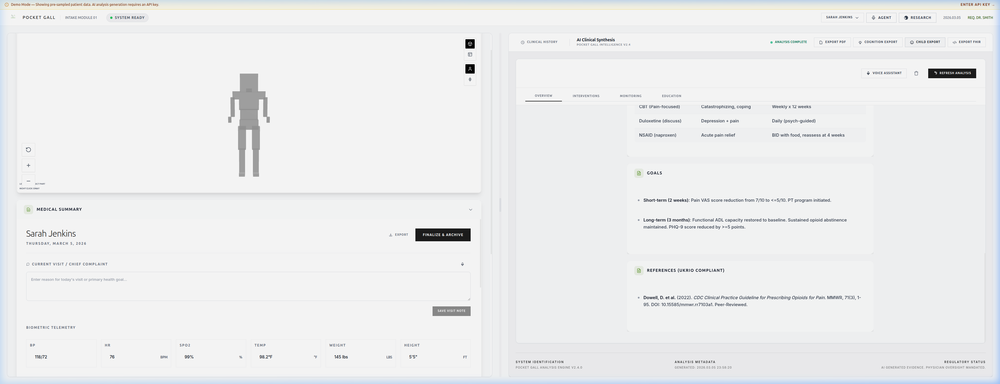
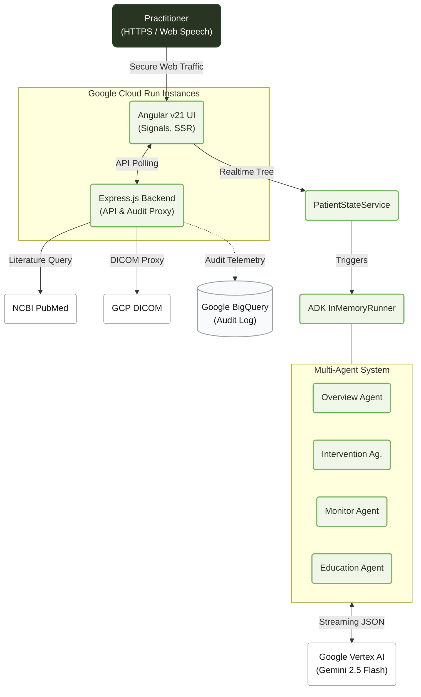

# 🕊️ POCKET GULL
**Aerial Perspective for the Clinical Ocean**

---

### PREPARED FOR
**Google Gemini Live Agent Challenge** / Hackathon 2026

### CATEGORY
**Live Agents 🗣️** (Multimodal Synthesis & Agent Orchestration)

### VISION
*"To provide practitioners with the 'Gull's Eye View'—the ability to rise above the turbulent sea of medical data and see the clear, actionable patterns beneath."*

---

## 📋 THE STORY OF THE SEAGULL

In modern medicine, practitioners are often drowning in a "Sea of Information"—fragmented vitals, sprawling patient histories, and an ever-shifting tide of clinical literature. **Pocket Gull** was conceived as an aerial navigator. 

Like its namesake, the agent is **agile**, **interruptible**, and **highly observant**. It doesn't just process data; it provides **Uplift**. By synthesizing multimodal inputs (3D spatial data, voice dictation, and biometric telemetry) into a singular, high-integrity strategy, it allows the clinician to maintain perspective without losing sight of the patient.

> **Industrial Grace:** We believe medical tools should be as beautiful as they are functional. Our design language combines the clinical precision of a laboratory with the "Less, but better" philosophy of Dieter Rams.

---

## 🛠️ SCIENTIFIC RIGOR & CORE CAPABILITIES

#### 🧠 EVIDENCE-GROUNDED REASONING (EGR)
Pocket Gull eliminates "Black Box" AI anxiety. Every recommendation is anchored by an **Evidence Trail** generated through real-time integration with **Google Programmable Search** and **NCBI PubMed**. The agent doesn't just suggest; it cites.

#### 🎙️ MULTIMODAL SYNTHESIS & ORCHESTRATION
Powered by `@google/adk` and the Web Speech API. Specialized `LlmAgent` experts operate in a "InMemoryRunner" environment, maintaining **context-aware memory** of report nodes, allowing for fluid, multi-turn reasoning across voice and visual UI.

#### 📐 PRECISION 3D ANATOMICAL MODELING
Using Three.js, we provide a procedurally detailed skeletal and surface model. Severity is visualized through dynamic particle systems, translating abstract pain descriptions into **spatial clinical data**.

#### 📄 COGNITIVE LOCALIZATION (COLO)
Moving beyond simple translation, the **COLO Engine** adjusts the "Clinical Strategy" to the patient's cognitive state (Standard, Dyslexia-Friendly, Pediatric) without losing clinical accuracy, ensuring **Informed Consent** is truly inclusive.

---

## 🧩 TECHNICAL ARCHITECTURE (Time, Scale, and Trade-offs)

Built on Google's definition of software engineering through the lenses of **"Time and Change," "Scale and Efficiency," and "Trade-offs and Costs."**

### Scale & Efficiency
The application demonstrates alignment through **Smartwatch & Mobile Optimization**, scaling the UI down to extremely constrained viewports (e.g., 286px for Pixel Watch 2), while leveraging **Google Cloud Run** for infinitely scalable backend compute.

### Trade-offs & Costs
Architectural trade-offs explicitly favor **Local Persistence and FHIR-Standard Data Portability** over a centralized remote database, ensuring maximum privacy, zero PII footprint, and robust offline capabilities.

### Hybrid AI Orchestration (PubGemma Integration)
While the default agent operates on Google's cloud-based Gemini Flash, the architecture structurally supports **Local Open-Weights Inference**. By leveraging the included `PubGemmaProvider` and the local `docker-compose.yml` Ollama infrastructure, the application can route specific biomedical synthesis tasks directly to a local **PubGemma** instance. This eliminates external transit of patient data, fulfilling absolute Zero-PII requirements while maintaining clinical rigor.

A highly interactive, aesthetically minimal user interface (Industrial Grace) designed for immediate clinical insight.
*For a full demonstration, press the `Demo` button in the top-right of the application to load the patient simulation.*

### Product Highlights




---

## 📃 Text Description

**What it does:**
Pocket Gull is a next-generation "Live Agent" orchestrator. By combining real-time human-in-the-loop web speech interaction with a diagnostic 3D surface model and Gemini's deep reasoning (`gemini-2.5-flash` natively and via `@google/adk`), it processes a patient's multimodal symptom data to instantly produce synthesized, actionable clinical strategies.

**Core Features:**
- **Live AI Consult & Multi-Agent Orchestration:** Powered by `@google/adk` and the Web Speech API. Specialized `LlmAgent` experts synthesize clinical data into actionable insights through an interruptible, natural conversational UI with **context-aware memory** of recently discussed report nodes.
- **Immutable Audit Trails (HIPAA Readiness):** Every clinical intervention is securely processed through **Google Vertex AI** and asynchronously logged to a discrete **Google Cloud BigQuery** telemetry warehouse, establishing a tamper-proof chain of custody without relying on persistent patient record databases.
- **Care Plan Recommendation Engine:** A professional clinical analysis engine that synthesizes structured strategies for patient care, organized by diagnostic lenses (Overview, Interventions, Monitoring, Education). Includes **inline agent queries** directly from generated report nodes.
- **Interactive Astro Documentation Portal:** Comprehensive, SSG-powered developer portal featuring Cmd+K local search (Pagefind), semantic AI hover-drilldowns, and interactive Mermaid.js topological diagrams exploring the codebase architecture.
- **Cognition & Child Export Modes:** Seamlessly translate Care Plans into dyslexia-friendly or pediatric formats, outputted to PDF using refined Dieter Rams 'carousel informatics' typography.
- **Printable Clinical Stationery:** CSS Grid-optimized, multi-page physical printouts featuring Halftone body maps for visual pain hotspot diagnosis, with user-selectable toggles for clinical summaries and history.
- **Minimalist Dieter Rams Design:** A premium, minimalist UI prioritizing clarity, neutrality, functional excellence, and seamless mobile responsive layouts (`100dvh`). Includes dark-mode agent conversations.
- **Detailed 3D Medical Imagery:** Precise anatomical selection using a Three.js-powered skeletal and surface model (including detailed procedural spine geometry) with dynamic particle systems highlighting diagnostic severity.
- **Smartwatch & Mobile Optimization:** Responsive Two-Column Grid UI scaling down to extremely constrained viewports (e.g., Pixel Watch 2 at 286px width) for ultra-portable clinical referencing.
- **Scans & Diagnostics Library:** Integrated visual gallery within the patient profile for organizing and analyzing medical imagery (e.g., MRI, X-Rays), complete with dynamic Wikimedia Commons linking.
- **Evidence Focus Iconography:** Custom medical iconography enhancing the interactive Task Bracketing and inline chat systems.
- **Box Breathing UX:** Focused 16-second box breathing visual animations integrated into primary intake text areas to promote practitioner mindfulness.
- **Interactive Task Bracketing:** Rapidly markup generated care plans using a double-click state machine (Normal, Added, Removed) to vet and customize AI recommendations.
- **FHIR-Standard Data Portability & Localized Auto-Save:** Real-time persistence with visual "Saving..." / "Saved ✔" indicators, exported via Unicode-safe Base64 encoded FHIR Bundles.
- **Patient Management System:** Full CRUD capabilities for patient records, including historical visit review and permanent record removal.

**Technologies Used:**
- **Framework:** Angular v21.1 (Signals-based, Zoneless), Server-Side Rendering (SSR) & Client-Side Hydration
- **Documentation Engine:** Astro (`docs` portal), Pagefind (Local Search), and Mermaid.js
- **Visualization:** Three.js (3D Anatomical Modeling)
- **Intelligence:** Google Vertex AI (`gemini-2.5-flash`), Google GenAI SDK & Google Agent Development Kit (`@google/adk`)
- **Research Integrations:** Google Programmable Search Engine (CSE) & NIH PubMed E-utilities
- **Export Engine:** jsPDF & FHIR Bundle standard
- **Styling:** Tailwind CSS & Dieter Rams Design System
- **Speech Control:** Web Speech API (Bi-directional voice interaction)
- **Deployment & Infrastructure:** Google Cloud Run, Express.js Backend, and Google Cloud BigQuery

**Data Sources:**
Primary inputs consist of manual demographics, biometric body map interaction, and voice-to-text dictation. Auxiliary real-time clinical context is gathered securely without persistent DB tracking using Google Programmable Search Engine API and NCBI PubMed E-utilities XML parsing algorithms. Patient state data is strictly locally persisted between active sessions.

**Findings and Learnings:**
Reflecting on the development of Pocket Gull, my commitment is to continuously embrace the complexity of multi-agent architectures and rigorous frontend performance optimization. Building this platform taught me the profound importance of balancing bleeding-edge AI orchestration—like implementing `@google/adk`'s `InMemoryRunner` to stabilize clinical generations—with the strict UX demands of a modern progressive web application. I commit to changing how I approach state management in future projects by prioritizing granular, reactive UI signals from day one, and to never settle for "good enough" when a top-tier mobile performance score (100/100 Lighthouse) is attainable through diligent layout unblocking and dynamic asset loading. Further, this project deepened my respect for CSS—from mastering viewport units (`100dvh`) to restore native scrolling on complex mobile constraints, to implementing robust `@media print` rules for structured offline clinical stationery.

---

## 📚 Documentation

Full engineering documentation is available in the [`docs/`](./docs/) directory, built with [Astro](https://astro.build) and equipped with Cmd+K local search.

- **[Overview](./docs/src/pages/index.astro)** — Product introduction, screenshots, and key metrics
- **[Architecture](./docs/src/pages/architecture.mdx)** — Interactive system diagrams, data flow, and technology stack
- **[Security & Compliance](./docs/src/pages/security.mdx)** — Zero Trust, CSP, HIPAA readiness, and auditing
- **[Features](./docs/src/pages/features.mdx)** — Complete feature reference by category
- **[Data & Privacy](./docs/src/pages/data.mdx)** — Storage model, PHI handling, and FHIR portability
- **[Responsible AI](./docs/src/pages/responsible-ai.mdx)** — Core principles and societal impact
- **[Getting Started](./docs/src/pages/getting-started.mdx)** — Installation, development, and deployment
- **[Case Study](./docs/case_study.md)** — Professional engineering case study with benchmark results

---

## 👨‍💻 Public Code Repository & Spin-Up Instructions

**Developer Profile:** [g.dev/philgear](https://g.dev/philgear)  
**Repository:** [github.com/philgear/pocketgull](https://github.com/philgear/pocketgull)

To run this project in a local development environment:

1.  **Clone the repository:**
    ```bash
    git clone https://github.com/philgear/pocketgull.git
    cd pocket-gull
    ```

2.  **Install dependencies:**
    ```bash
    npm install
    ```

3.  **Run the development server:**
    ```bash
    npm run dev
    ```

4.  **Preview Production Build:**
    ```bash
    npm run build
    npm run preview
    ```

---

## 🖥️ Proof of Google Cloud Deployment

Pocket Gull's backend service and Express proxy layer is architecturally designed to deploy directly to **Google Cloud Run**.

- **Proof of Action:** Successfully deployed to Google Cloud Run! The live application is available at: [https://pocketgall.app](https://pocketgall.app) (and [https://understory-315235665910.us-west1.run.app](https://understory-315235665910.us-west1.run.app))
- **Repository Proof:** See `./server.js` and `./src/services/clinical-intelligence.service.ts` for Google Cloud infrastructure integrations.

---

## 🏗️ Architecture Diagram

Built with a **Signals-First (Zoneless)** architecture in Angular v21.1 for 100/100 Lighthouse performance and deterministic state management.
The application leverages a modern, reactive architecture utilizing Angular Signals, Cloud Run orchestration, and the Google GenAI API stack. *(Note: This conceptual map is available in high resolution within the hackathon image carousel.)*



---

## 🚀 INFRASTRUCTURE, CI/CD & TESTING

#### 1. KAIZEN PHILOSOPHY & CONTINUOUS DELIVERY
Our Kaizen principle of continuous, incremental improvement maps directly to Google's methodologies for **Continuous Integration and Continuous Delivery (CI/CD)**. "Iterative Design" and "Incremental Intelligence" translate into maintaining fast feedback loops and automation. Deployment pipelines (like `./scripts/deploy.sh`) break up releases into manageable pieces, shifting data-driven decisions earlier in the process.

#### 2. RIGOROUS AUTOMATED TESTING
Mirroring Google's heavy dedication to testing infrastructure, the repository formalizes:
- **Unit Testing:** For individual state management and utility functions.
- **Test Doubles:** Faking and Stubbing for AI agents (`LlmAgent`) and external APIs to ensure reliability without rate-limit flakiness.
- **Larger Testing:** Comprehensive browser, device, and performance testing using Puppeteer scripts (`puppeteer-test.js`, `test-mobile-scroll.js`) and Lighthouse checks to guarantee 100/100 performance scores.

#### 3. CLOUD ORCHESTRATION
The project is built for **Google Cloud Run** to ensure reproducible, scalable compute. Our deployment scripts automate the build-and-release pipeline, including Google Cloud Secret Manager integration for `GEMINI_API_KEY`.

---

## 📜 RESPONSIBLE AI & ENGINEERING FOR EQUITY

Pocket Gull prioritizes **Engineering for Equity**, recognizing that "Bias Is the Default." We actively strive to understand diversity and challenge established processes to ensure fair AI outputs.

- **Fairness & Bias Mitigation:** The architecture relies on structured, physician-directed inputs to significantly reduce the risk of biased AI generations.
- **Human-in-the-Loop (HITL) Oversight:** Clinicians must manually "bracket" (validate/edit) AI suggestions before they are archived. By preventing "black box" decisions, we perfectly align with building safe, equitable software.
- **Explainability:** The agent surfaces its reasoning lens (Intervention, Monitoring, Education) for every output and cites real-world evidence.
- **Privacy Core:** Zero PII persistence. All patient state is transient or locally-stored.

---

## 👨‍💻 THE CRAFT & STANDARDIZED ENGINEERING

**Phil Gear** / [g.dev/philgear](https://g.dev/philgear)  
Engineering with **Kaizen**—the belief that clinical excellence is a journey of continuous refinement.

To mirror Google's internal engineering culture, the project relies heavily on internal processes for **Knowledge Sharing, Style Guides, Code Review, and Documentation**:
- **Code Correctness & Consistency:** Strict Angular/TypeScript formatters (Zoneless, Signals-first) combined with a highly curated Tailwind Dieter Rams style guide.
- **Readability Standard:** Maintaining rigorous documentation regarding data flow, architecture (`docs/study/`), and deployment. Practicing "blameless" code reviews and consistent styling ensures long-term system maintainability.

---

*© 2026 Pocket Gull. Industrial Grace & Clinical Intelligence.*
*© 2026 Pocket Gull. Licensed under MIT.*