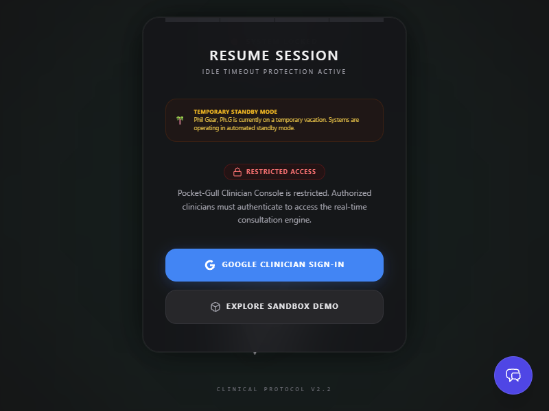

# 🕊️ POCKET GULL
**Aerial Perspective for the Clinical Ocean — Living Medical Intelligence Engine**

[](file:///c:/Users/philg/Pocketgull/pocketgull/LICENSE)


[](https://securityscorecards.dev/viewer/?uri=github.com/philgear/pocketgull)
[](https://orcid.org/0009-0008-1372-5381)
[](https://zenodo.org/records/20647514)

---

### 🌐 Live Production Application
**[https://pocketgull.app](https://pocketgull.app)** — Deployed on **Google Cloud Run** with Google Vertex AI Enterprise (`gemini-2.5-flash`).

---

## 🎯 VISION & PURPOSE

> *"To provide practitioners with the 'Gull's Eye View'—the ability to rise above the turbulent sea of medical data and see the clear, actionable patterns beneath."*

**Pocket Gull** is an active, living medical Care Plan Strategy and Live AI Consult engine powered by Google Gemini. Designed for clinicians, nurses, researchers, and caregivers, it synthesizes multimodal inputs (3D spatial anatomical mapping, bi-directional voice dictation, and biometric telemetry) into structured, evidence-grounded clinical strategies across Western, Eastern TCM, and Ayurvedic paradigms.

---

## 🔬 LIVING SYSTEM CAPABILITIES

### 🧠 1. Multimodal AI & Multi-Agent Orchestration
- **Google Agent Development Kit (`@google/adk`)**: Specialized `LlmAgent` experts execute inside an `InMemoryRunner` environment maintaining **context-aware memory** of active patient nodes.
- **Vertex AI Enterprise Engine**: Regional Google Cloud Vertex AI integration with automatic Application Default Credentials (ADC) token resolution and custom safety thresholds.
- **Bi-Directional Voice Consult & Barge-In Interruption**: Full-duplex audio streaming powered by the Web Speech API and Express `/ws/gemini-live` WebSocket proxy. Features instant local client-side `onspeechstart` barge-in speech cancellation.
- **PubMed Evidence-Grounded Reasoning**: Automatic real-time grounding against NIH PubMed E-utilities and Google Programmable Search to anchor every recommendation in verified medical literature.

---

### 📐 2. Interactive 3D Spatial Anatomy & Raycast Loci
- **Three.js Procedural Skeletal & Organ Viewer**: Detailed 3D skeletal geometry and surface mesh rendering with severity-mapped dynamic particle systems.
- **Anatomical Search & Camera Tracking (`focusOnPart`)**: Instant fuzzy anatomical search bar (Head/Neuro, Organs, Limbs/Spine) that smoothly interpolates WebGL camera targets onto targeted organs.
- **Interactive 3D Raycast Tooltips & Data Cards**: Hovering over 3D anatomical nodes displays part icons, active paradigm badges, and pain scores. Clicking opens a quick data entry overlay card with pain sliders (0–10) and symptom notes.
- **Method of Loci Memory Palace**: Anchors clinical consult nodes directly to 3D spatial anatomical coordinates for visual recall of patient history.

---

### 🩺 3. Dynamic Multi-Paradigm Clinical Lenses
- **🩺 Western Allopathic Lens**: Evidence-grounded ICD-10/SNOMED coding, Comprehensive Metabolic Panels (CMP: Troponin, ALT/AST, eGFR, Fasting Glucose), lab workups, and monitoring protocols.
- **🌿 Eastern TCM Lens**: Zang-Fu Qi constriction patterns, tongue/pulse diagnostic matrix, Ba Gang (Yin, Yang, Qi, Blood, Cold, Heat) classification, and 3D Acupoint Jing-Luo meridians (`GV-20 Baihui`, `CV-17 Danzhong`, `ST-36 Zusanli`).
- **🧘 Ayurvedic Medicine Lens**: Tridosha (Vata, Pitta, Kapha) balance, Agni metabolic fire types (*Samagni*, *Vishamagni*, *Mandagni*, *Tikshnagni*), and 3D Sushumna Lotus Chakras (`Sahasrara`, `Ajna`, `Anahata`, `Manipura`).
- **🧪 Orthomolecular Profiling**: Automatic extraction and visualization of biochemical markers (Magnesium, Vit D3, B12, Zinc) into a glassmorphic nutrient matrix.

---

### 📋 4. 10 Standardized Clinical & Life Sovereignty Assessment Instruments
Pocket Gull features 10 built-in standardized assessment instruments integrated directly into the patient state:

| Assessment Instrument | Standard Code / System | Metric Range | Clinical Utility & Scope |
| :--- | :--- | :---: | :--- |
| 🧠 **PHQ-9 (Depression)** | LOINC `44261-6` | `0 – 27` | Patient Health Questionnaire for depression severity. |
| ⚡ **GAD-7 (Anxiety)** | LOINC `69725-0` | `0 – 21` | Generalized Anxiety Disorder scale paired with 0.1 Hz vagal breathing biofeedback. |
| 🌙 **ISI (Insomnia)** | LOINC `86095-7` | `0 – 28` | Insomnia Severity Index with CBT-I sleep restriction directives. |
| 🛡️ **C-SSRS (Safety)** | LOINC `84411-8` | `0 – 16` | Columbia Suicide Screener with automatic **Sentinel Safety Alerts** & 988 Lifeline routing. |
| 🩺 **ROS-14 (Review of Systems)** | LOINC `69742-5` | 14 Systems | Comprehensive organ-system symptom intake inventory. |
| 🫀 **PHQ-15 (Somatic)** | LOINC `81675-1` | `0 – 30` | Somatic Symptom Scale evaluating physical distress & autonomic dysregulation. |
| 🤝 **PRAPARE (SDOH)** | LOINC `93304-4` | 5 Vectors | Social Determinants of Health protocol exporting ICD-10 Z-codes (`Z59.8`, `Z59.41`, `Z59.6`). |
| 🧘 **AYURVEDA (Tridosha)** | Samskrita | 6 Vectors | Tridosha Inventory calculating Vata/Pitta/Kapha balance & Agni metabolic fire type. |
| 🌿 **TCM (Shi Wen)** | Ten Questions | 6 Vectors | Traditional Chinese Medicine 6-vector inventory calculating Ba Gang Qi/Yin/Yang patterns. |
| 🌱 **GROW_THYSELF** | Epigenetic | `0 – 10` | Life Sovereignty inventory assessing Purpose/Ikigai, Somatic Sovereignty, & Epigenetic Vitality. |

---

### 🎨 5. Health Literacy Personas & Cognitive Reading Modes

#### 🧠 5 Persona Writing Styles
Users can toggle between 5 distinct writing personas to suit different cognitive styles:
1. **🔬 Clinical Allopathic**: Formal ICD-10, SNOMED, physiological telemetry, and PubMed trial citations.
2. **🌳 Arborist Redwood**: Translates body systems into dendrochronology, tree ring growth, and sap velocity (`120/80 hPa`).
3. **🏎️ Garage Mechanic**: Translates body systems into V8 engine chassis logs, fluid line PSI, and OBD-II DTC diagnostic codes (`DTC P0128`).
4. **🎩 Extraordinary Gentleman**: Victorian Steampunk expedition memoirs with central brass chronometer governors and etheric purity gauges.
5. **✨ Inspirational Muse**: Health history expressed as a 3-movement epic symphony with 528 Hz Solfeggio frequencies.

#### 📖 4 Adaptive Cognitive Reading Modes
1. 📜 **Classic Literary Reader**: Serif typography with drop-cap chapter headers and warm parchment styling.
2. ⚡ **Bionic Speed Reader**: Highlighting initial letterforms of clinical terms for accelerated visual cognitive processing.
3. 🧩 **Dyslexic Accessible**: OpenDyslexic weighted font styling with increased line height (`leading-loose`) and letter spacing (`tracking-wide`).
4. 🎧 **Audiobook Narrator**: Web Speech API speech synthesis paired with 528 Hz / 432 Hz Solfeggio soundscape background tones.

---

### 🚨 6. Emergency Good Samaritan Care & Geo-Sentinel Triage
- **Good Samaritan Emergency Mode**: Offline override mode featuring a 110 BPM chest-compression metronome, BLS safety-gated local Gemini Nano routing, local FHIR-compliant EMT QR code serialization (`lean-qr`), and global telemetry suppression.
- **Geo-Sentinel Outbreak Viewpoint Deck**: 3 international public health surveillance modes (Global 🌎 WHO, Regional 🌍 PAHO, Domestic 🇺🇸 CDC/NHI) with real-time AI containment directives.
- **Urgency Priority Sorting**: Automatically sorts patient rosters by Triage Urgency Score so Level 1 Emergency Resuscitation and Level 2 Emergent cases appear at the top.

---

### 🛡️ 7. Shift-Left Security & Egress Guard
- **Sentinel Security & Egress Guard (`sentinel_security_guard.mjs`)**: Native Node.js security script inspecting source code for unauthorized egress endpoints (enforcing a clinical domain whitelist: `generativelanguage.googleapis.com`, `fhir.org`, `cloudrun.app`).
- **Shannon Entropy Secret Scanner**: Scans for high-entropy random strings (potential API keys, JWTs, or session tokens) before commit.
- **CodeQL 100% Remediation**: Fully hardened against SSRF (`normalizeAndValidateModel`), path traversal (`express.static`), prototype pollution (`__proto__`, `constructor`, `prototype`), command injection (`execFile`), ReDoS, and insecure randomness.
- **Google Tink AEAD Cryptography**: Encrypts local patient records with Quantum-Safe Cryptography (Kyber/Dilithium) transport fallbacks.

---

## 📐 ARCHITECTURE & SYSTEM DATA FLOW

Pocket Gull utilizes a hybrid client-server-edge architecture designed for low-latency live consults, privacy-first offline operation, and continuous multi-lens clinical reasoning.


```mermaid
graph TB
    classDef doorway fill:#18181b,stroke:#a855f7,stroke-width:3px,color:#fafafa;
    classDef leftWing fill:#0f172a,stroke:#38bdf8,stroke-width:2px,color:#f8fafc;
    classDef rightWing fill:#0f172a,stroke:#10b981,stroke-width:2px,color:#f8fafc;
    classDef cloudCeiling fill:#0f172a,stroke:#6366f1,stroke-width:2px,color:#f8fafc;
    classDef foundation fill:#0f172a,stroke:#f59e0b,stroke-width:2px,color:#f8fafc;

    subgraph CloudCeiling ["⚡ CLOUD CEILING & BACKEND RUNTIME"]
        CloudRun["Google Cloud Run Serverless Service"]
        ExpressProxy["Express.js SSR & Single-Hop Proxy"]
        FastAPISidecar["Python FastAPI Sidecar (ML Risk Scoring)"]
        VertexAI["Vertex AI Enterprise (Gemini 2.5 Flash)"]
    end

    subgraph LeftWing ["📱 LEFT WING — INGESTION & PORTALS"]
        Body3D["Three.js 3D Body Surface & Skeleton Viewer"]
        VoiceSTT["Bi-Directional Voice Assistant & Web Speech API"]
        URLHandoff["Expanded URL State Handoff (?share=...&mode=...)"]
        IntakeForm["Demographics & Vitals Diagnostic Intake"]
    end

    subgraph DoorwayHub ["🚪 THE DOORWAY HUB — CENTRAL STATE & AI ORCHESTRATION"]
        PatientState["PatientStateService Signal Store\n(Central Source of Truth)"]
        ADKRunner["@google/adk InMemoryRunner\n(Multi-Agent Orchestrator)"]
        WebMCPCatalog["WebMCP Polyfill & JSON-LD Tool Catalog"]
        CognitiveShield["Cognitive Localization & Shield Filter"]
    end

    subgraph RightWing ["🩺 RIGHT WING — MULTI-PARADIGM LENSES"]
        WesternLens["Western Allopathic Lens"]
        TCMLens["Eastern TCM Lens"]
        AyurvedicLens["Ayurvedic Lens"]
        OrthoLens["Orthomolecular Lens"]
        YBOCsLens["Y-BOCs Diagnostic Screener"]
        CDCSentinel["CDC Sentinel Triage (Levels 1–5)"]
    end

    subgraph Foundation ["💾 FOUNDATION — STANDARDS & ARCHIVING"]
        FHIRBundles["FHIR R4 / R5 / R6 / FHIR 7 Bundles"]
        IndexedDBCache["Encrypted Offline Browser Cache"]
        PubmedGrounding["NCBI PubMed & Evidence Grounding"]
    end

    CloudRun --> ExpressProxy
    ExpressProxy <--> FastAPISidecar
    ExpressProxy <--> VertexAI

    Body3D -->|Spatio-Anatomical Signals| PatientState
    VoiceSTT -->|Audio Stream & Transcripts| ADKRunner
    URLHandoff -->|Base64 Payload Restore| PatientState
    IntakeForm -->|Vitals & Symptoms| PatientState

    ExpressProxy <-->|WebSocket & REST| DoorwayHub

    PatientState <--> ADKRunner
    ADKRunner <--> WebMCPCatalog
    PatientState <--> CognitiveShield

    DoorwayHub <--> WesternLens
    DoorwayHub <--> TCMLens
    DoorwayHub <--> AyurvedicLens
    DoorwayHub <--> OrthoLens
    DoorwayHub <--> YBOCsLens
    DoorwayHub <--> CDCSentinel

    PatientState --> FHIRBundles
    PatientState --> IndexedDBCache
    ADKRunner --> PubmedGrounding

    class PatientState,ADKRunner,WebMCPCatalog,CognitiveShield doorway;
    class Body3D,VoiceSTT,URLHandoff,IntakeForm leftWing;
    class WesternLens,TCMLens,AyurvedicLens,OrthoLens,YBOCsLens,CDCSentinel rightWing;
    class CloudRun,ExpressProxy,FastAPISidecar,VertexAI cloudCeiling;
    class FHIRBundles,IndexedDBCache,PubmedGrounding foundation;
```

---

## 💻 SYSTEM INTERFACE VISUALS




---

## 📜 LIVING RELEASE HISTORY & CHANGELOG DIGEST

A living record of major system evolutions (Full details in [`docs/study/src/pages/changelog.mdx`](file:///c:/Users/philg/Pocketgull/pocketgull/docs/study/src/pages/changelog.mdx)):

- **v1.3.0 (2026-07-24)**: Sentinel Security & Egress Guard (`sentinel_security_guard.mjs`), Step-Security Harden-Runner v2.16.0, Node.js 24 migration, CodeQL 100% remediation.
- **v1.2.0 (2026-07-22)**: 10 Standardized Clinical & Life Sovereignty Assessments, Dynamic 3D Paradigm Synchronization (Western Organs, Eastern Meridians, Ayurvedic Chakras), Rice Papercraft Theme.
- **v1.1.0-rc3 (2026-07-21)**: 60fps 3D Patient Slide-in Transition, Triage Urgency Priority Sorting, Geo-Sentinel Surveillance Deck, FHIR R4 1-Click Export.
- **v1.1.0-rc2 (2026-07-21)**: Patient Health Trajectory Storybook, 4 Adaptive Cognitive Reading Modes (Classic, Bionic, Dyslexic, Audiobook), Mind-State Synthesizer.
- **v1.1.0-rc1 (2026-07-21)**: 3-Act Clinical Narrative Arc, Pixel 9 Pro Touch Snap Carousel, Instant Patient Action Suite.
- **v1.0.0-rc12 (2026-07-21)**: 7-Day Chrono Weekly Meal Planner, Geolocational Micro-Climate Relocation Engine, KSS Acronym Expander.
- **v1.0.0-rc10 (2026-07-21)**: PhysioNet 2026 Waveform Lens (QRS, ST-segment, QTc, HRV LF/HF), Origami Unfolding Splash Animation.
- **v1.0.0-rc9 (2026-07-21)**: 3D Anatomical Search & Camera Tracking (`focusOnPart`), Viewport-Contextual CMP Lab Panels, Global Multilingual Exchange (Spanish, German, French, Japanese, Hindi).

---

## ⚡ QUICK START & DEVELOPER GUIDE

### Prerequisites
- **Node.js**: `v24.x` (Strict requirement specified in `.nvmrc`)
- **npm**: `v10.x` or higher

### Local Spin-Up

```bash
# 1. Clone the repository
git clone https://github.com/philgear/pocketgull.git
cd pocketgull

# 2. Install dependencies
npm install

# 3. Start local development server (Angular UI + Express SSR Proxy)
npm run dev

# 4. Run shift-left security & egress audit
npm run sentinel:audit

# 5. Run Vitest unit test suite
npm test
```

### Production Build & Local Preview

```bash
npm run build
npm run preview
```

---

## 🔒 ETHICS, SAFETY & RESPONSIBLE AI

- **Human-in-the-Loop (HITL)**: Clinicians must review and validate AI-generated treatment options before archiving care plans.
- **Automated Red-Teaming**: Vitest safety suite (`tests/safety.spec.ts`) continuously tests Google Gemini safety thresholds against adversarial prompts.
- **Privacy Core**: Zero unencrypted PII persistence. All patient state is transient or encrypted locally using Google Tink AEAD.
- **Professional Standards Alignment**: Engineered in accordance with the [ACM Code of Ethics](https://www.acm.org/code-of-ethics) and [IEEE Code of Ethics](https://www.ieee.org/about/corporate/governance/p7-8.html).

---

## 📚 EXTENDED DOCUMENTATION PORTAL

Full documentation is available in the [`docs/study/`](file:///c:/Users/philg/Pocketgull/pocketgull/docs/study/) directory:

- **[System Architecture](file:///c:/Users/philg/Pocketgull/pocketgull/docs/study/src/pages/architecture.mdx)** — System design, data flow, and tech stack
- **[Changelog & Release Notes](file:///c:/Users/philg/Pocketgull/pocketgull/docs/study/src/pages/changelog.mdx)** — Complete release history and technical diffs
- **[Clinical Paradigms](file:///c:/Users/philg/Pocketgull/pocketgull/docs/study/src/pages/clinical-paradigms.mdx)** — Western, TCM, and Ayurvedic frameworks
- **[Design System & Avian Personas](file:///c:/Users/philg/Pocketgull/pocketgull/DESIGN.md)** — Dieter Rams aesthetics and agent persona specs
- **[Data & Privacy Model](file:///c:/Users/philg/Pocketgull/pocketgull/docs/study/src/pages/data.mdx)** — Storage model, DOMPurify, and FHIR portability
- **[Responsible AI Guidelines](file:///c:/Users/philg/Pocketgull/pocketgull/docs/study/src/pages/responsible-ai.mdx)** — Ethical principles and safety red-teaming
- **[Contributing Guidelines](file:///c:/Users/philg/Pocketgull/pocketgull/CONTRIBUTING.md)** — Coding standards and PR guidelines
- **[REST API Reference](file:///c:/Users/philg/Pocketgull/pocketgull/pocketgull_api/openapi.yaml)** — OpenAPI 3.0 specification

---

## 👨‍💻 MAINTAINER

**Phil Gear** / [g.dev/philgear](https://g.dev/philgear)  
*Engineering with Kaizen — continuous refinement for clinical excellence.*

---

## 🔬 ACADEMIC CITATION & ZENODO ARCHIVE

If you reference or use Pocket Gull in clinical research, medical informatics studies, or AI health publications, please cite our official Zenodo archive record:

- **Zenodo Release Record (v0.10.0)**: [](https://doi.org/10.5281/zenodo.20647514) — [`10.5281/zenodo.20647514`](https://zenodo.org/records/20647514)
- **Zenodo Concept DOI (All Versions)**: [](https://doi.org/10.5281/zenodo.20647513) — [`10.5281/zenodo.20647513`](https://doi.org/10.5281/zenodo.20647513)
- **ORCID iD**: [](https://orcid.org/0009-0008-1372-5381)

```bibtex
@software{gear_phil_2026_20647514,
  author       = {Gear, Phil},
  title        = {Pocket-Gull: Living Medical Intelligence Engine},
  month        = jul,
  year         = 2026,
  publisher    = {Zenodo},
  version      = {v0.10.0},
  doi          = {10.5281/zenodo.20647514},
  url          = {https://doi.org/10.5281/zenodo.20647514}
}
```

---

*© 2026 Pocket Gull. Licensed under the [MIT License](file:///c:/Users/philg/Pocketgull/pocketgull/LICENSE).*
