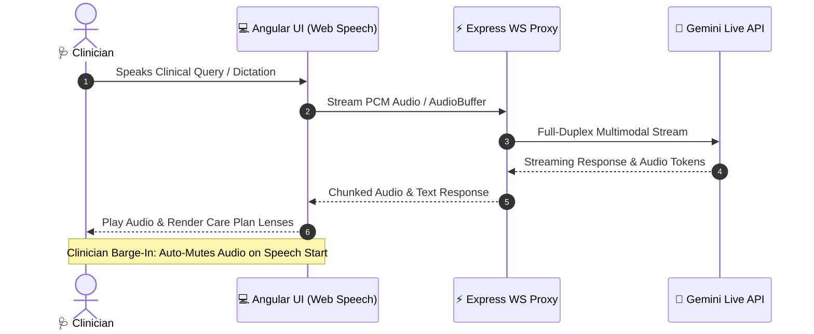
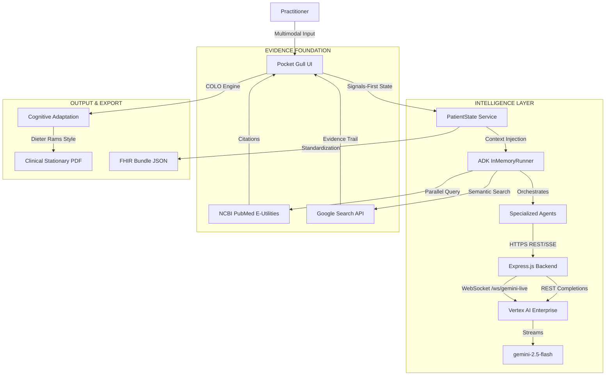
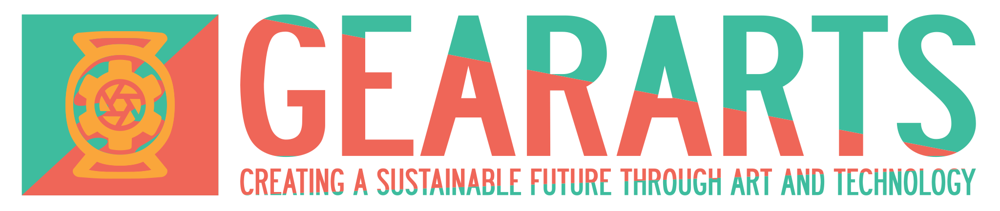

<<<<<<< HEAD
# 🕊️ POCKET GULL
**Aerial Perspective for the Clinical Ocean — Living Medical Intelligence Engine**

[](file:///c:/Users/philg/Pocketgull/pocketgull/LICENSE)


[](https://securityscorecards.dev/viewer/?uri=github.com/philgear/pocketgull)
[](https://orcid.org/0009-0008-1372-5381)
[](https://zenodo.org/records/20647514)

---

### 🌐 Live Production Application
**[https://pocketgull.app](https://pocketgull.app)** — Deployed on **Google Cloud Run** with Google Vertex AI Enterprise (`gemini-2.5-flash`).

---

## 🎯 VISION & PURPOSE

> *"To provide practitioners with the 'Gull's Eye View'—the ability to rise above the turbulent sea of medical data and see the clear, actionable patterns beneath."*

**Pocket Gull** is an active, living medical Care Plan Strategy and Live AI Consult engine powered by Google Gemini. Designed for clinicians, nurses, researchers, and caregivers, it synthesizes multimodal inputs (3D spatial anatomical mapping, bi-directional voice dictation, and biometric telemetry) into structured, evidence-grounded clinical strategies across Western, Eastern TCM, and Ayurvedic paradigms.

---

## 🔬 LIVING SYSTEM CAPABILITIES

### 🧠 1. Multimodal AI & Multi-Agent Orchestration
- **Google Agent Development Kit (`@google/adk`)**: Specialized `LlmAgent` experts execute inside an `InMemoryRunner` environment maintaining **context-aware memory** of active patient nodes.
- **Vertex AI Enterprise Engine**: Regional Google Cloud Vertex AI integration with automatic Application Default Credentials (ADC) token resolution and custom safety thresholds.
- **Bi-Directional Voice Consult & Barge-In Interruption**: Full-duplex audio streaming powered by the Web Speech API and Express `/ws/gemini-live` WebSocket proxy. Features instant local client-side `onspeechstart` barge-in speech cancellation.
- **PubMed Evidence-Grounded Reasoning**: Automatic real-time grounding against NIH PubMed E-utilities and Google Programmable Search to anchor every recommendation in verified medical literature.

---

### 📐 2. Interactive 3D Spatial Anatomy & Raycast Loci
- **Three.js Procedural Skeletal & Organ Viewer**: Detailed 3D skeletal geometry and surface mesh rendering with severity-mapped dynamic particle systems.
- **Anatomical Search & Camera Tracking (`focusOnPart`)**: Instant fuzzy anatomical search bar (Head/Neuro, Organs, Limbs/Spine) that smoothly interpolates WebGL camera targets onto targeted organs.
- **Interactive 3D Raycast Tooltips & Data Cards**: Hovering over 3D anatomical nodes displays part icons, active paradigm badges, and pain scores. Clicking opens a quick data entry overlay card with pain sliders (0–10) and symptom notes.
- **Method of Loci Memory Palace**: Anchors clinical consult nodes directly to 3D spatial anatomical coordinates for visual recall of patient history.

---

### 🩺 3. Dynamic Multi-Paradigm Clinical Lenses
- **🩺 Western Allopathic Lens**: Evidence-grounded ICD-10/SNOMED coding, Comprehensive Metabolic Panels (CMP: Troponin, ALT/AST, eGFR, Fasting Glucose), lab workups, and monitoring protocols.
- **🌿 Eastern TCM Lens**: Zang-Fu Qi constriction patterns, tongue/pulse diagnostic matrix, Ba Gang (Yin, Yang, Qi, Blood, Cold, Heat) classification, and 3D Acupoint Jing-Luo meridians (`GV-20 Baihui`, `CV-17 Danzhong`, `ST-36 Zusanli`).
- **🧘 Ayurvedic Medicine Lens**: Tridosha (Vata, Pitta, Kapha) balance, Agni metabolic fire types (*Samagni*, *Vishamagni*, *Mandagni*, *Tikshnagni*), and 3D Sushumna Lotus Chakras (`Sahasrara`, `Ajna`, `Anahata`, `Manipura`).
- **🧪 Orthomolecular Profiling**: Automatic extraction and visualization of biochemical markers (Magnesium, Vit D3, B12, Zinc) into a glassmorphic nutrient matrix.

---

### 📋 4. 10 Standardized Clinical & Life Sovereignty Assessment Instruments
Pocket Gull features 10 built-in standardized assessment instruments integrated directly into the patient state:

| Assessment Instrument | Standard Code / System | Metric Range | Clinical Utility & Scope |
| :--- | :--- | :---: | :--- |
| 🧠 **PHQ-9 (Depression)** | LOINC `44261-6` | `0 – 27` | Patient Health Questionnaire for depression severity. |
| ⚡ **GAD-7 (Anxiety)** | LOINC `69725-0` | `0 – 21` | Generalized Anxiety Disorder scale paired with 0.1 Hz vagal breathing biofeedback. |
| 🌙 **ISI (Insomnia)** | LOINC `86095-7` | `0 – 28` | Insomnia Severity Index with CBT-I sleep restriction directives. |
| 🛡️ **C-SSRS (Safety)** | LOINC `84411-8` | `0 – 16` | Columbia Suicide Screener with automatic **Sentinel Safety Alerts** & 988 Lifeline routing. |
| 🩺 **ROS-14 (Review of Systems)** | LOINC `69742-5` | 14 Systems | Comprehensive organ-system symptom intake inventory. |
| 🫀 **PHQ-15 (Somatic)** | LOINC `81675-1` | `0 – 30` | Somatic Symptom Scale evaluating physical distress & autonomic dysregulation. |
| 🤝 **PRAPARE (SDOH)** | LOINC `93304-4` | 5 Vectors | Social Determinants of Health protocol exporting ICD-10 Z-codes (`Z59.8`, `Z59.41`, `Z59.6`). |
| 🧘 **AYURVEDA (Tridosha)** | Samskrita | 6 Vectors | Tridosha Inventory calculating Vata/Pitta/Kapha balance & Agni metabolic fire type. |
| 🌿 **TCM (Shi Wen)** | Ten Questions | 6 Vectors | Traditional Chinese Medicine 6-vector inventory calculating Ba Gang Qi/Yin/Yang patterns. |
| 🌱 **GROW_THYSELF** | Epigenetic | `0 – 10` | Life Sovereignty inventory assessing Purpose/Ikigai, Somatic Sovereignty, & Epigenetic Vitality. |

---

### 🎨 5. Health Literacy Personas & Cognitive Reading Modes

#### 🧠 5 Persona Writing Styles
Users can toggle between 5 distinct writing personas to suit different cognitive styles:
1. **🔬 Clinical Allopathic**: Formal ICD-10, SNOMED, physiological telemetry, and PubMed trial citations.
2. **🌳 Arborist Redwood**: Translates body systems into dendrochronology, tree ring growth, and sap velocity (`120/80 hPa`).
3. **🏎️ Garage Mechanic**: Translates body systems into V8 engine chassis logs, fluid line PSI, and OBD-II DTC diagnostic codes (`DTC P0128`).
4. **🎩 Extraordinary Gentleman**: Victorian Steampunk expedition memoirs with central brass chronometer governors and etheric purity gauges.
5. **✨ Inspirational Muse**: Health history expressed as a 3-movement epic symphony with 528 Hz Solfeggio frequencies.

#### 📖 4 Adaptive Cognitive Reading Modes
1. 📜 **Classic Literary Reader**: Serif typography with drop-cap chapter headers and warm parchment styling.
2. ⚡ **Bionic Speed Reader**: Highlighting initial letterforms of clinical terms for accelerated visual cognitive processing.
3. 🧩 **Dyslexic Accessible**: OpenDyslexic weighted font styling with increased line height (`leading-loose`) and letter spacing (`tracking-wide`).
4. 🎧 **Audiobook Narrator**: Web Speech API speech synthesis paired with 528 Hz / 432 Hz Solfeggio soundscape background tones.

---

### 🚨 6. Emergency Good Samaritan Care & Geo-Sentinel Triage
- **Good Samaritan Emergency Mode**: Offline override mode featuring a 110 BPM chest-compression metronome, BLS safety-gated local Gemini Nano routing, local FHIR-compliant EMT QR code serialization (`lean-qr`), and global telemetry suppression.
- **Geo-Sentinel Outbreak Viewpoint Deck**: 3 international public health surveillance modes (Global 🌎 WHO, Regional 🌍 PAHO, Domestic 🇺🇸 CDC/NHI) with real-time AI containment directives.
- **Urgency Priority Sorting**: Automatically sorts patient rosters by Triage Urgency Score so Level 1 Emergency Resuscitation and Level 2 Emergent cases appear at the top.

---

### 🛡️ 7. Shift-Left Security & Egress Guard
- **Sentinel Security & Egress Guard (`sentinel_security_guard.mjs`)**: Native Node.js security script inspecting source code for unauthorized egress endpoints (enforcing a clinical domain whitelist: `generativelanguage.googleapis.com`, `fhir.org`, `cloudrun.app`).
- **Shannon Entropy Secret Scanner**: Scans for high-entropy random strings (potential API keys, JWTs, or session tokens) before commit.
- **CodeQL 100% Remediation**: Fully hardened against SSRF (`normalizeAndValidateModel`), path traversal (`express.static`), prototype pollution (`__proto__`, `constructor`, `prototype`), command injection (`execFile`), ReDoS, and insecure randomness.
- **Google Tink AEAD Cryptography**: Encrypts local patient records with Quantum-Safe Cryptography (Kyber/Dilithium) transport fallbacks.

---

## 📐 ARCHITECTURE & SYSTEM DATA FLOW

Pocket Gull utilizes a hybrid client-server-edge architecture designed for low-latency live consults, privacy-first offline operation, and continuous multi-lens clinical reasoning.


```mermaid
graph TB
    classDef doorway fill:#18181b,stroke:#a855f7,stroke-width:3px,color:#fafafa;
    classDef leftWing fill:#0f172a,stroke:#38bdf8,stroke-width:2px,color:#f8fafc;
    classDef rightWing fill:#0f172a,stroke:#10b981,stroke-width:2px,color:#f8fafc;
    classDef cloudCeiling fill:#0f172a,stroke:#6366f1,stroke-width:2px,color:#f8fafc;
    classDef foundation fill:#0f172a,stroke:#f59e0b,stroke-width:2px,color:#f8fafc;

    subgraph CloudCeiling ["⚡ CLOUD CEILING & BACKEND RUNTIME"]
        CloudRun["Google Cloud Run Serverless Service"]
        ExpressProxy["Express.js SSR & Single-Hop Proxy"]
        FastAPISidecar["Python FastAPI Sidecar (ML Risk Scoring)"]
        VertexAI["Vertex AI Enterprise (Gemini 2.5 Flash)"]
    end

    subgraph LeftWing ["📱 LEFT WING — INGESTION & PORTALS"]
        Body3D["Three.js 3D Body Surface & Skeleton Viewer"]
        VoiceSTT["Bi-Directional Voice Assistant & Web Speech API"]
        URLHandoff["Expanded URL State Handoff (?share=...&mode=...)"]
        IntakeForm["Demographics & Vitals Diagnostic Intake"]
    end

    subgraph DoorwayHub ["🚪 THE DOORWAY HUB — CENTRAL STATE & AI ORCHESTRATION"]
        PatientState["PatientStateService Signal Store\n(Central Source of Truth)"]
        ADKRunner["@google/adk InMemoryRunner\n(Multi-Agent Orchestrator)"]
        WebMCPCatalog["WebMCP Polyfill & JSON-LD Tool Catalog"]
        CognitiveShield["Cognitive Localization & Shield Filter"]
    end

    subgraph RightWing ["🩺 RIGHT WING — MULTI-PARADIGM LENSES"]
        WesternLens["Western Allopathic Lens"]
        TCMLens["Eastern TCM Lens"]
        AyurvedicLens["Ayurvedic Lens"]
        OrthoLens["Orthomolecular Lens"]
        YBOCsLens["Y-BOCs Diagnostic Screener"]
        CDCSentinel["CDC Sentinel Triage (Levels 1–5)"]
    end

    subgraph Foundation ["💾 FOUNDATION — STANDARDS & ARCHIVING"]
        FHIRBundles["FHIR R4 / R5 / R6 / FHIR 7 Bundles"]
        IndexedDBCache["Encrypted Offline Browser Cache"]
        PubmedGrounding["NCBI PubMed & Evidence Grounding"]
    end

    CloudRun --> ExpressProxy
    ExpressProxy <--> FastAPISidecar
    ExpressProxy <--> VertexAI

    Body3D -->|Spatio-Anatomical Signals| PatientState
    VoiceSTT -->|Audio Stream & Transcripts| ADKRunner
    URLHandoff -->|Base64 Payload Restore| PatientState
    IntakeForm -->|Vitals & Symptoms| PatientState

    ExpressProxy <-->|WebSocket & REST| DoorwayHub

    PatientState <--> ADKRunner
    ADKRunner <--> WebMCPCatalog
    PatientState <--> CognitiveShield

    DoorwayHub <--> WesternLens
    DoorwayHub <--> TCMLens
    DoorwayHub <--> AyurvedicLens
    DoorwayHub <--> OrthoLens
    DoorwayHub <--> YBOCsLens
    DoorwayHub <--> CDCSentinel

    PatientState --> FHIRBundles
    PatientState --> IndexedDBCache
    ADKRunner --> PubmedGrounding

    class PatientState,ADKRunner,WebMCPCatalog,CognitiveShield doorway;
    class Body3D,VoiceSTT,URLHandoff,IntakeForm leftWing;
    class WesternLens,TCMLens,AyurvedicLens,OrthoLens,YBOCsLens,CDCSentinel rightWing;
    class CloudRun,ExpressProxy,FastAPISidecar,VertexAI cloudCeiling;
    class FHIRBundles,IndexedDBCache,PubmedGrounding foundation;
```

---

## 💻 SYSTEM INTERFACE VISUALS


---

## 📜 LIVING RELEASE HISTORY & CHANGELOG DIGEST

A living record of major system evolutions (Full details in [`docs/study/src/pages/changelog.mdx`](file:///c:/Users/philg/Pocketgull/pocketgull/docs/study/src/pages/changelog.mdx)):

- **v1.3.0 (2026-07-24)**: Sentinel Security & Egress Guard (`sentinel_security_guard.mjs`), Step-Security Harden-Runner v2.16.0, Node.js 24 migration, CodeQL 100% remediation.
- **v1.2.0 (2026-07-22)**: 10 Standardized Clinical & Life Sovereignty Assessments, Dynamic 3D Paradigm Synchronization (Western Organs, Eastern Meridians, Ayurvedic Chakras), Rice Papercraft Theme.
- **v1.1.0-rc3 (2026-07-21)**: 60fps 3D Patient Slide-in Transition, Triage Urgency Priority Sorting, Geo-Sentinel Surveillance Deck, FHIR R4 1-Click Export.
- **v1.1.0-rc2 (2026-07-21)**: Patient Health Trajectory Storybook, 4 Adaptive Cognitive Reading Modes (Classic, Bionic, Dyslexic, Audiobook), Mind-State Synthesizer.
- **v1.1.0-rc1 (2026-07-21)**: 3-Act Clinical Narrative Arc, Pixel 9 Pro Touch Snap Carousel, Instant Patient Action Suite.
- **v1.0.0-rc12 (2026-07-21)**: 7-Day Chrono Weekly Meal Planner, Geolocational Micro-Climate Relocation Engine, KSS Acronym Expander.
- **v1.0.0-rc10 (2026-07-21)**: PhysioNet 2026 Waveform Lens (QRS, ST-segment, QTc, HRV LF/HF), Origami Unfolding Splash Animation.
- **v1.0.0-rc9 (2026-07-21)**: 3D Anatomical Search & Camera Tracking (`focusOnPart`), Viewport-Contextual CMP Lab Panels, Global Multilingual Exchange (Spanish, German, French, Japanese, Hindi).

---

## ⚡ QUICK START & DEVELOPER GUIDE

### Prerequisites
- **Node.js**: `v24.x` (Strict requirement specified in `.nvmrc`)
- **npm**: `v10.x` or higher

### Local Spin-Up

```bash
# 1. Clone the repository
git clone https://github.com/philgear/pocketgull.git
cd pocketgull

# 2. Install dependencies
npm install

# 3. Start local development server (Angular UI + Express SSR Proxy)
npm run dev

# 4. Run shift-left security & egress audit
npm run sentinel:audit

# 5. Run Vitest unit test suite
npm test
```

### Production Build & Local Preview

```bash
npm run build
npm run preview
```

---

## 🔒 ETHICS, SAFETY & RESPONSIBLE AI

- **Human-in-the-Loop (HITL)**: Clinicians must review and validate AI-generated treatment options before archiving care plans.
- **Automated Red-Teaming**: Vitest safety suite (`tests/safety.spec.ts`) continuously tests Google Gemini safety thresholds against adversarial prompts.
- **Privacy Core**: Zero unencrypted PII persistence. All patient state is transient or encrypted locally using Google Tink AEAD.
- **Professional Standards Alignment**: Engineered in accordance with the [ACM Code of Ethics](https://www.acm.org/code-of-ethics) and [IEEE Code of Ethics](https://www.ieee.org/about/corporate/governance/p7-8.html).

---

## 📚 EXTENDED DOCUMENTATION PORTAL

Full documentation is available in the [`docs/study/`](file:///c:/Users/philg/Pocketgull/pocketgull/docs/study/) directory:

- **[System Architecture](file:///c:/Users/philg/Pocketgull/pocketgull/docs/study/src/pages/architecture.mdx)** — System design, data flow, and tech stack
- **[Changelog & Release Notes](file:///c:/Users/philg/Pocketgull/pocketgull/docs/study/src/pages/changelog.mdx)** — Complete release history and technical diffs
- **[Clinical Paradigms](file:///c:/Users/philg/Pocketgull/pocketgull/docs/study/src/pages/clinical-paradigms.mdx)** — Western, TCM, and Ayurvedic frameworks
- **[Design System & Avian Personas](file:///c:/Users/philg/Pocketgull/pocketgull/DESIGN.md)** — Dieter Rams aesthetics and agent persona specs
- **[Data & Privacy Model](file:///c:/Users/philg/Pocketgull/pocketgull/docs/study/src/pages/data.mdx)** — Storage model, DOMPurify, and FHIR portability
- **[Responsible AI Guidelines](file:///c:/Users/philg/Pocketgull/pocketgull/docs/study/src/pages/responsible-ai.mdx)** — Ethical principles and safety red-teaming
- **[Contributing Guidelines](file:///c:/Users/philg/Pocketgull/pocketgull/CONTRIBUTING.md)** — Coding standards and PR guidelines
- **[REST API Reference](file:///c:/Users/philg/Pocketgull/pocketgull/pocketgull_api/openapi.yaml)** — OpenAPI 3.0 specification

---

## 👨‍💻 MAINTAINER

**Phil Gear** / [g.dev/philgear](https://g.dev/philgear)  
*Engineering with Kaizen — continuous refinement for clinical excellence.*

---

## 🔬 ACADEMIC CITATION & ZENODO ARCHIVE

If you reference or use Pocket Gull in clinical research, medical informatics studies, or AI health publications, please cite our official Zenodo archive record:

- **Zenodo Release Record (v0.10.0)**: [](https://doi.org/10.5281/zenodo.20647514) — [`10.5281/zenodo.20647514`](https://zenodo.org/records/20647514)
- **Zenodo Concept DOI (All Versions)**: [](https://doi.org/10.5281/zenodo.20647513) — [`10.5281/zenodo.20647513`](https://doi.org/10.5281/zenodo.20647513)
- **ORCID iD**: [](https://orcid.org/0009-0008-1372-5381)

```bibtex
@software{gear_phil_2026_20647514,
  author       = {Gear, Phil},
  title        = {Pocket-Gull: Living Medical Intelligence Engine},
  month        = jul,
  year         = 2026,
  publisher    = {Zenodo},
  version      = {v0.10.0},
  doi          = {10.5281/zenodo.20647514},
  url          = {https://doi.org/10.5281/zenodo.20647514}
}
```

---

*© 2026 Pocket Gull. Licensed under the [MIT License](file:///c:/Users/philg/Pocketgull/pocketgull/LICENSE).*
=======
# 🕊️ POCKET GULL
**Aerial Perspective for the Clinical Ocean**

---

### PREPARED FOR
**Google Gemini Live Agent Challenge** / 2026


[](https://securityscorecards.dev/viewer/?uri=github.com/philgear/pocketgull)
[](https://bestpractices.coreinfrastructure.org)
[](https://orcid.org/0009-0008-1372-5381)
[](https://doi.org/10.5281/zenodo.20647513)
[](https://www.acm.org/code-of-ethics)
[](https://www.ieee.org/about/corporate/governance/p7-8.html)
[](https://anitab.org)
[](https://www.pdxwit.org)
[](http://calagator.org)
[](https://oregoncarepartners.com)
[](https://www.apa.org)
[](https://www.amacad.org)


### CATEGORY
**Live Agents 🗣️** (Multimodal Synthesis & Agent Orchestration)

### VISION
*"To provide practitioners with the 'Gull's Eye View'—the ability to rise above the turbulent sea of medical data and see the clear, actionable patterns beneath."*

---

<!-- 📄 CLINICAL STATIONERY HEADER & PATIENT CARE PLAN DOSSIER -->
<div align="center">
  <table width="100%" border="0" style="border: 3px double #1e3a5f; background: #faf8f5; color: #1e293b; padding: 20px; font-family: 'Inter', monospace, sans-serif; border-radius: 8px; box-shadow: 0 10px 25px rgba(0,0,0,0.08);">
    <tr>
      <td>
        <div style="border-bottom: 2px solid #1e3a5f; padding-bottom: 12px; margin-bottom: 16px; display: flex; justify-content: space-between; align-items: center;">
          <div>
            <h2 style="margin: 0; color: #1e3a5f; letter-spacing: 2px;">🏥 POCKET GULL MEDICAL INTELLIGENCE</h2>
            <p style="margin: 4px 0 0 0; font-size: 12px; color: #64748b; font-weight: bold; text-transform: uppercase;">Official Clinical Care Plan Strategy & Live AI Consult Engine</p>
          </div>
          <div style="text-align: right; font-size: 11px; color: #475569;">
            <span><strong>DOSSIER NO:</strong> PG-2026-EX-9901</span><br/>
            <span><strong>FHIR R4 BUNDLE:</strong> VERIFIED ✓</span><br/>
            <span><strong>STATIONERY THEME:</strong> CONSTRUCTIVE PAPERCRAFT</span>
          </div>
        </div>
      </td>
    </tr>
  </table>
</div>

---

## 📄 SECTION 1: CLINICAL STATIONERY & PATIENT TRAJECTORY

### 📑 CLINICAL DATA CARD 1.0 — PATIENT DEMOGRAPHICS & BASELINE VITALS

| Field | Parameter | Baseline Metric | Status & Clinical Interpretation |
| :--- | :--- | :--- | :--- |
| 👤 **Patient Identity** | Phil Gear, Ph.G | Age 42 (Male) | ID: `p_phil_gear` \| Executive Care Profile |
| 💓 **Hemodynamics** | Blood Pressure / Heart Rate | `122/82 mmHg` \| `68 bpm` | Optimal resting autonomic tone (LF/HF `1.25`) |
| 🫁 **Pulmonary & Temp** | SpO2 / Body Temperature | `98%` \| `98.6°F` | Eupneic baseline, normal thermoregulation |
| ⚖️ **Anthropometrics** | Height / Weight | `5'10"` \| `178 lbs` | BMI `25.5` \| Samagni Metabolic Balance |
| 🧪 **Biomarker Matrix** | Mg / Vit D3 / B12 / Zn | `2.1 mg/dL` \| `32 ng/mL` \| `580 pg/mL` \| `92 mcg/dL` | Sub-optimal Mg & D3; optimal methylation & Zn |
| 🎯 **Care Objective** | Patient Strategy Goal | *"Optimize metabolic health, synchronize biometrics from Health Connect, and reduce sleep latency."* | Active Care Plan |

---

### 📑 CLINICAL DATA CARD 2.0 — ASSESSMENT & SCREENER TRAJECTORY GRID

| Assessment Instrument | Standard Code (LOINC / System) | Measured Score | Severity Classification | Recommended Interventions |
| :--- | :--- | :---: | :---: | :--- |
| 🌿 **GAD-7 (Anxiety)** | LOINC `69725-0` | `4 / 21` | **Mild / Subclinical** | 0.1 Hz Vagal Resonant Breathing & Sleep Hygiene |
| 🧠 **PHQ-9 (Depression)** | LOINC `44261-6` | `3 / 27` | **Minimal Baseline** | Circadian Sunlight Entrainment & Habit Tracking |
| 🌀 **Y-BOCS (OCD)** | LOINC `82290-8` | `4 / 40` | **Subclinical** | Daily Routine Structuring & Mindfulness Anchoring |
| 😴 **KSS Readiness** | LOINC `71556-5` | `3 / 9` | **Alert (Level 3)** | Full Multimodal Telemetry Enabled |
| 🌙 **ISI (Insomnia)** | LOINC `86095-7` | `5 / 28` | **None** | Evening Blue-Light Blocking & Mag Glycinate |
| 🚨 **C-SSRS (Safety)** | LOINC `84411-8` | `0` | **Minimal Risk** | Standard Safeguards & Emergency Mode Readiness |
| 🌱 **Grow-Thyself Index** | Custom Epigenetic | `8.8 / 10` | **Sovereignty** | High Resilience & Lifestyle Alignment |

---

### 📑 CLINICAL DATA CARD 3.0 — MULTI-PARADIGM MEDICINE MATRIX

```
┌─────────────────────────────────────────────────────────────────────────────────────────────┐
│                       🏥 POCKET GULL MULTI-LENS CLINICAL PARADIGM MATRIX                     │
├───────────────────────────────┬───────────────────────────────┬─────────────────────────────┤
│ 🩺 WESTERN ALLOPATHIC LENS     │ 🌿 TRADITIONAL CHINESE (TCM)  │ 🧘 AYURVEDIC MEDICINE LENS  │
│ • Diagnosis: Mild Tension     │ • Pattern: Zang-Fu Qi         │ • Prakriti: V3 / P5 / K3    │
│   Headache & Sleep Latency    │   Constriction (Liver Qi)     │ • Vikriti: V4 / P6 / K3     │
│ • ICD-10: G44.209, G47.00     │ • Tongue: Pink, Thin White    │ • Agni: Samagni Balance     │
│ • FHIR R4 Bundle Exported     │ • Pulse: Normal / Moderate    │ • Nadi: Frog-Pitta Flow     │
├───────────────────────────────┼───────────────────────────────┼─────────────────────────────┤
│ 🧪 ORTHOMOLECULAR & NUTRIENT  │ 📊 PHYSIONET 2026 TELEMETRY   │ ⏳ ACTUARIAL LONGEVITY LENS │
│ • Magnesium: Sub-optimal      │ • QRS Interval: 88 ms         │ • Projected QALY Gain:      │
│ • Vit D3: Sub-optimal (32)    │ • QTc (Fridericia): 412 ms    │   +4.2 Quality-Adjusted Yrs │
│ • B12 & Zinc: Optimal Status  │ • LF/HF Ratio: 1.25           │ • 10-Yr Mortality Risk:     │
│ • Precision Dosing 400mg PM   │ • RMSSD: 48 ms (Good Vagal)   │   -18.5% Relative Reduc.    │
└───────────────────────────────┴───────────────────────────────┴─────────────────────────────┘
```

---

## 📄 SECTION 2: ARCHITECTURAL BLUEPRINT & SYSTEM VISUALS

<!-- 📐 CONSTRUCTION BLUEPRINT IMAGE FRAME 1.0 -->
<div align="center" style="background: #0f172a; border: 2px dashed #f59e0b; padding: 20px; border-radius: 12px; margin: 24px 0; box-shadow: 0 10px 30px rgba(0,0,0,0.3);">
  <div style="display: flex; justify-content: space-between; align-items: center; border-bottom: 1px solid #334155; padding-bottom: 8px; margin-bottom: 16px;">
    <span style="color: #f59e0b; font-family: monospace; font-size: 13px; font-weight: bold;">📐 FIG 1.0 — ANATOMICAL 3D BLUEPRINT & LIVE AI CONSULT DASHBOARD</span>
    <span style="color: #64748b; font-family: monospace; font-size: 11px;">SCALE: 1:1 | RENDER: THREE.JS WEBGL + GEMINI 2.5 FLASH</span>
  </div>
  
  <p style="color: #94a3b8; font-size: 11px; font-family: monospace; margin: 12px 0 0 0;">
    [BLUEPRINT SPEC] Three.js Procedural Skeletal & Surface Mesh • Real-Time Web Speech Multimodal Audio Streaming • Evidence-Grounded PubMed Search
  </p>
</div>

---

## 🎨 AVAILABLE THEMES & COGNITIVE HEALTH LITERACY MODES

Pocket Gull features a comprehensive design system supporting dynamic visual themes, 5 health literacy persona modes, 3 spatial paradigm lenses, and WCAG AA accessibility standards:

### 🌓 1. Visual Themes & Aesthetic Systems
- **🌞 Light Mode**: Warm parchment & crisp glassmorphism cards (`bg-white/70`, `bg-[#FFFDF5]`), high-contrast dark text (`text-gray-900`), soft borders (`border-gray-200`), and subtle ambient drop shadows.
- **🌙 Dark Mode**: Deep obsidian & zinc styling (`dark:bg-zinc-900`, `dark:bg-zinc-950`), glowing neon accents (`emerald-500`, `cyan-400`, `amber-400`), crisp bright typography (`dark:text-zinc-100`), and zero-whitespace circadian breathing ambient glow.
- **📄 Constructive Papercraft Stationery**: Neumorphic paper cards with double borders, tactile shadows (`shadow-[4px_6px_0px_0px_rgba(28,28,28,0.85)]`), and official FHIR R4 clinical dossier stamps.

---

### 🧠 2. Health Literacy Personas & Cognitive Writing Styles
Users can toggle between 5 distinct cognitive writing styles to suit their preferred mental model and emotional tone:

1. **🔬 Clinical Allopathic Mode**:
   - Evidence-grounded ICD-10/SNOMED coding, physiological telemetry, FHIR R4 bundles, and PubMed clinical trial citations.
2. **🌳 The Arborist Botanical Redwood Mode**:
   - Translates body systems into dendrochronology, tree ring growth, xylem sap velocity (`120/80 hPa`), and canopy foliage vitality (`SpO₂ 98%`).
3. **🏎️ Car Talk Warm Garage Mechanic Mode**:
   - Translates body systems into V8 engine chassis logs, fluid line PSI, manifold vacuum pressure, and OBD-II DTC diagnostic trouble codes (`DTC P0128`).
4. **🎩 The Extraordinary Gentleman Polymath Mode**:
   - Translates telemetry into a Victorian Steampunk expedition memoir with central brass chronometer governors, barometric pressure dials, and etheric purity gauges.
5. **✨ The Inspirational Artistic Muse Mode**:
   - Translates health history into a 3-movement epic symphony with 528 Hz Solfeggio frequencies, watercolor canvas palettes, and harmonic resonance.

---

### 🩺 3. 3D Spatial Paradigm Lenses
- **🩺 Western Allopathic 3D Surface & Skeletal Model** (Organ target selection & skeletal overlay)
- **🌿 Eastern TCM 3D Acupoint Meridian Lens** (GV-20 Baihui, CV-17 Danzhong, CV-12 Zhongwan, ST-36 Zusanli, LI-4 Hegu)
- **🧘 Ayurvedic 3D Sushumna Chakra Lens** (Crown, Third Eye, Throat, Heart, Solar Plexus, Sacral, Root)

---

### ♿ 4. Accessibility, Typography & Ergonomics Framework

#### 🔤 The 3-Tier Font Pairing System
- **Interface & Body (`Inter / Sans-Serif`)**: Clinical rationales, drug matrix tables, and care plan steps. High x-height, open apertures, clear letterform separation (`1`, `I`, `l`, `0`, `O`).
- **Data & Telemetry (`JetBrains Mono / Monospace`)**: Vital signs, blood pressure (`120/80 hPa`), ICD-10/SNOMED codes, timestamps. Fixed character widths guarantee that lab columns alignment never shifts during live streaming updates.
- **Persona Narrative (`Serif / Display`)**: Sylvan Arborist lore, Gentleman memoirs, and Muse poetry. High-contrast strokes create an immersive, rhythmic cadence for narrative health storybooks.

#### 📏 Scale, Leading & Touch Target Boundaries
- **Hero Card Header**: `text-lg` (`18px – 20px`), `leading-snug` (`1.375`).
- **Section Title**: `text-base` (`16px`), `leading-normal` (`1.5`).
- **Body Rationale**: `text-xs/sm` (`12px – 14px`), `leading-relaxed` (`1.625`) capped at 3 lines per paragraph to prevent line-skipping fatigue.
- **Biomarker Metric**: `text-[11px]` (`11px font-mono`), `leading-none` (`1.0`).
- **Interactive Touch Targets**: `min-h-[44px]` × `px-3.5 py-2` across all buttons and paradigm selection pills ensuring **44px × 44px minimum touch area** for WCAG AA mobile & touchscreen compliance.

#### 🎨 Color Contrast Ratios (WCAG AAA Compliance)
- **☀️ Light Mode**: Warm Parchment (`#FFFDF5` / `bg-slate-50`), Deep Charcoal text (`#111827`, **Contrast 16.2:1** vs AAA 7:1), Slate Gray labels (`#475569`, **Contrast 4.8:1** vs AA 4.5:1).
- **🌙 Dark Mode**: Obsidian Zinc (`#09090b` / `dark:bg-zinc-950`), Pure Ice Zinc text (`#f4f4f5`, **Contrast 17.1:1** vs AAA 7:1), high-glow neon metrics (`#34d399` emerald-400, `#22d3ee` cyan-400, `#fbbf24` amber-400).

#### 🧠 Cognitive Ergonomics for Rapid Scanability
- **Dynamic Text Resizing Multipliers (`textSizeScale`)**: `A (Std)` 1.0× baseline, `A+ (Lg)` 1.15× magnification, `A++ (XL)` 1.30× magnification for high-visibility environments.
- **Plain Language Dual Rationale Toggle**: Instantly switch between **🔬 Deep Clinical Rationale** (ICD-10, pathophysiology, FHIR R4) and **📖 Plain Language** (persona metaphors and micro-habits).

---

## 📋 THE STORY OF THE SEAGULL

In modern medicine, practitioners are often drowning in a "Sea of Information"—fragmented vitals, sprawling patient histories, and an ever-shifting tide of clinical literature. **Pocket Gull** was conceived as an aerial navigator. 

Like its namesake, the agent is **agile**, **interruptible**, and **highly observant**. It doesn't just process data; it provides **Uplift**. By synthesizing multimodal inputs (3D spatial data, voice dictation, and biometric telemetry) into a singular, high-integrity strategy, it allows the clinician to maintain perspective without losing sight of the patient.

> **Industrial Grace:** We believe medical tools should be as beautiful as they are functional. Our design language combines the clinical precision of a laboratory with the "Less, but better" philosophy of Dieter Rams.

<!-- 📐 CONSTRUCTION BLUEPRINT IMAGE FRAME 2.0 -->
<div align="center" style="background: #0f172a; border: 2px dashed #38bdf8; padding: 20px; border-radius: 12px; margin: 24px 0; box-shadow: 0 10px 30px rgba(0,0,0,0.3);">
  <div style="display: flex; justify-content: space-between; align-items: center; border-bottom: 1px solid #334155; padding-bottom: 8px; margin-bottom: 16px;">
    <span style="color: #38bdf8; font-family: monospace; font-size: 13px; font-weight: bold;">📄 FIG 2.0 — CLINICAL CARE PLAN & MULTI-LENS ANALYSIS LENSES</span>
    <span style="color: #64748b; font-family: monospace; font-size: 11px;">THEME: PAPERCRAFT CONSTRUCTIVE STATIONERY</span>
  </div>
  
</div>

---

## 📄 SECTION 3: SYSTEM ARCHITECTURE & COMPLIANCE SPECIFICATIONS

---

## 🛠️ SCIENTIFIC RIGOR & CORE CAPABILITIES

#### 🧠 EVIDENCE-GROUNDED REASONING (EGR)
Pocket Gull eliminates "Black Box" AI anxiety. Every recommendation is anchored by an **Evidence Trail** generated through real-time integration with **Google Programmable Search** and **NCBI PubMed**. The agent doesn't just suggest; it cites.

#### 🎙️ MULTIMODAL SYNTHESIS & ORCHESTRATION
Powered by `@google/adk` and the Web Speech API. Specialized `LlmAgent` experts operate in an `InMemoryRunner` environment, maintaining **context-aware memory** of report nodes, allowing for fluid, multi-turn reasoning across voice and visual UI.

#### 📐 PRECISION 3D ANATOMICAL MODELING
Using Three.js, we provide a procedurally detailed skeletal and surface model. Severity is visualized through dynamic particle systems, translating abstract pain descriptions into **spatial clinical data**.

#### 📄 COGNITIVE LOCALIZATION (COLO)
Moving beyond simple translation, the **COLO Engine** adjusts the "Clinical Strategy" to the patient's cognitive state (Standard, Dyslexia-Friendly, Pediatric) without losing clinical accuracy, ensuring **Informed Consent** is truly inclusive.

---

## 🧩 TECHNICAL ARCHITECTURE

Pocket Gull utilizes a hybrid client-server-edge architecture designed for low-latency live consults, privacy-first offline operation, and continuous multi-lens clinical reasoning.


```mermaid
graph TB
    classDef doorway fill:#18181b,stroke:#a855f7,stroke-width:3px,color:#fafafa;
    classDef leftWing fill:#0f172a,stroke:#38bdf8,stroke-width:2px,color:#f8fafc;
    classDef rightWing fill:#0f172a,stroke:#10b981,stroke-width:2px,color:#f8fafc;
    classDef cloudCeiling fill:#0f172a,stroke:#6366f1,stroke-width:2px,color:#f8fafc;
    classDef foundation fill:#0f172a,stroke:#f59e0b,stroke-width:2px,color:#f8fafc;

    %% TOP CEILING: CLOUD & BACKEND RUNTIME
    subgraph CloudCeiling ["⚡ CLOUD CEILING & BACKEND RUNTIME"]
        CloudRun["Google Cloud Run Serverless Service"]
        ExpressProxy["Express.js SSR & Single-Hop Proxy"]
        FastAPISidecar["Python FastAPI Sidecar (ML Risk Scoring)"]
        VertexAI["Vertex AI Enterprise (Gemini 2.5 Flash)"]
    end

    %% LEFT WING: INGESTION & USER PORTALS
    subgraph LeftWing ["📱 LEFT WING — INGESTION & PORTALS"]
        Body3D["Three.js 3D Body Surface & Skeleton Viewer"]
        VoiceSTT["Bi-Directional Voice Assistant & Web Speech API"]
        URLHandoff["Expanded URL State Handoff (?share=...&mode=...)"]
        IntakeForm["Demographics & Vitals Diagnostic Intake"]
    end

    %% CENTER CORE: THE DOORWAY HUB
    subgraph DoorwayHub ["🚪 THE DOORWAY HUB — CENTRAL STATE & AI ORCHESTRATION"]
        PatientState["PatientStateService Signal Store\n(Central Source of Truth)"]
        ADKRunner["@google/adk InMemoryRunner\n(Multi-Agent Orchestrator)"]
        WebMCPCatalog["WebMCP Polyfill & JSON-LD Tool Catalog"]
        CognitiveShield["Cognitive Localization & Shield Filter\n(Grade 4 / Grade 8 / Dyslexia)"]
    end

    %% RIGHT WING: MULTI-PARADIGM LENSES
    subgraph RightWing ["🩺 RIGHT WING — MULTI-PARADIGM LENSES"]
        WesternLens["Western Allopathic Lens\n(Summary, Workup & Monitoring)"]
        TCMLens["Eastern TCM Lens\n(Meridian, Tongue/Pulse & Qi)"]
        AyurvedicLens["Ayurvedic Lens\n(Vata, Pitta, Kapha & Agni)"]
        OrthoLens["Orthomolecular Lens\n(Biomarker & Precision Nutrients)"]
        YBOCsLens["Y-BOCs Diagnostic Screener"]
        CDCSentinel["CDC Sentinel Triage (Levels 1–5)"]
    end

    %% BOTTOM FOUNDATION: STANDARDS & ARCHIVING
    subgraph Foundation ["💾 FOUNDATION — STANDARDS & ARCHIVING"]
        FHIRBundles["FHIR R4 / R5 / R6 / FHIR 7 Bundles"]
        CERNZenodo["CERN Zenodo Open Science (CC0 1.0 + ORCID iD)"]
        IndexedDBCache["Encrypted Offline Browser Cache"]
        PubmedGrounding["NCBI PubMed & Evidence Grounding"]
    end

    %% CONNECTIONS RADIATING FROM & THROUGH THE DOORWAY HUB
    CloudRun --> ExpressProxy
    ExpressProxy <--> FastAPISidecar
    ExpressProxy <--> VertexAI

    Body3D -->|Spatio-Anatomical Signals| PatientState
    VoiceSTT -->|Audio Stream & Transcripts| ADKRunner
    URLHandoff -->|Base64 Payload Restore| PatientState
    IntakeForm -->|Vitals & Symptoms| PatientState

    ExpressProxy <-->|WebSocket & REST| DoorwayHub

    PatientState <--> ADKRunner
    ADKRunner <--> WebMCPCatalog
    PatientState <--> CognitiveShield

    DoorwayHub <--> WesternLens
    DoorwayHub <--> TCMLens
    DoorwayHub <--> AyurvedicLens
    DoorwayHub <--> OrthoLens
    DoorwayHub <--> YBOCsLens
    DoorwayHub <--> CDCSentinel

    PatientState --> FHIRBundles
    FHIRBundles --> CERNZenodo
    PatientState --> IndexedDBCache
    ADKRunner --> PubmedGrounding

    class PatientState,ADKRunner,WebMCPCatalog,CognitiveShield doorway;
    class Body3D,VoiceSTT,URLHandoff,IntakeForm leftWing;
    class WesternLens,TCMLens,AyurvedicLens,OrthoLens,YBOCsLens,CDCSentinel rightWing;
    class CloudRun,ExpressProxy,FastAPISidecar,VertexAI cloudCeiling;
    class FHIRBundles,CERNZenodo,IndexedDBCache,PubmedGrounding foundation;
```

A highly interactive, aesthetically minimal user interface (Industrial Grace) designed for immediate clinical insight.
*For a full demonstration, press the `Demo` button in the top-right of the application to load the patient simulation.*

### Product Highlights


---

## 📃 Text Description

**What it does:**
Pocketgull is a secure digital assistant for doctors, nurses, and caregivers. It allows clinicians to speak naturally to a smart assistant while viewing a 3D model of the human body. As the clinician describes patient symptoms or taps on pain areas, the assistant instantly compiles the information, searches trusted medical literature (like PubMed), and creates a clear, structured care strategy. This reduces the time clinicians spend on documentation and helps them focus on patient care.

---

### 🔒 Security & Compliance

- **Vertex AI Enterprise Backend**: Upgraded from the developer Gemini API to regional Google Cloud Vertex AI Enterprise, with automatic ADC token resolution, regional endpoints, and custom safety thresholds.
- **Bidirectional WebSocket Live Proxy**: Secure `/ws/gemini-live` proxy route on Express with recursive camelCase↔snake_case translation for full-duplex live audio streaming.
- **Tink Envelope Cryptography & PQC**: Google Tink AEAD cryptographic envelopment for local patient records with Quantum-Safe Cryptography Kyber/Dilithium transport fallbacks for HIPAA transit compliance.
- **Draw-to-Unlock Secure Gateway**: Premium Canvas drawing pad verifying a smiley face gesture pattern, replacing the legacy numeric PIN screen. Includes WebAuthn biometric conditional UI where device-supported.
- **Security Hardening & MFA Gateways**: Firebase Google Login flow with domain whitelists and multi-factor authentication (MFA) parameters.
- **Shift-Left Pre-Commit Hook**: Husky pre-commit pipeline checking TypeScript types, running Vitest unit tests, scanning for credential/API key leaks, and verifying markdown image references.
- **IP-Based API Rate Limiting**: Custom in-memory `rateLimiter` middleware to mitigate denial-of-service and resource exhaustion on patient data endpoints.
- **CodeQL-Hardened Routes**: SSRF patching via `normalizeAndValidateModel`, path traversal prevention on static routes, and PII redaction from CI logs.

### 🤖 AI & Intelligence

- **Live AI Consult & Multi-Agent Orchestration:** Powered by `@google/adk` and the Web Speech API. Specialized `LlmAgent` experts synthesize clinical data into actionable insights through an interruptible, natural conversational UI with **context-aware memory** of recently discussed report nodes.


```mermaid
sequenceDiagram
    autonumber
    actor Clinician as 🩺 Clinician
    participant UI as 💻 Angular UI (Web Speech)
    participant Proxy as ⚡ Express WS Proxy
    participant Gemini as 🧠 Gemini Live API

    Clinician->>UI: Speaks Clinical Query / Dictation
    UI->>Proxy: Stream PCM Audio / AudioBuffer
    Proxy->>Gemini: Full-Duplex Multimodal Stream
    Gemini-->>Proxy: Streaming Response & Audio Tokens
    Proxy-->>UI: Chunked Audio & Text Response
    UI-->>Clinician: Play Audio & Render Care Plan Lenses
    Note over Clinician,UI: Clinician Barge-In: Auto-Mutes Audio on Speech Start
```
- **Care Plan Recommendation Engine:** A professional clinical analysis engine that synthesizes structured strategies for patient care, organized by diagnostic lenses (Overview, Interventions, Monitoring, Education). Includes **inline agent queries** directly from generated report nodes.
- **Y-BOCs Diagnostic Screener & Voice Interview:** Core clinical logic mapping obsessive-compulsive target symptom checklists and a 10-item severity rating scale. Features a hands-free voice diagnostic interview agent ("Mindful Macaw") using the Web Speech API's `speechSynthesis` and text-to-score semantic mapping.
- **Human-in-the-Loop (HITL) Cost-Benefit Matrix:** The *Treatment Matrix* dynamically tracks and visualizes the clinician's vetting decisions. Appends custom additions with green `[Added]` badges, and highlights rejected default recommendations with `line-through` styles and red `[Removed]` badges.
- **Orthomolecular Profiling & Biomarker Matrix:** Automatically extracts and visualizes biochemical markers (e.g., Magnesium, B12) from AI-generated functional protocols into a glassmorphic diagnostic dashboard.
- **Multi-Paradigm Philosophy Dashboards:** Full system support for Western, Eastern, and Ayurvedic medicine paradigms, with automated report regeneration and a secular translation engine mapping 13 world philosophies into psychological and physiological domains.
- **Offline PWA Intelligence:** Built-in `window.ai` (Gemini Nano) routing for on-device fallback and token-free local processing in the Progressive Web App.
- **WebMCP Schema Mapping:** Registered Model Context Protocol (MCP) standards schemas for seamless integration of external clinical knowledge databases.

### 🏥 Clinical UX

- **Good Samaritan Emergency Care:** Offline emergency override mode featuring a 110 BPM chest-compression metronome, BLS safety-gated Gemini Nano local routing, local FHIR-compliant EMT QR code serialization (`lean-qr`), and global telemetry suppression.
- **Calm Mode & Somatic Grounding:** Specialized paper-white sensory layout with reduced motion transitions. Overlaid with an interactive Three.js somatic particle visualizer, Zamecznik HTML5 Grounding Canvas, and a 16-second box-breathing coach.
- **3D Anatomical Search & Viewport-Contextual CMP Telemetry:** Real-time fuzzy anatomical search bar with auto-camera tracking onto 3D organ meshes (`focusOnPart`), dynamically filtering Comprehensive Metabolic Panels (CMP) and organ-specific lab values (Troponin, ALT/AST, eGFR, Fasting Glucose) alongside one-tap symptom shortcuts.
- **Cognition & Multilingual Care Plan Exports:** Seamlessly translate Care Plans into dyslexia-friendly, pediatric formats, or professionally translate them into **Spanish, German, French, Japanese, or Hindi** (aligned with global medical research exchange). Outputted to PDF using refined Dieter Rams 'carousel informatics' typography.
- **Colleague Collaboration Room (TaskFlow):** A real-time multiplayer workspace integrated directly into the patient's view for clinicians to share states, dictate notes, and chat collaboratively.
- **Hands-Free Voice Dictation & Controls:** Voice command interception during dictation allows hands-free UI control, task addition, and message composition.
- **Client-Side Barge-In Interruption:** Local `onspeechstart` barge-in tuning across clinical dialog and voice assistant panels, with instant audio muting when the clinician begins speaking.
- **Printable Clinical Stationery:** CSS Grid-optimized, multi-page physical printouts featuring Halftone body maps for visual pain hotspot diagnosis, with user-selectable toggles for clinical summaries and history.
- **Circadian UI & AVS Coregulation:** Seamless integration of continuous, time-based circadian CSS themes with the clinical interface to promote ambient rhythm alignment. Features an interactive **Circadian Tuning Dashboard** inside the standalone companion app that drives a high-performance `<canvas>` wave visualizer and Web Audio API binaural beat synthesis across presets (`indigo`, `emerald`, `violet`, `rose-earth`) and custom frequencies.
- **Multi-Paradigm Diagnostic Matrix (MDM UI):** Renders Eastern (TCM `tcmPattern`) and Ayurvedic (`ayurvedicImbalance`) parameters using themed tags within active anatomical hotspots and patient dashboards.
- **Agones Stateful Session Orchestration:** Kubernetes-native pod lifecycles managed via `@google-cloud/agones-sdk` to signal readiness, maintain health check pings, and handle graceful shutdown signals (`SIGTERM`) to safeguard active consultations.
- **IoT Smart Lighting Sync:** `AmbientLightingService` mathematically mapping UI circadian HSL values directly to local physical Philips Hue hardware to physically coregulate the clinical environment.
- **KSS Readiness Gateway:** 9-point Karolinska Sleepiness Scale integration for real-time clinician alertness checks overriding the ambient circadian theme.
- **Sentinel Gamification & Cognitive Triage:** Clinician alertness and fatigue-tracking dashboard to monitor practitioner cognitive load in high-stress triage environments.
- **Box Breathing UX:** Focused 16-second box breathing visual animations integrated into primary intake text areas to promote practitioner mindfulness.

### 📊 Visualization & Data

- **Detailed 3D Medical Imagery:** Precise anatomical selection using a Three.js-powered skeletal and surface model (including detailed procedural spine geometry) with dynamic particle systems highlighting diagnostic severity.
- **Method of Loci (Memory Palace):** Anchor clinical chat entries to spatial memory loci across the 3D anatomical model, facilitating rapid spatial recall of complex patient histories.
- **3D Anatomical Extensions:** Pluggable mesh loaders (GLTF, USDZ, OBJ) on the Three.js viewport for customized skeletal modeling.
- **Scans & Diagnostics Library:** Integrated visual gallery within the patient profile for organizing and analyzing medical imagery (e.g., MRI, X-Rays), complete with dynamic Wikimedia Commons linking.
- **FHIR-Standard Data Portability & Localized Auto-Save:** Real-time persistence with visual "Saving..." / "Saved ✔" indicators, exported via Unicode-safe Base64 encoded FHIR Bundles.
- **Smartwatch & Mobile Optimization:** Responsive Two-Column Grid UI scaling down to extremely constrained viewports (e.g., Pixel Watch 2 at 286px width) for ultra-portable clinical referencing.
- **Multi-Vendor GPU Telemetry:** Windows CIM/WMI adapters querying AMD/Intel/NVIDIA graphics, macOS system profiles, unified memory estimation, and dynamic WebGPU routing recommendations.

**Technologies Used:**
- **Framework:** Angular v22.0 (Signals-based, Zoneless), Server-Side Rendering (SSR) & Client-Side Hydration
- **Visualization:** Three.js (3D Anatomical Modeling)
- **Intelligence:** Google GenAI SDK (`gemini-2.5-flash` via Vertex AI Enterprise) & Google Agent Development Kit (`@google/adk`)
- **Research Integrations:** Google Programmable Search Engine (CSE) & NIH PubMed E-utilities
- **Export Engine:** jsPDF & FHIR Bundle standard
- **Styling:** Tailwind CSS & Dieter Rams Design System
- **Speech Control:** Web Speech API (Bi-directional voice interaction)
- **Deployment & Infrastructure:** Google Cloud Run, Express.js Backend with Vertex AI regional endpoints

**Data Sources:**
Primary inputs consist of manual demographics, biometric body map interaction, and voice-to-text dictation. Auxiliary real-time clinical context is gathered securely without persistent DB tracking using Google Programmable Search Engine API and NCBI PubMed E-utilities XML parsing algorithms. Patient state data is strictly locally persisted between active sessions.

**Findings and Learnings:**
Reflecting on the development of Pocket Gull, my commitment is to continuously embrace the complexity of multi-agent architectures and rigorous frontend performance optimization. Building this platform taught me the profound importance of balancing bleeding-edge AI orchestration—like implementing `@google/adk`'s `InMemoryRunner` to stabilize clinical generations—with the strict UX demands of a modern progressive web application. I commit to changing how I approach state management in future projects by prioritizing granular, reactive UI signals from day one, and to never settle for "good enough" when a top-tier mobile performance score (100/100 Lighthouse) is attainable through diligent layout unblocking and dynamic asset loading. Further, this project deepened my respect for CSS—from mastering viewport units (`100dvh`) to restore native scrolling on complex mobile constraints, to implementing robust `@media print` rules for structured offline clinical stationery.

---

## 📚 Documentation

Full engineering documentation is available in the [`docs/study/`](./docs/study/) directory, built with [Astro](https://astro.build).

- **[Overview](./docs/study/src/pages/index.astro)** — Product introduction, screenshots, and key metrics
- **[Architecture](./docs/study/src/pages/architecture.mdx)** — System diagram, data flow, and technology stack
- **[Features](./docs/study/src/pages/features.mdx)** — Complete feature reference by category
- **[Data & Privacy](./docs/study/src/pages/data.mdx)** — Storage model, PHI handling, and FHIR portability
- **[Responsible AI](./docs/study/src/pages/responsible-ai.mdx)** — Core principles and societal impact
- **[Dependencies & Licenses](./docs/study/src/pages/dependencies.mdx)** — Third-party compliance, import considerations, and Apache/MIT attributions
- **[Getting Started](./docs/study/src/pages/getting-started.mdx)** — Installation, development, and deployment
- **[Case Study](./docs/case_study.md)** — Professional engineering case study with benchmark results
- **[Valuation & Positioning](./docs/valuation_and_positioning.md)** — Business case, target audience, and valuation framework
- **[Design System & Avian Personas](./DESIGN.md)** — Dieter Rams design language, brand identity, and the Gull Squadron AI agent personas
- **[REST API Reference](file:///c:/Users/philg/Pocketgull/pocketgull/pocketgull_api/openapi.yaml)** — OpenAPI specification describing the external REST and WebSocket interfaces (inputs, outputs, endpoints, and schemas) of the backend service.


---

## 🤝 Contributing & Feedback

We welcome contributions and feedback from the community! Please refer to our [Contributing Guidelines](file:///c:/Users/philg/Pocketgull/pocketgull/CONTRIBUTING.md) for detailed information on:
*   **Obtaining the software**: Step-by-step instructions on cloning the repository and setting up the local environment.
*   **Providing Feedback**: How to file bug reports or request new features using our issue tracker.
*   **Contributing Code**: Guidelines on [Contribution Requirements & Coding Standards](file:///c:/Users/philg/Pocketgull/pocketgull/CONTRIBUTING.md#4-requirements-for-acceptable-contributions) and submitting pull requests.

We also expect all contributors to follow our [Code of Conduct](file:///c:/Users/philg/Pocketgull/pocketgull/CODE_OF_CONDUCT.md) to keep our community safe and welcoming. Detailed policies on data security and terms of usage are available in our [Privacy Policy](file:///c:/Users/philg/Pocketgull/pocketgull/PRIVACY.md) and [Terms of Service](file:///c:/Users/philg/Pocketgull/pocketgull/TERMS.md).

---

## 👨‍💻 Public Code Repository & Spin-Up Instructions

**Developer Profile:** [g.dev/philgear](https://g.dev/philgear)  
**Repository:** [github.com/philgear/pocketgull](https://github.com/philgear/pocketgull)

To run this project in a local development environment:

1.  **Clone the repository:**
    ```bash
    git clone https://github.com/philgear/pocketgull.git
    cd pocketgull
    ```

2.  **Install dependencies:**
    ```bash
    npm install
    ```

3.  **Run the development server:**
    ```bash
    npm run dev
    ```

4.  **Preview Production Build:**
    ```bash
    npm run build
    npm run preview
    ```

---

## 🖥️ Proof of Google Cloud Deployment

Pocket Gull's backend service and Express proxy layer is architecturally designed to deploy directly to **Google Cloud Run**.

- **Proof of Action:** Successfully deployed to Google Cloud Run! The live application is available at: [https://pocketgull.app](https://pocketgull.app)
- **Repository Proof:** See `./server.js` and `./src/services/clinical-intelligence.service.ts` for Google Cloud infrastructure integrations.

---

## 🏗️ Architecture Diagram

Built with a **Signals-First (Zoneless)** architecture in Angular v22.0 for 100/100 Lighthouse performance and deterministic state management.
The application leverages a modern, reactive architecture utilizing Angular Signals, Cloud Run orchestration, and the Google Vertex AI Enterprise stack. *(Note: This conceptual map is available in high resolution within the hackathon image carousel.)*


```mermaid
graph TD
    User[Practitioner] -->|Multimodal Input| UI[Pocket Gull UI]
    UI -->|Signals-First State| State[PatientState Service]
    
    subgraph "INTELLIGENCE LAYER"
        State -->|Context Injection| Adk[ADK InMemoryRunner]
        Adk -->|Orchestrates| Agents[Specialized Agents]
        Agents -->|HTTPS REST/SSE| Proxy[Express.js Backend]
        Proxy -->|WebSocket /ws/gemini-live| VertexAI[Vertex AI Enterprise]
        Proxy -->|REST Completions| VertexAI
        VertexAI -->|Streams| Gemini[gemini-2.5-flash]
    end

    subgraph "EVIDENCE FOUNDATION"
        Adk -->|Parallel Query| PubMed[NCBI PubMed E-Utilities]
        Adk -->|Semantic Search| GSearch[Google Search API]
        PubMed -->|Citations| UI
        GSearch -->|Evidence Trail| UI
    end

    subgraph "OUTPUT & EXPORT"
        UI -->|COLO Engine| Translation[Cognitive Adaptation]
        Translation -->|Dieter Rams Style| PDF[Clinical Stationary PDF]
        State -->|Standardization| FHIR[FHIR Bundle JSON]
    end
```

---

## 🚀 INFRASTRUCTURE & DEPLOYMENT

#### 1. REPRODUCIBILITY
```bash
git clone https://github.com/philgear/pocketgull.git
npm install
npm run dev
```

#### 2. CLOUD ORCHESTRATION
The project is built for **Google Cloud Run**. Our `cloudbuild.yaml` orchestrates an automated CI/CD pipeline, building the container image and securely deploying it with Google Cloud Secret Manager integration for the `GEMINI_API_KEY`.

---

## 📜 RESPONSIBLE AI & ETHICS

Pocket Gull adheres to the **Human-in-the-Loop** (HITL) principle and is hardened via automated red-teaming.
- **Task Bracketing:** Clinicians must manually "bracket" (validate/edit) AI suggestions before they are archived.
- **Automated Red Teaming:** A built-in Vitest test suite (`tests/safety.spec.ts`) actively verifies the Google Gemini `BLOCK_MEDIUM_AND_ABOVE` boundaries against adversarial prompts targeting the live proxy.
- **Explainability:** The agent surfaces its reasoning lens (Intervention, Monitoring, Education, Orthomolecular) for every output.
- **Privacy Core:** Zero PII persistence. All patient state is transient or locally-stored.

### Professional Standards & Communities
We align our engineering practices and ethical standards with these guidelines and professional organizations:
- **[ACM Code of Ethics](https://www.acm.org/code-of-ethics)**: Ensuring honesty, trustworthiness, and data integrity.
- **[IEEE Code of Ethics](https://www.ieee.org/about/corporate/governance/p7-8.html)**: Commitment to public safety, privacy, and technical competence.
- **[AnitaB.org](https://anitab.org)**: Supporting gender diversity and parity in technology.
- **[PDXWIT](https://www.pdxwit.org)**: Fostering inclusion, education, and representation within the Portland, OR tech ecosystem.
- **[Calagator](http://calagator.org)**: Connecting with local open-source technology events and community dev forums.
- **[Oregon Care Partners](https://oregoncarepartners.com)**: Accessing high-quality caregiver training and evidence-based education to support local Oregon eldercare and community wellness.
- **[American Psychological Association](https://www.apa.org)**: Promoting psychological science and professional standards in behavior, mental health, and clinical assessment.
- **[American Academy of Arts and Sciences](https://www.amacad.org)**: Aligning clinical strategy with independent research and multidisciplinary studies in the arts, humanities, and sciences.

---

## 👨‍💻 THE CRAFT
**Phil Gear** / [g.dev/philgear](https://g.dev/philgear)  
Engineering with **Kaizen**—the belief that clinical excellence is a journey of continuous refinement.

---

<p align="center">
  
</p>

---

*© 2026 Pocket Gull. Industrial Grace & Clinical Intelligence.*
*© 2026 Pocket Gull. Licensed under MIT.*
>>>>>>> origin/feat/dieter-rams-sentinel-personas
