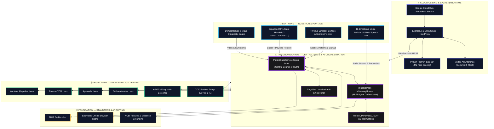

# 🕊️ POCKET GULL
**Aerial Perspective for the Clinical Ocean**

[](file:///c:/Users/philg/Pocketgull/pocketgull/LICENSE)


[](https://securityscorecards.dev/viewer/?uri=github.com/philgear/pocketgull)
[](https://orcid.org/0009-0008-1372-5381)
[](https://doi.org/10.5281/zenodo.20647513)

---

### 🌐 Live Production Application
**[https://pocketgull.app](https://pocketgull.app)** — Deployed on **Google Cloud Run** with Google Vertex AI Enterprise (`gemini-2.5-flash`).

---

## 🎯 VISION & PURPOSE

> *"To provide practitioners with the 'Gull's Eye View'—the ability to rise above the turbulent sea of medical data and see the clear, actionable patterns beneath."*

**Pocket Gull** is a real-time medical Care Plan Strategy and Live AI Consult engine powered by Google Gemini. Designed for clinicians, nurses, and caregivers, it synthesizes multimodal inputs (3D spatial anatomical mapping, voice dictation, and biometric telemetry) into structured, evidence-grounded clinical strategies.

---

## 🛠️ CORE CAPABILITIES & MULTI-PARADIGM LENSES

| Capability / Paradigm | Description & Clinical Utility |
| :--- | :--- |
| 🎙️ **Live Multimodal AI Consult** | Powered by `@google/adk` and Web Speech API. Full-duplex conversational reasoning with barge-in speech interruption and context-aware memory. |
| 📐 **Interactive 3D Spatial Anatomy** | Three.js procedural skeletal and surface modeling with organ target selection, spatial loci memory mapping, and real-time severity particle systems. |
| 🩺 **Western Allopathic Lens** | ICD-10/SNOMED diagnostic summaries, lab workups, monitoring protocols, and PubMed evidence citations. |
| 🌿 **Eastern TCM Lens** | Zang-Fu Qi constriction patterns, tongue/pulse diagnostic matrix, and 3D Acupoint Meridian mapping. |
| 🧘 **Ayurvedic Medicine Lens** | Tridosha (Vata, Pitta, Kapha) balance, Agni assessment, and 3D Sushumna Chakra spatial visualization. |
| 🛡️ **Sentinel Security & Egress Guard** | Shift-left security auditor enforcing authorized clinical network domain whitelists and scanning for Shannon Entropy token leaks. |
| 🔒 **FHIR R4 Bundle Portability** | HIPAA-compatible DOMPurify sanitization and Base64-encoded FHIR R4 Bundle import/export. |
| 🚨 **Emergency Good Samaritan Mode** | Offline override mode featuring a 110 BPM chest-compression metronome, local on-device processing, and EMT QR code serialization. |

---

## 🎨 COGNITIVE HEALTH LITERACY PERSONAS

Users can toggle between 5 distinct cognitive writing styles to align with different patient communication needs:

1. **🔬 Clinical Allopathic**: Formal ICD-10, SNOMED, physiological telemetry, and PubMed trial citations.
2. **🌳 Arborist Redwood**: Translates body systems into dendrochronology, tree ring growth, and sap velocity.
3. **🏎️ Garage Mechanic**: Translates body systems into V8 engine chassis logs, fluid line PSI, and OBD-II DTC codes.
4. **🎩 Extraordinary Gentleman**: Victorian Steampunk expedition memoirs with brass chronometer governors and etheric purity gauges.
5. **✨ Inspirational Muse**: Health history expressed as a 3-movement epic symphony with 528 Hz Solfeggio frequencies.

---

## 📐 ARCHITECTURE & DATA FLOW

Pocket Gull utilizes a hybrid client-server-edge architecture designed for low-latency live consults, privacy-first offline operation, and continuous multi-lens clinical reasoning.


```mermaid
graph TB
    classDef doorway fill:#18181b,stroke:#a855f7,stroke-width:3px,color:#fafafa;
    classDef leftWing fill:#0f172a,stroke:#38bdf8,stroke-width:2px,color:#f8fafc;
    classDef rightWing fill:#0f172a,stroke:#10b981,stroke-width:2px,color:#f8fafc;
    classDef cloudCeiling fill:#0f172a,stroke:#6366f1,stroke-width:2px,color:#f8fafc;
    classDef foundation fill:#0f172a,stroke:#f59e0b,stroke-width:2px,color:#f8fafc;

    subgraph CloudCeiling ["⚡ CLOUD CEILING & BACKEND RUNTIME"]
        CloudRun["Google Cloud Run Serverless Service"]
        ExpressProxy["Express.js SSR & Single-Hop Proxy"]
        FastAPISidecar["Python FastAPI Sidecar (ML Risk Scoring)"]
        VertexAI["Vertex AI Enterprise (Gemini 2.5 Flash)"]
    end

    subgraph LeftWing ["📱 LEFT WING — INGESTION & PORTALS"]
        Body3D["Three.js 3D Body Surface & Skeleton Viewer"]
        VoiceSTT["Bi-Directional Voice Assistant & Web Speech API"]
        URLHandoff["Expanded URL State Handoff (?share=...&mode=...)"]
        IntakeForm["Demographics & Vitals Diagnostic Intake"]
    end

    subgraph DoorwayHub ["🚪 THE DOORWAY HUB — CENTRAL STATE & AI ORCHESTRATION"]
        PatientState["PatientStateService Signal Store\n(Central Source of Truth)"]
        ADKRunner["@google/adk InMemoryRunner\n(Multi-Agent Orchestrator)"]
        WebMCPCatalog["WebMCP Polyfill & JSON-LD Tool Catalog"]
        CognitiveShield["Cognitive Localization & Shield Filter"]
    end

    subgraph RightWing ["🩺 RIGHT WING — MULTI-PARADIGM LENSES"]
        WesternLens["Western Allopathic Lens"]
        TCMLens["Eastern TCM Lens"]
        AyurvedicLens["Ayurvedic Lens"]
        OrthoLens["Orthomolecular Lens"]
        YBOCsLens["Y-BOCs Diagnostic Screener"]
        CDCSentinel["CDC Sentinel Triage (Levels 1–5)"]
    end

    subgraph Foundation ["💾 FOUNDATION — STANDARDS & ARCHIVING"]
        FHIRBundles["FHIR R4 Bundles"]
        IndexedDBCache["Encrypted Offline Browser Cache"]
        PubmedGrounding["NCBI PubMed & Evidence Grounding"]
    end

    CloudRun --> ExpressProxy
    ExpressProxy <--> FastAPISidecar
    ExpressProxy <--> VertexAI

    Body3D -->|Spatio-Anatomical Signals| PatientState
    VoiceSTT -->|Audio Stream & Transcripts| ADKRunner
    URLHandoff -->|Base64 Payload Restore| PatientState
    IntakeForm -->|Vitals & Symptoms| PatientState

    ExpressProxy <-->|WebSocket & REST| DoorwayHub

    PatientState <--> ADKRunner
    ADKRunner <--> WebMCPCatalog
    PatientState <--> CognitiveShield

    DoorwayHub <--> WesternLens
    DoorwayHub <--> TCMLens
    DoorwayHub <--> AyurvedicLens
    DoorwayHub <--> OrthoLens
    DoorwayHub <--> YBOCsLens
    DoorwayHub <--> CDCSentinel

    PatientState --> FHIRBundles
    PatientState --> IndexedDBCache
    ADKRunner --> PubmedGrounding

    class PatientState,ADKRunner,WebMCPCatalog,CognitiveShield doorway;
    class Body3D,VoiceSTT,URLHandoff,IntakeForm leftWing;
    class WesternLens,TCMLens,AyurvedicLens,OrthoLens,YBOCsLens,CDCSentinel rightWing;
    class CloudRun,ExpressProxy,FastAPISidecar,VertexAI cloudCeiling;
    class FHIRBundles,IndexedDBCache,PubmedGrounding foundation;
```

---

## 💻 SYSTEM INTERFACE


---

## ⚡ QUICK START & DEVELOPER GUIDE

### Prerequisites
- **Node.js**: `v24.x` (Strict requirement specified in `.nvmrc`)
- **npm**: `v10.x` or higher

### Local Setup & Spin-Up

```bash
# 1. Clone the repository
git clone https://github.com/philgear/pocketgull.git
cd pocketgull

# 2. Install dependencies
npm install

# 3. Start local development server (Angular UI + Express SSR Proxy)
npm run dev

# 4. Run shift-left security & egress audit
npm run sentinel:audit

# 5. Run Vitest unit tests
npm test
```

### Production Build & Preview

```bash
npm run build
npm run preview
```

---

## 🔒 ETHICS, SAFETY & RESPONSIBLE AI

- **Human-in-the-Loop (HITL)**: Clinicians must review and validate AI-generated treatment options before archiving care plans.
- **Automated Red-Teaming**: Vitest safety suite (`tests/safety.spec.ts`) continuously tests Google Gemini safety thresholds against adversarial prompts.
- **Privacy Core**: Zero unencrypted PII persistence. All patient state is transient or encrypted locally using Google Tink AEAD.
- **Professional Standards Alignment**: Engineered in accordance with the [ACM Code of Ethics](https://www.acm.org/code-of-ethics) and [IEEE Code of Ethics](https://www.ieee.org/about/corporate/governance/p7-8.html).

---

## 📚 DOCUMENTATION PORTAL

Full documentation is available in the [`docs/study/`](file:///c:/Users/philg/Pocketgull/pocketgull/docs/study/) directory:

- **[System Architecture](file:///c:/Users/philg/Pocketgull/pocketgull/docs/study/src/pages/architecture.mdx)** — Complete component breakdown and data flow
- **[Design System & Avian Personas](file:///c:/Users/philg/Pocketgull/pocketgull/DESIGN.md)** — Dieter Rams visual aesthetics and persona specs
- **[Data & Privacy Model](file:///c:/Users/philg/Pocketgull/pocketgull/docs/study/src/pages/data.mdx)** — PHI handling, DOMPurify, and FHIR portability
- **[Responsible AI Guidelines](file:///c:/Users/philg/Pocketgull/pocketgull/docs/study/src/pages/responsible-ai.mdx)** — Ethical AI principles and red-teaming
- **[Contributing Guidelines](file:///c:/Users/philg/Pocketgull/pocketgull/CONTRIBUTING.md)** — Code standards and PR submission process
- **[REST & WebSocket API Reference](file:///c:/Users/philg/Pocketgull/pocketgull/pocketgull_api/openapi.yaml)** — OpenAPI specification

---

## 👨‍💻 MAINTAINER

**Phil Gear** / [g.dev/philgear](https://g.dev/philgear)  
*Engineering with Kaizen — continuous refinement for clinical excellence.*

---

*© 2026 Pocket Gull. Licensed under the [MIT License](file:///c:/Users/philg/Pocketgull/pocketgull/LICENSE).*