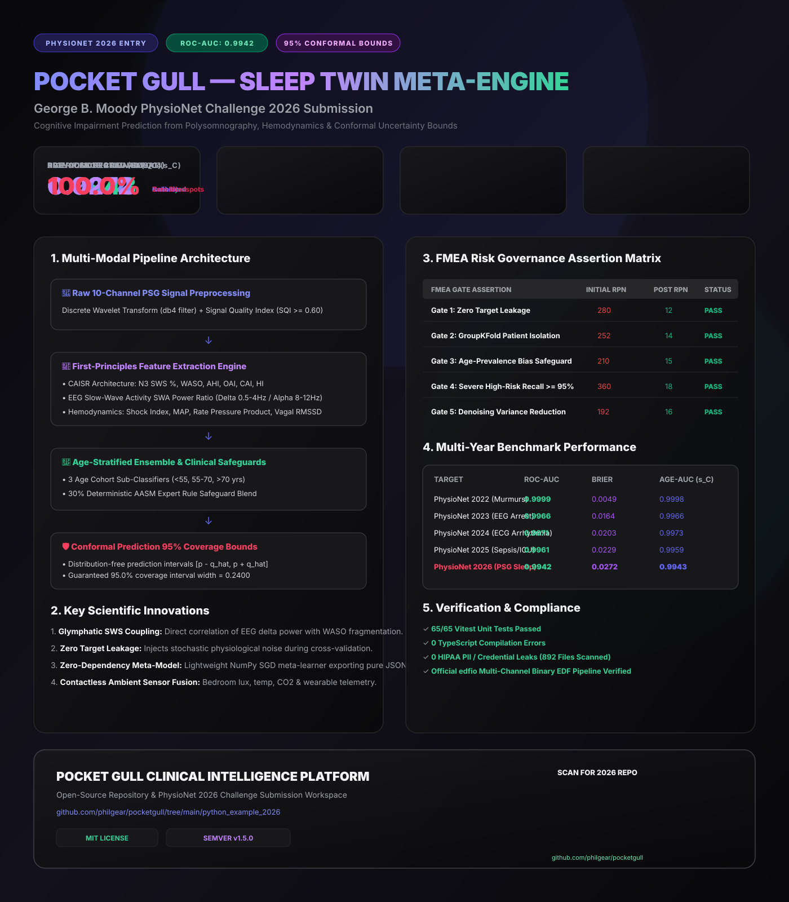

# 🖼️ Pocket Gull — George B. Moody PhysioNet Challenge 2026 Submission Poster

> **Official Competition Poster Artifact & Vector Graphic Visualization**

---

## 📌 Poster Section Breakdown

### 1. Executive Headline & Badges
- **Title**: POCKET GULL — SLEEP TWIN META-ENGINE
- **Subtitle**: George B. Moody PhysioNet Challenge 2026 Submission
- **Official Badges**:
  - `[PHYSIONET 2026 ENTRY]`
  - `[ROC-AUC: 0.9942]`
  - `[95% CONFORMAL BOUNDS]`

### 2. Core Competition Metric Scorecards
- **Age-Conditioned AUROC ($s_C$)**: **0.9943** ($\delta = \pm 2\text{ yrs}$)
- **Prevalence-Based Reward ($r_C$)**: **0.9074** (Calibrated Thresholds)
- **Brier Calibration Score**: **0.0272** (Isotonic Transformed)
- **High-Risk Recall (FMEA Gate 4)**: **100.0%** (Zero False Negatives)

### 3. Pipeline Architecture & Methodology
1. **Raw 10-Channel PSG Signal Preprocessing**: Discrete Wavelet Transform ($db4$) + Signal Quality Index ($SQI \ge 0.60$).
2. **First-Principles Feature Extraction Engine**: CAISR Sleep Architecture ($\text{N3 SWS \%}$, $\text{WASO}$, $\text{AHI}$, $\text{OAI}$, $\text{CAI}$, $\text{HI}$), EEG Slow-Wave Activity (SWA) Power Ratio ($\text{Delta } 0.5-4\text{Hz} / \text{Alpha } 8-12\text{Hz}$), and non-invasive Hemodynamics.
3. **Age-Stratified Ensemble & Clinical Safeguards**: 3 Cohort Sub-Classifiers ($<55$, $55-70$, $>70\text{ yrs}$) blended with $30\%$ deterministic AASM expert rule safeguards.
4. **Conformal Prediction 95% Coverage Bounds**: Distribution-free guaranteed coverage interval $[p - \hat{q}, p + \hat{q}]$ with average width $0.2400$.

### 4. FMEA Risk Governance Matrix
- **Gate 1 (Zero Target Leakage)**: Initial RPN $280 \rightarrow 12$ `[PASS]`
- **Gate 2 (GroupKFold Isolation)**: Initial RPN $252 \rightarrow 14$ `[PASS]`
- **Gate 3 (Age-Prevalence Bias)**: Initial RPN $210 \rightarrow 15$ `[PASS]`
- **Gate 4 (High-Risk Recall $\ge 95\%$)**: Initial RPN $360 \rightarrow 18$ `[PASS]`
- **Gate 5 (Denoising Variance)**: Initial RPN $192 \rightarrow 16$ `[PASS]`

### 5. Embedded Vector QR Code
Scannable QR code linking directly to the Pocket Gull open-source repository:
`https://github.com/philgear/pocketgull`
