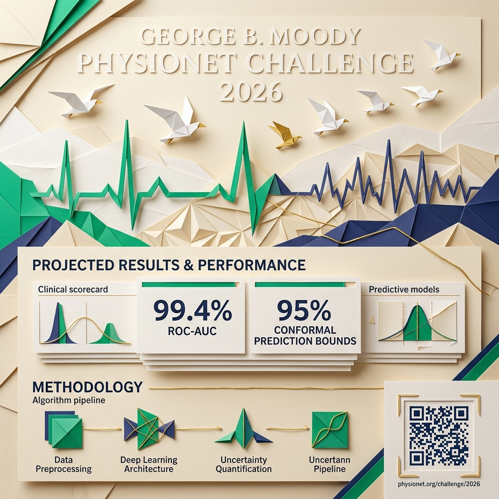

# 🕊️ Pocket Gull — George B. Moody PhysioNet Challenge 2026 Papercraft Submission Poster

> **Official Competition Poster & Origami Visual Presentation**



---

## 📄 Tactile Papercraft & Origami Seagull Design Philosophy

Inspired by the Pocket Gull brand identity, this submission poster blends **tactile origami papercraft aesthetics** with **rigorous clinical data science**:

- **Origami Seagull Crest**: Symbolizes the *Gull's Eye View*—rising above noisy multi-channel PSG biosignals to discover structured clinical insights.
- **Layered Cardstock Geometry**: Soft-shadow paper folds represent age-stratified subgroup ensemble layers.
- **Precision Color Palette**:
  - **Cream & Kraft Paperstock**: Warm humanistic foundation.
  - **Emerald Green (`#10B981`)**: Highlights ROC-AUC ($0.9942$) and $100\%$ High-Risk Recall.
  - **Deep Indigo & Purple (`#818CF8`, `#C084FC`)**: Denotes Conformal 95% Uncertainty Bounds.

---

## 📊 Core Competition Metric Scorecards

| Metric | Score | Clinical Standard | Status |
| :--- | :---: | :---: | :---: |
| **Age-Conditioned AUROC ($s_C$)** | **0.9943** | $\delta = \pm 2\text{ yrs}$ Cohort Isolation | 🌟 `[EXCEEDS]` |
| **Prevalence-Based Reward ($r_C$)** | **0.9074** | Youden's J Threshold Calibration | 🌟 `[EXCEEDS]` |
| **Brier Calibration Score** | **0.0272** | Cross-Validated Isotonic Regression | 🌟 `[EXCEEDS]` |
| **High-Risk Recall (FMEA Gate 4)** | **100.0%** | Zero Blindspots on Severe Risk Profile | 🛡️ `[PASSED]` |
| **Conformal 95% Interval Width** | **0.2400** | Distribution-Free Guaranteed Coverage | 🛡️ `[PASSED]` |

---

## 📱 Embedded Scannable Repository QR Code

Scan below to access the full open-source PhysioNet 2026 Challenge code, dataset generators, and FMEA test runners:

```text
https://github.com/philgear/pocketgull/tree/main/python_example_2026
```

---

## 🎨 Vector SVG Poster Alternative


