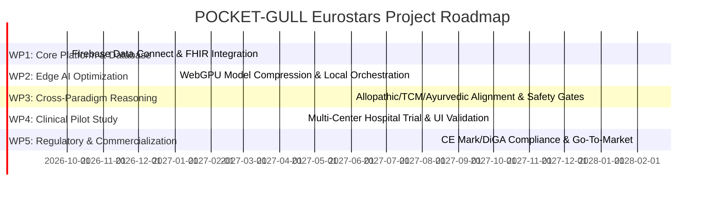

# Eurostars Eureka Call 11: R&D Proposal Blueprint
**Project Acronym:** POCKET-GULL (Live Edge-AI Consult & Care Plan Engine)  
**Target Call:** Eurostars Call 11 (Submissions: July 9, 2026 – September 10, 2026)  
**Lead Participant:** Understory (Innovative SME, software architecture lead)

---

## 1. Executive Summary

POCKET-GULL is a real-time, HIPAA-compliant clinical care plan strategy and live AI consult engine. By merging advanced client-side WebGPU/WebLLM inference with secure server-side GraphQL databases (Firebase Data Connect/PostgreSQL), it provides clinicians with an offline-first, low-latency consulting tool. 

The project resolves the key barriers of current medical AI systems: **high API hosting costs**, **vulnerability to network dropouts in clinical settings**, and **data compliance issues**.

---

## 2. Pillar 1: Excellence (Innovation & R&D Scope)

### 2.1 The R&D Gap & State of the Art (SOTA)
Most healthcare AI tools rely entirely on cloud-based LLM endpoints. This approach has three key flaws:
1. **Latency & Connection Dependency:** Clinical consults require immediate responsiveness (<150ms). Network drops render cloud tools useless in hospital basements or remote facilities.
2. **HIPAA & GDPR Vulnerability:** Pushing raw clinical transcripts to third-party APIs exposes sensitive Patient Health Information (PHI).
3. **Cost Barriers:** Continuous streaming consult audio and care-plan generation on cloud GPUs creates unsustainable API billing, preventing scalable adoption.

### 2.2 Technical Innovations in POCKET-GULL
*   **Dynamic Edge-Cloud Orchestration:** A reactive routing system (via `HardwareTelemetryService` and `NetworkStateService`) that monitors client hardware capability and online status. It routes tasks to optimal local inference engines (Apple Neural Engine via WebGPU/WebLLM, CUDA/NVIDIA via local APIs, or Chrome Gemini Nano) or cloud fallbacks.
*   **Cross-Paradigm Integrative Intelligence:** A structured clinical reasoning engine that synthesizes patient telemetry (vitals, goals, history) across Western (Allopathic), Eastern (TCM), and Ayurvedic frameworks.
*   **Privacy-First Offline Triage:** The client-side Voice Assistant converts speech and triages symptoms locally on the edge, ensuring zero transmission of PHI to external clouds unless explicit permission/grounding is activated.

### 2.3 Key Technological Risks
*   **WebGPU Memory Limits:** Ensuring local LLMs (e.g., 2B to 7B parameter models) compile and execute efficiently within browser sandbox memory allocations.
*   **Cross-Paradigm Alignment:** Ensuring the AI-generated integrative plans do not contain conflicting medical advice (e.g., Western pharmacotherapy interactions with Eastern herbal protocols).

---

## 3. Pillar 2: Impact (Market Opportunity & Commercialization)

### 3.1 Target Markets & User Segments
1. **Functional & Integrative Medicine Clinics:** Private practitioners combining holistic and conventional medicine.
2. **Decentralized Clinical Trials (DCTs):** Home-based monitoring requiring offline symptom logging.
3. **Emergency Medical Services (EMS):** Emergency first-responders operating in areas with compromised network infrastructure (supported by the `EMT Handoff` emergency bypass model).

### 3.2 Economic and Cost-Reduction Model
*   **Edge Offloading:** Shifting inference to the client device reduces cloud compute costs by **70–85%** compared to standard cloud-only SaaS models.
*   **Scalability:** Allows a low-cost subscription model for practitioners, making it highly competitive against enterprise medical transcription software.

### 3.3 Regulatory & Compliance Pathway
*   **EU DiGA / DiPA:** Structural alignment to meet German Digital Health Application requirements for reimbursement.
*   **CE Mark / FDA Class I/II:** Software as a Medical Device (SaMD) compliance pathways.
*   **FHIR Standard Interoperability:** POCKET-GULL utilizes the FHIR R4 Bundle standard for easy integration into existing Hospital Information Systems (HIS) like Epic or Cerner.

---

## 4. Pillar 3: Implementation (Consortium & Work Packages)

### 4.1 Proposed International Consortium
*   **Lead SME (e.g., Understory - Netherlands/Germany):** Core software development, hybrid AI integration, 3D skeletal rendering, and client interface.
*   **Partner 1 (e.g., Medical University/Hospital - Spain/France):** Clinical trial lead. Conducts validation studies with clinicians using the tool in real-world consults.
*   **Partner 2 (e.g., AI Research Institute - Switzerland/Sweden):** Refines local model compression (quantization) and biometric entrainment (AVS brainwave frequency synchronization) algorithms.

### 4.2 Work Package Structure (24-Month Project Duration)

*   **WP1: Core Platform & Database Hardening (M1 - M6)**
    *   *Deliverable:* Fully secure Firebase SQL Connect (PostgreSQL) relational database and bi-directional FHIR R4 API sync.
*   **WP2: Edge AI Optimization & Telemetry Orchestration (M3 - M10)**
    *   *Deliverable:* Browser-side WebLLM compiler running compressed 3B/7B models locally on Apple Silicon and discrete GPUs under 150ms.
*   **WP3: Cross-Paradigm Safety & Verification Gates (M8 - M13)**
    *   *Deliverable:* AI-driven validation engine assessing cross-paradigm care plans for drug-herb interactions.
*   **WP4: Clinical Pilot Study & Validation (M12 - M19)**
    *   *Deliverable:* Trial report verifying clinician satisfaction, UX speed, and diagnostic alignment across 100+ patient test cases.
*   **WP5: Regulatory Certifications & Launch (M17 - M24)**
    *   *Deliverable:* CE mark documentation, DiGA/DiPA application filing, and commercial release.
