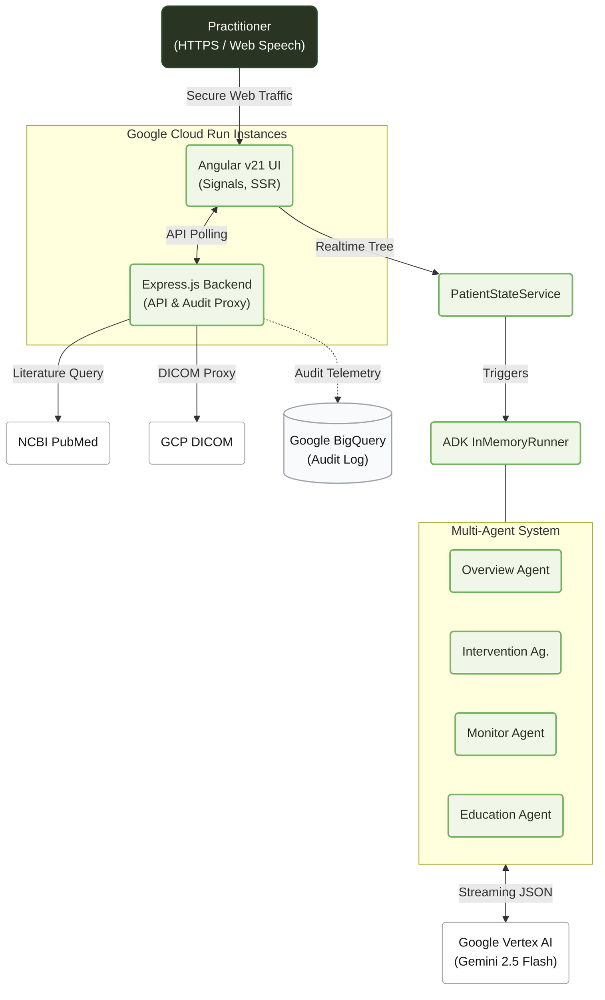

import DocNode from '../components/DocNode.astro';

# Architecture

Pocket Gull leverages a modern, reactive architecture utilizing <DocNode term="Angular Signals" category="Google · Angular Team" hint="Reactive state primitives introduced in Angular v16+, replacing zone.js." link="https://angular.dev/guide/signals" linkLabel="angular.dev →" icon="https://angular.dev/favicon.ico">Angular Signals</DocNode>, <DocNode term="Google Cloud Run" category="Google Cloud" hint="Fully managed serverless container platform." link="https://cloud.google.com/run/docs" linkLabel="cloud.google.com →" icon="https://www.gstatic.com/devrel-devsite/prod/v0e0f589edd85502a40d78d7d0825db8ea5ef3b99ab4070381571c97ab7df9861/cloud/images/favicons/onecloud/favicon.ico">Cloud Run</DocNode> orchestration, Express.js Middleware, and the <DocNode term="Google GenAI SDK" category="Google DeepMind" hint="Client-side JavaScript SDK for accessing Gemini models." link="https://ai.google.dev/gemini-api/docs" linkLabel="ai.google.dev →" icon="https://ai.google.dev/favicon.ico">Google GenAI API</DocNode> stack.

---

## System Diagram

The architecture is divided into three primary layers: the Angular frontend, the Express.js proxy backend, and the external intelligence services.

---

## Data Flow

1. **Input & Environment** — The Node backend natively auto-loads `.env` configuration on boot to establish the GCP project, dataset, and DICOM store mappings. Clinicians input data interactively via Three.js body maps or dictate notes via the <DocNode term="Web Speech API" category="W3C · Web Platform" hint="W3C standard browser API for speech recognition." link="https://developer.mozilla.org/en-US/docs/Web/API/Web_Speech_API" linkLabel="MDN Reference →" icon="https://developer.mozilla.org/favicon-48x48.png">Web Speech API</DocNode>.
2. **State Management** — All updates synchronously update the highly-reactive `PatientStateService` powered completely by <DocNode term="Angular Signals" category="Google · Angular Team" hint="Fine-grained reactive primitives." link="https://angular.dev/guide/signals" linkLabel="angular.dev →" icon="https://angular.dev/favicon.ico">Angular Signals</DocNode> (`signal()`, `computed()`).
3. **Telemetry & Proxies** — The UI aggressively polls system stats (like using `nvidia-smi` for GPU VRAM availability) and fetches external diagnostic studies over DICOM via proxy endpoints hosted on the Express backend (`/api/system/stats`, `/api/dicom/studies`) to avoid CORS limitations.
5. **Streaming Synthesis** — Recommendations are streamed from <DocNode term="Vertex AI" category="Google Cloud" hint="Enterprise-grade AI platform. Ensures data residency and HIPAA compliance." link="https://cloud.google.com/vertex-ai" linkLabel="Vertex API →" icon="https://www.gstatic.com/devrel-devsite/prod/v0e0f589edd85502a40d78d7d0825db8ea5ef3b99ab4070381571c97ab7df9861/cloud/images/favicons/onecloud/favicon.ico">`Google Vertex AI`</DocNode> iteratively, updating the signal tree incrementally.
6. **Immutable Auditing** — Clinical actions (like generating a report or initiating an AI chat) trigger asynchronous background telemetry which is streamed into <DocNode term="GCP BigQuery" category="Google Cloud" hint="Serverless, highly scalable enterprise data warehouse. Used for immutable clinical audit trails." link="https://cloud.google.com/bigquery/docs" linkLabel="BigQuery Docs →" icon="https://www.gstatic.com/devrel-devsite/prod/v0e0f589edd85502a40d78d7d0825db8ea5ef3b99ab4070381571c97ab7df9861/cloud/images/favicons/onecloud/favicon.ico">`Google Cloud BigQuery`</DocNode> for compliance logging.
6. **Persistence & Export** — Approved reports are synced locally via Base64-encoded `FHIR R4 Bundles` JSON payloads, while users can generate visual Cognitive Localized PDF snapshots.

### Hybrid AI Orchestration (PubGemma Integration)

While the default agent topology safely operates on Google's cloud-based Gemini Flash API, the architecture structurally accommodates **Local Open-Weights Inference**. By invoking the `PubGemmaProvider` and pointing it to local isolated containers via `docker-compose.yml`, specific synthesis tasks can be reliably routed directly to local `PubGemma` inference to satisfy absolute Zero-PII offline processing requirements.

---

## Technology Stack

| Layer | System / Technology | Purpose |
|---|---|---|
| **Framework** | <DocNode term="Angular v21" category="Google · Angular Team" hint="Component-based UI framework." link="https://angular.dev" linkLabel="angular.dev →" icon="https://angular.dev/favicon.ico">Angular v21</DocNode> (Zoneless) + Server-Side Rendering (SSR) | Complete frontend control |
| **Backend** | <DocNode term="Express.js" category="OpenJS Foundation" hint="Minimalist Node framework." link="https://expressjs.com/" linkLabel="expressjs.com →" icon="https://expressjs.com/images/favicon.png">Express.js</DocNode>  | Static proxy, `.env` file hydration, REST API |
| **Styles** | <DocNode term="Tailwind CSS" category="Tailwind Labs (Adam Wathan)" hint="Utility-first styling framework." link="https://tailwindcss.com" linkLabel="tailwindcss.com →" icon="https://tailwindcss.com/favicons/favicon.ico">Tailwind CSS</DocNode> | Utility-driven UI composition |
| **3D Engine** | <DocNode term="Three.js" category="Ricardo Cabello (mrdoob)" hint="WebGL library for in-browser 3D." link="https://threejs.org/docs/" linkLabel="threejs.org →" icon="https://threejs.org/favicon.ico">Three.js v0.183</DocNode> | Anatomical point-and-click surface models |
| **Orchestration** | <DocNode term="@google/adk" category="Google" hint="Multi-agent orchestration." link="https://google.github.io/adk-docs/" linkLabel="ADK Docs →" icon="https://ai.google.dev/favicon.ico">`@google/adk`</DocNode> + <DocNode term="Genkit" category="Google" hint="GenAI SDK abstractions." link="https://firebase.google.com/docs/genkit" linkLabel="Genkit →" icon="https://ai.google.dev/favicon.ico">Genkit</DocNode> | Memory-persisted multi-agent reasoning loops |
| **Enterprise AI** | <DocNode term="Vertex AI" category="Google Cloud" hint="Enterprise-grade AI platform. Ensures data residency and HIPAA compliance." link="https://cloud.google.com/vertex-ai" linkLabel="Vertex API →" icon="https://www.gstatic.com/devrel-devsite/prod/v0e0f589edd85502a40d78d7d0825db8ea5ef3b99ab4070381571c97ab7df9861/cloud/images/favicons/onecloud/favicon.ico">Google Vertex AI</DocNode> | HIPAA-compliant LLM inference backend |
| **Auditing & DB** | <DocNode term="BigQuery" category="Google Cloud" hint="Fully managed, serverless enterprise data warehouse." link="https://cloud.google.com/bigquery" linkLabel="BigQuery →" icon="https://www.gstatic.com/devrel-devsite/prod/v0e0f589edd85502a40d78d7d0825db8ea5ef3b99ab4070381571c97ab7df9861/cloud/images/favicons/onecloud/favicon.ico">Google Cloud BigQuery</DocNode> | Immutable centralized clinical audit logging |
| **Ext. Research** | <DocNode term="Google CSE" category="Google" hint="Programmable Search." link="https://programmablesearchengine.google.com/" linkLabel="CSE Console →" icon="https://www.google.com/favicon.ico">Google Search</DocNode> & <DocNode term="NCBI PubMed" category="NIH" hint="Biomedical literature catalog." link="https://pubmed.ncbi.nlm.nih.gov/" linkLabel="PubMed →" icon="https://www.ncbi.nlm.nih.gov/favicon.ico">NCBI PubMed XML</DocNode> | Real-time differential diagnosis queries |
| **Healthcare** | <DocNode term="Google Cloud Healthcare" category="Google Cloud" hint="DICOM imagery storage endpoints." link="https://cloud.google.com/healthcare-api/docs/" linkLabel="Healthcare API →" icon="https://www.gstatic.com/devrel-devsite/prod/v0e0f589edd85502a40d78d7d0825db8ea5ef3b99ab4070381571c97ab7df9861/cloud/images/favicons/onecloud/favicon.ico">GCP DICOM Stores</DocNode> | Secure acquisition of external radiological studies |
| **Export** | <DocNode term="jsPDF" category="Parallax" hint="PDF compilation toolkit." link="https://github.com/parallax/jsPDF" linkLabel="jsPDF Github →" icon="https://github.com/favicon.ico">jsPDF</DocNode> | Patient-friendly Cognitive Typography exports |
| **Deploy** | <DocNode term="Cloud Run" category="Google Cloud" hint="Serverless containers." link="https://cloud.google.com/run" linkLabel="Cloud Run Docs →" icon="https://www.gstatic.com/devrel-devsite/prod/v0e0f589edd85502a40d78d7d0825db8ea5ef3b99ab4070381571c97ab7df9861/cloud/images/favicons/onecloud/favicon.ico">Google Cloud Run</DocNode> | Scalable zero-maintenance hosting |

---

## Active Backend Routes (`server.ts / server.js`)

| Endpoints | Responsibility |
|---|---|
| `/api/system/stats` | Asynchronously executes `nvidia-smi` and queries OS to return RAM, CPU, and GPU properties for the live telemetry UI grid. |
| `/api/dicom/studies` | Reads populated `.env` GCP credentials to query healthcare datasets securely without leaking project IDs to the client. |
| `/api/pubmed` | Executes robust HTTP GET calls to NIH's E-utilities and transpiles the complex XML response into manageable JSON entries. |
| `/api/audit` | Proxies clinical telemetry from the `AuditService` directly into BigQuery `pocket_gull_clinical.patient_records` for compliance. |
