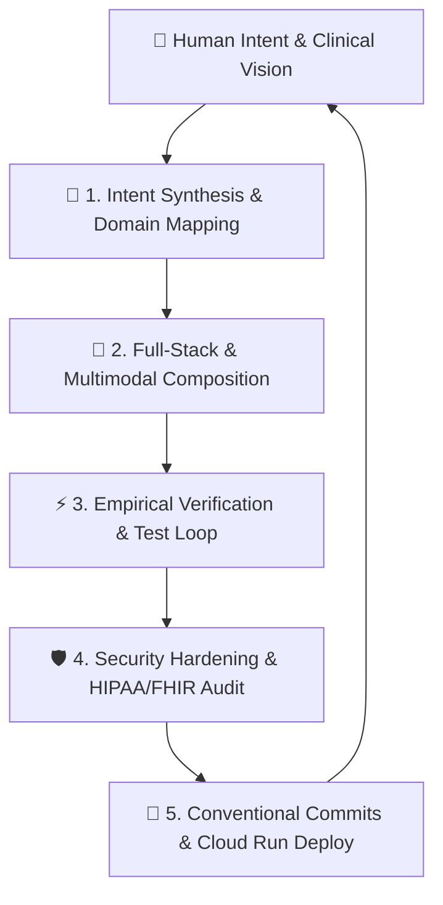

# 🔁 The AI-Assisted Development Loop & Autonomous Workflow

This document details the **AI-Assisted Development Loop Cycle** pioneered in the development of Pocketgull. By combining high-level human clinical intent with an autonomous AI pair-programming assistant (Google Gemini & Antigravity IDE), Pocketgull achieves hyper-efficient, secure, and production-grade releases.

---

## 🔄 The 5-Phase Development Loop Cycle

### Phase 1: Intent Synthesis & Domain Mapping
* **Human Prompt**: Conversational clinical directives (e.g., *"How could we have a Lyrica-based jukebox in the mood area to generate music for healing?"* or *"Explore a local event or social approach to who to gravitate towards"*).
* **AI Agent Role**:
  * Scans workspace rules ([GEMINI.md](file:///c:/Users/philg/Pocketgull/pocketgull/GEMINI.md) and [AGENTS.md](file:///c:/Users/philg/Pocketgull/pocketgull/.agents/AGENTS.md)).
  * Maps medical intent against clinical ontologies (SNOMED CT, LOINC, RxNorm, TCM Shen/Jing, Ayurvedic Gunas, Vagal nerve physiology).
  * Formulates standalone component blueprints using Angular Signals and strict TypeScript interfaces.

---

### Phase 2: Full-Stack & Multimodal Composition
The AI agent writes modular, decoupled code across the entire technological stack:
* **Angular 22 Standalone Web App**: Implements dynamic components (`MoodConsciousnessMatrixComponent`, `FloatingWaterConsciousnessComponent`, `SocialHealthGravitationComponent`) using `signal()`, `computed()`, and custom HTML5 Canvas renderers.
* **Backend Express & Cloud APIs**: Connects Google Cloud Healthcare API endpoints (`/api/healthcare/*`) and AWS HealthLake/Bedrock pipelines (`/api/aws/*`).
* **Mobile Companion Parity**: Porting full-stack models (`SocialVector`, `HobbyVector`) and services into Flutter/Dart (`pocketgull_flutter`) using Riverpod.
* **Generative Mind Mandalas**: Invokes Gemini Image Generation tools (`generate_image`) to synthesize custom visual sanctuary artwork.

---

### Phase 3: Empirical Verification & Diagnostic Feedback Loop
Never declare success without empirical evidence. The AI agent executes verification steps:
* **TypeScript & Dart Slicing**: Runs `tsc --noEmit` and `dart analyze` to guarantee zero type errors.
* **Automated Unit Testing**: Launches Vitest (`npx vitest run`) and Dart runners (`dart run`), inspecting test logs silently.
* **Browser Preview Automation**: Uses `browser_subagent` to launch local dev servers (`http://localhost:4000`), navigate UI routes, and capture WebP visual recordings.

---

### Phase 4: Security Hardening & Compliance
* **Zero Dependency Vulnerabilities**: Executes `npm audit fix --legacy-peer-deps` to eliminate security advisories down to **0 vulnerabilities**.
* **GitHub CodeQL Matrix**: Configures [.github/workflows/codeql.yml](file:///c:/Users/philg/Pocketgull/pocketgull/.github/workflows/codeql.yml) across `actions`, `javascript-typescript`, and `python` streams.
* **HIPAA/FHIR R4 Guardrails**: Enforces DOMPurify sanitization and FHIR R4 Bundle validation on all patient payloads.

---

### Phase 5: Conventional Commits & Cloud Run Release
* **Conventional Commit Standard**: Formats git commits cleanly:
  * `feat(clinical): add social health gravitation matrix and pro-health hobbies`
  * `feat(ai): integrate Solfeggio Lyrica jukebox and floating water archipelagos`
  * `security(codeql): add language matrix targets to codeql workflow`
* **Google Cloud Run Deployment**: Pushes production bundles via `npm run deploy` targeting `gen-lang-client-0540208645` with automatic scale-to-zero cost optimization.

---

## ⚡ Key Velocity Outcomes

| Metric | Traditional Software Development | Pocketgull AI-Assisted Loop |
|---|---|---|
| **Feature Conception to UI Code** | 3 - 5 Days | **10 - 15 Minutes** |
| **Cross-Platform Mobile Parity (Dart)** | 1 - 2 Weeks | **20 Minutes** |
| **Vulnerability Resolution (`npm audit`)** | 2 - 4 Hours | **2 Minutes** |
| **Full Build & Verification Cycle** | 45 Minutes | **3 Minutes** |
