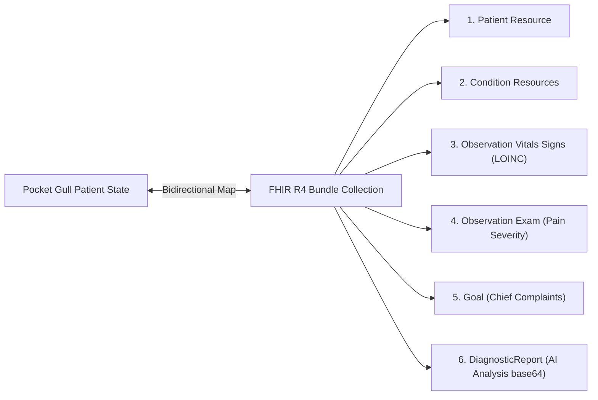

import DocNode from '../components/DocNode.astro';

# Clinical Paradigms & FHIR Integration

Pocket Gull bridges the gap between conventional medicine, traditional paradigms, and modern medical data interchange. It translates structured patient context dynamically across healthcare standards and holistic frameworks.

---

## 🌐 1. HL7 FHIR R4 Bundle Conversion

The bi-directional clinical data mapper in <DocNode term="ExportService" category="Web Client" hint="Generates PDF print templates and exports/imports compliant HL7 FHIR R4 Bundles." link="file:///c:/Users/philg/Pocketgull/pg2/pocketgull/src/services/export.service.ts" linkLabel="export.service.ts →" icon="https://angular.dev/favicon.ico">`ExportService`</DocNode> translates the transient patient profile into a standard FHIR R4 Bundle Collection:

### Resource Schema Mapping

1. **Patient Resource**: Demographics (`name`, `gender`) are matched. Patient age is calculated dynamically back to an estimated `birthDate` format.
2. **Conditions**: Preexisting conditions are mapped to standard `Condition` resources with an `active` status code.
3. **LOINC Vitals (Observations)**: Patient vitals are categorized under the standard FHIR `vital-signs` category and mapped directly to global LOINC codes:
   - **Blood Pressure**: LOINC `85354-9`
   - **Heart Rate**: LOINC `8867-4`
   - **Body Temperature**: LOINC `8310-5`
   - **Oxygen Saturation**: LOINC `2708-6`
   - **Body Weight**: LOINC `29463-7`
   - **Body Height**: LOINC `8302-2`
4. **Anatomical Exam (Observations)**: Physical issues located on the 3D model are exported as `exam` Observations. They contain a custom extension mapping the visual pain level scale (`http://pocketgull.app/fhir/StructureDefinition/pain-level`).
5. **DiagnosticReport (AI Analysis)**: Stored AI Care Plans are exported as a base64-encoded attachment under standard LOINC `11506-3` (*Progress Note*).

---

## ☯️ 2. Holistic Clinical Paradigms

When a clinician toggles the paradigm selectors, the system instructions in <DocNode term="ClinicalIntelligenceService" category="Services" hint="Configures ADK runner, system instructions, and handles AI completions." link="file:///c:/Users/philg/Pocketgull/pg2/pocketgull/src/services/clinical-intelligence.service.ts" linkLabel="clinical-intelligence.service.ts →" icon="https://angular.dev/favicon.ico">`ClinicalIntelligenceService`</DocNode> instruct the Google Gemini models to synthesize the patient's biochemical markers and vitals into distinct clinical frameworks:

### 🟢 Eastern (Traditional Chinese Medicine) Mode
* **Diagnostic Lenses**: Evaluates Zang-Fu organ systems disharmonies, Yin/Yang balance, Qi dynamics, and blood stagnation (e.g., Qi Stasis in the Liver).
* **Interventions**: Suggests acupoints, meridian channels, moxibustion guidelines, and thermal-energetic dietary adjustments (warming vs. cooling foods).
* **Biomarker-to-Meridian Bridge**: Directs the AI to translate and map modern Western lab values directly to TCM pathways:
  - **Zinc** $\rightarrow$ mapped to **Kidney Essence (Jing)** regulation.
  - **Magnesium** $\rightarrow$ mapped to **Heart/Liver Qi flow** regulation.
  - **Vitamin D3** $\rightarrow$ mapped to **Yang Vitality** stimulation.
  - **B12 / Iron** $\rightarrow$ mapped to **Spleen Blood generation**.

### 🟡 Ayurvedic Medicine Mode
* **Diagnostic Lenses**: Evaluates Tridosha imbalances (Vata, Pitta, Kapha), metabolic fire (**Agni**), undigested metabolic toxicity (**Ama**), core vitality (**Ojas**), and attributes (**Gunas**).
* **Channel & Tissue Penetration**: Assesses system blockages within the bodily channels (**Srotas**, such as *Asthivaha* and *Majjavaha*) and tissue layers (**Dhatus**, including *Asthi* and *Majja*).
* **Reactive Clinical Triage Logic**: Automatically maps clinical status updates (vitals, symptoms, goals) to energetic imbalances:
  - **Vata (Ruksha/Sheeta Gunas)**: Triggered by neurological symptoms, radiculopathy, pain, and irregular heart rates.
  - **Pitta (Ushna/Tikshna Gunas)**: Triggered by fever, inflammatory markers, and hypertension.
  - **Kapha (Guru/Manda Gunas)**: Triggered by sluggishness or congestion.
* **Interventions**: Integrates customized *Dinacharya* (daily circadian regimens like *Gandusha* oil pulling, *Nasya* drops, and *Abhyanga* warm massage), local therapies (such as *Kati Basti* oil pooling), spice energetics, and alternate nostril breathing (*Nadi Shodhana*).
* **Biomarker-to-Dhatu Bridge**: Maps micronutrients to the seven traditional bodily tissues (**Dhatus**) and core vitality (**Ojas**):
  - **Calcium / Vitamin D3** $\rightarrow$ mapped to **Asthi Dhatu** (bone/cartilage tissue) and *Asthivaha Srotas*.
  - **Iron / B12** $\rightarrow$ mapped to **Rakta Dhatu** (blood tissue) and *Raktavaha Srotas*.
  - **Zinc / Magnesium** $\rightarrow$ mapped to **Majja Dhatu** (nervous tissue) and *Majjavaha Srotas*.
  - **Antioxidant capacity** $\rightarrow$ mapped to **Ojas replenishment** and *Manovaha Srotas* (mind channel).

---

## 🏛️ 3. Secular Longevity (Grow Thy Self) Mode

This mode is designed for preventive wellness and longevity, focusing on cellular optimization and Linus Pauling orthomolecular principles.

### Cellular Optimization
Focuses on mitochondrial health, cortisol dynamics, autonomic nervous system balance, sleep architecture, and evolutionary stress resilience (Cell Danger Response, calorie restriction mimetics, hormesis).

### Secular Integration Translator
Pocket Gull actively strips theological or dogmatic language from clinical findings, translating ancient world frameworks into physiological and psychological domains:
- **Enso (Zen)** $\rightarrow$ Translates to somatic mindfulness and psychological self-compassion for chronic conditions.
- **Golden Mean (Aristotle)** $\rightarrow$ Translates to moderation in diet/biohacking, preventing toxic over-supplementation.
- **Hygge (Danish)** $\rightarrow$ Translates to down-regulating the sympathetic nervous system via cozy rest spaces.
- **Ikigai (Japanese)** $\rightarrow$ Translates to long-term physical activation, cognitive engagement, and sense of purpose.
- **Mizan (Islamic)** $\rightarrow$ Translates to systemic bodily homeostasis and clean, wholesome (Tayyib) nutrition.
- **Ubuntu (African)** $\rightarrow$ Translates to family co-regulation and communal support circles to lower isolation stress.
- **Tikkun Olam (Jewish)** $\rightarrow$ Translates to personal physical healing as a prerequisite for community service.

---

## 🎨 4. Aesthetic Design & Theme Tokens

The application's **Industrial Grace** design language uses distinct color accents and typography to represent each clinical paradigm. When a paradigm is toggled, it dynamically transforms the color palette, visual hierarchy, and borders of active cards and status components.

These same themes can be toggled dynamically at the top right of this documentation page:

### 🔵 Western (Allopathic) Theme / Sky Accent
* **Theme class**: `theme-western`
* **Accents**: Sky Blue (`sky-50/40`, `sky-200/60`, `sky-950/10`, `sky-900/30`, `sky-400`, `sky-500`, `sky-700`)
* **Design Philosophy**: Denotes crisp, clear, clinical efficiency and standard allopathic evidence. It uses a high-contrast layout to focus on modern lab biomarkers and standard vital metrics.

### 🟢 Eastern (TCM) Theme / Emerald Accent
* **Theme class**: `theme-eastern`
* **Accents**: Emerald Green (`emerald-600`, `emerald-500`, `emerald-400`, etc.)
* **Design Philosophy**: Emphasizes balance, herbal growth, and natural Qi meridian channels. The softer organic green borders reduce clinician fatigue and visually signal holistic/systemic harmony.

### 🟡 Ayurvedic Theme / Amber Accent
* **Theme class**: `theme-ayurvedic`
* **Accents**: Amber/Orange (`amber-950/20`, `amber-900/30`, `amber-500`, `amber-400`, `amber-300/80`)
* **Design Philosophy**: Represents metabolic fire (Agni), vitality (Ojas), and traditional warm herbs/spices. The warm background gradients create a welcoming, ancient-world grounding element.

### 🔘 Secular Longevity Theme / Zinc Accent
* **Theme class**: `theme-longevity`
* **Accents**: Neutral Slate/Zinc (`zinc-800`, `zinc-700`, `zinc-500`, `zinc-400`, etc.)
* **Design Philosophy**: A minimalist, high-contrast monochrome design focus. Designed for data-heavy preventive wellness and cellular optimization analysis without extraneous color distractions.

