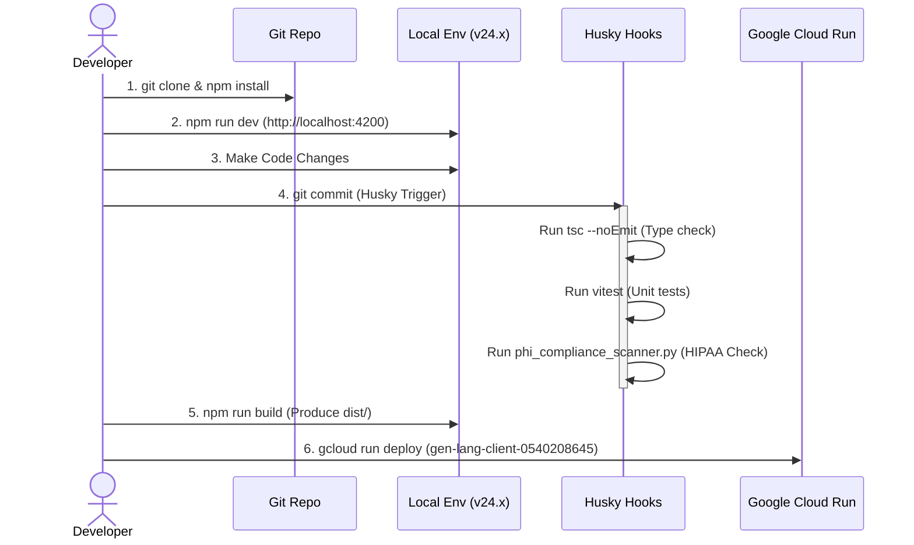

import DocNode from '../components/DocNode.astro';

# Getting Started

**Developer Profile:** [g.dev/philgear](https://g.dev/philgear)
**Repository:** [github.com/philgear/pocketgull](https://github.com/philgear/pocketgull)

---

## Prerequisites

- <DocNode term="Node.js" category="OpenJS Foundation" hint="JavaScript runtime built on Chrome's V8 engine. Originally created by Ryan Dahl in 2009. Pocket Gull requires v20+." link="https://nodejs.org/en/docs" linkLabel="nodejs.org →" icon="https://nodejs.org/favicon.ico">Node.js</DocNode> ≥ 20.0.0
- npm
- A <DocNode term="Gemini API Key" category="Google DeepMind" hint="Personal API key from Google AI Studio. Used for local development. In production, Vertex AI Enterprise via Application Default Credentials is used instead." link="https://aistudio.google.com/apikey" linkLabel="Get API Key →" icon="https://ai.google.dev/favicon.ico">Gemini API key</DocNode> for local development — **or** <DocNode term="Google Cloud ADC" category="Google Cloud" hint="Application Default Credentials. In production and Cloud Run, Pocket Gull authenticates to Vertex AI Enterprise automatically via ADC — no API key required." link="https://cloud.google.com/docs/authentication/application-default-credentials" linkLabel="ADC Docs →" icon="https://www.gstatic.com/devrel-devsite/prod/v0e0f589edd85502a40d78d7d0825db8ea5ef3b99ab4070381571c97ab7df9861/cloud/images/favicons/onecloud/favicon.ico">Google Cloud ADC</DocNode> for production/Cloud Run

---

## Installation

```bash
# Clone the repository
git clone https://github.com/philgear/pocketgull.git
cd pocketgull
# Install dependencies
npm install
```

---

## Development

```bash
# Start the development server
npm run dev
```

The application will be available at `http://localhost:4200`. Enter your Gemini API key on the splash screen, or press **Try Demo** to load a pre-sampled patient with example AI analysis outputs.

---

## Production Build

```bash
# Build for production
npm run build

# Preview the production build locally
npm run preview
```

The production build outputs to `dist/` with full <DocNode term="Angular SSR" category="Google · Angular Team" hint="Server-Side Rendering — Angular renders the initial page on the Express.js server, then hydrates client-side. Faster first paint and SEO." link="https://angular.dev/guide/ssr" linkLabel="SSR Guide →" icon="https://angular.dev/favicon.ico">SSR</DocNode> support.



---

## Running Security & Safety Tests

Pocket Gull implements a "Shift-Left" security verification sequence to ensure de-identification and credential safety before code is staged or committed:

### 1. HIPAA PII & Secrets Compliance Scan
The repository includes an automated Python script to scan the workspace for accidental patient PII (such as Social Security Numbers, phone numbers, and zip codes in text/log files), raw credentials (like Google AI keys), and validates JSON patient data structures:
```bash
python3 scripts/phi_compliance_scanner.py
```

### 2. Responsible AI Safety Tests
To run the adversarial safety red-teaming checks locally:
```bash
# 1. Start the local Express server in one terminal
export SKIP_HEALTHCARE_PROVISION=true
node dist/server/server.mjs

# 2. Run the Vitest safety tests in another terminal window
export TEST_API_URL=http://localhost:4000/api/ai/stream
export GEMINI_API_KEY=your_key_here
npx vitest run tests/safety.spec.ts
```

---

## Deployment

Pocket Gull is architecturally designed to deploy to <DocNode term="Google Cloud Run" category="Google Cloud" hint="Fully managed serverless container platform. Auto-scales from zero. Pocket Gull deploys as a Docker container with Express.js + Angular SSR." link="https://cloud.google.com/run/docs" linkLabel="Cloud Run Docs →" icon="https://www.gstatic.com/devrel-devsite/prod/v0e0f589edd85502a40d78d7d0825db8ea5ef3b99ab4070381571c97ab7df9861/cloud/images/favicons/onecloud/favicon.ico">**Google Cloud Run**</DocNode>.

### Live Deployment

- **Primary URL:** [pocketgull.app](https://pocketgull.app)
- **Cloud Run URL:** [pocket-gull-no4o7fq6xa-uw.a.run.app](https://pocket-gull-no4o7fq6xa-uw.a.run.app)

### Automated Deployment

A single npm script builds, containerises, and deploys to Cloud Run:

```bash
npm run deploy
```

This runs `npm run build` followed by `gcloud run deploy` targeting the `gen-lang-client-0540208645` project in `us-west1`. The container authenticates to Vertex AI Enterprise via GCP Service Account — no API key injection required in production.

### Key Infrastructure Files

| File | Purpose |
|---|---|
| <DocNode term="Dockerfile" category="Docker · Solomon Hykes" hint="Container build configuration. Docker was created by Solomon Hykes at dotCloud (now Docker, Inc.)." link="https://docs.docker.com/reference/dockerfile/" linkLabel="Dockerfile Reference →" icon="https://www.docker.com/favicon.ico">`Dockerfile`</DocNode> | Container build — Node.js production image |
| `src/server.ts` | <DocNode term="Express.js" category="OpenJS Foundation" hint="Minimal Node.js web framework by TJ Holowaychuk. Handles SSR, API proxy, WebSocket live streaming, and static serving." link="https://expressjs.com/" linkLabel="expressjs.com →" icon="https://expressjs.com/images/favicon.png">Express.js</DocNode> backend — SSR, Vertex AI proxy, WebSocket live audio, static serving |
| `src/server/dicom.ts` | DICOM proxy router (QIDO-RS / WADO-RS / STOW-RS) |
| `src/server/healthcare.ts` | FHIR R4 Healthcare API router |
| `src/server/fitbit.ts` | Google Health API OAuth + biometric sync router |
| `scripts/update-porkbun-dns.js` | Porkbun DNS API automation |

---

## DNS Automation (Porkbun Integration)

Pocket Gull includes automated DNS management using the Porkbun API to map your Google Cloud Run custom domain front-end IP addresses (A & AAAA records) dynamically.

### 1. Requirements
Configure the following local, git-ignored `.env` variables:
```env
PORKBUN_API_KEY=pk1_...
PORKBUN_SECRET_KEY=sk1_...
```

### 2. Manual Update
You can run the script manually to inspect and sync domain records:
```bash
npm run dns:update
```
This script will:
- Retrieve current DNS entries.
- Map the Google Cloud Run GFE IPs (A and AAAA) to the apex and `www` records.
- Delete stale records (such as default forwarders/alias entries) to prevent routing issues.

---

## Project Structure

```
pocketgull/
├── src/
│   ├── app.component.ts          # Root component, MCP tools
│   ├── server.ts                 # Express.js backend (SSR, API proxy, WebSocket)
│   ├── server/                   # Modular backend routers
│   │   ├── dicom.ts              # DICOM proxy (QIDO-RS / WADO-RS)
│   │   ├── healthcare.ts         # FHIR R4 Healthcare API
│   │   └── fitbit.ts             # Google Health API + OAuth
│   ├── components/               # UI components
│   ├── services/                 # State, AI, patient management
│   └── directives/               # Animation directives
├── docs/
│   ├── images/                   # Product screenshots
│   └── study/                    # This documentation site
├── Dockerfile                    # Container config
└── package.json
```

---

## Versioning

This project integrates and adheres strictly to **Semantic Versioning (SemVer)**. Every release follows the `MAJOR.MINOR.PATCH` format:
- **MAJOR**: Incremented when you make incompatible API changes,
- **MINOR**: Incremented when you add functionality in a backwards-compatible manner, and
- **PATCH**: Incremented when you make backwards-compatible bug fixes.

All releases are tagged in git using their corresponding version number (e.g., `v1.0.0-rc8`).
