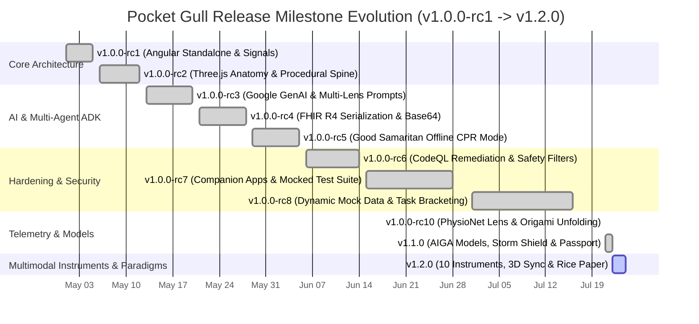
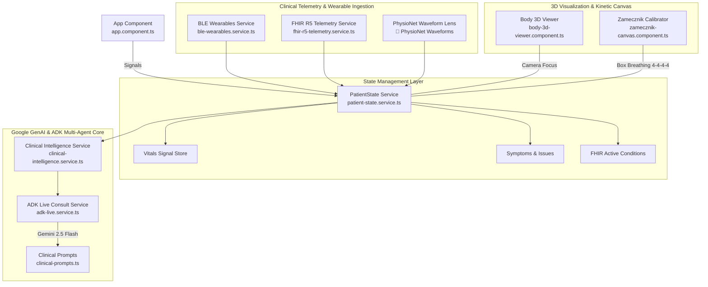

import DocNode from '../components/DocNode.astro';

# Git Roadmap & Clinical Telemetry Matrix

This interactive reference maps Pocket Gull's complete Git release history, component architecture hierarchy, and clinical measurement benchmarks.

---

## Git Release Milestone History (SEMVER Roadmap)

---

## Component Architecture & State Flow

---

## Clinical Measurement & Telemetry Benchmarks

| Measurement Domain | Metric Identifier | Clinical Reference Standard | Normal Range | Unit |
| :--- | :--- | :--- | :--- | :--- |
| **📡 PhysioNet Telemetry** | `qrsDuration` | Electrocardiography (ECG) | `80 – 110` | `ms` |
| **📡 PhysioNet Telemetry** | `qtcFridericia` | Fridericia Corrected QT | `380 – 440` | `ms` |
| **📡 PhysioNet Telemetry** | `stSegmentDev` | ST Elevation / Depression | `-0.05 – +0.05` | `mV` |
| **📡 PhysioNet Telemetry** | `hrvLfHfRatio` | Sympathovagal Balance | `0.8 – 1.5` | `ratio` |
| **🧪 CMP Lab Panel** | `troponinI` | High-Sensitivity Cardiac Troponin | `&lt; 0.04` | `ng/mL` |
| **🧪 CMP Lab Panel** | `eGfr` | Glomerular Filtration Rate | `> 90` | `mL/min/1.73m²` |
| **🧪 CMP Lab Panel** | `altAstRatio` | Hepatic Transaminases | `0.8 – 1.2` | `ratio` |
| **🫁 Somatic Box Breathing** | `boxCycleDuration` | Square Breathing (4-4-4-4) | `16.0` | `seconds` |
| **🚨 Good Samaritan CPR** | `cprCompressionRate` | AHA BLS CPR Metronome | `110 – 120` | `BPM` |
