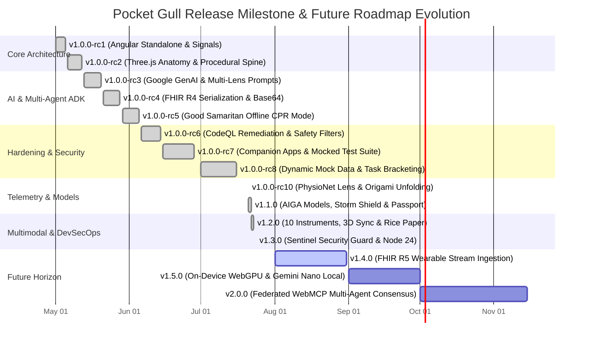
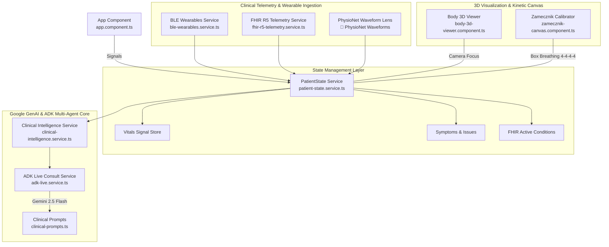

import DocNode from '../components/DocNode.astro';

# Git Roadmap & Software Development Lifecycle (SDLC)

This interactive reference maps Pocket Gull's complete Git release history, DevSecOps SDLC framework, component architecture hierarchy, and future product evolution roadmap.

---

## Git Release Milestone Evolution (SEMVER Roadmap)

```mermaid
gantt
    title Pocket Gull Release Milestone & Future Roadmap Evolution
    dateFormat  YYYY-MM-DD
    axisFormat  %b %d

    section Core Architecture
    v1.0.0-rc1 (Angular Standalone & Signals)       :done, rc1, 2026-05-01, 2026-05-05
    v1.0.0-rc2 (Three.js Anatomy & Procedural Spine):done, rc2, 2026-05-06, 2026-05-12

    section AI & Multi-Agent ADK
    v1.0.0-rc3 (Google GenAI & Multi-Lens Prompts)  :done, rc3, 2026-05-13, 2026-05-20
    v1.0.0-rc4 (FHIR R4 Serialization & Base64)     :done, rc4, 2026-05-21, 2026-05-28
    v1.0.0-rc5 (Good Samaritan Offline CPR Mode)    :done, rc5, 2026-05-29, 2026-06-05

    section Hardening & Security
    v1.0.0-rc6 (CodeQL Remediation & Safety Filters):done, rc6, 2026-06-06, 2026-06-14
    v1.0.0-rc7 (Companion Apps & Mocked Test Suite) :done, rc7, 2026-06-15, 2026-06-28
    v1.0.0-rc8 (Dynamic Mock Data & Task Bracketing):done, rc8, 2026-07-01, 2026-07-16

    section Telemetry & Models
    v1.0.0-rc10 (PhysioNet Lens & Origami Unfolding):done, rc10, 2026-07-21, 2026-07-21
    v1.1.0 (AIGA Models, Storm Shield & Passport)   :done, v11, 2026-07-21, 2026-07-22

    section Multimodal & DevSecOps
    v1.2.0 (10 Instruments, 3D Sync & Rice Paper)   :done, v12, 2026-07-22, 2026-07-23
    v1.3.0 (Sentinel Security Guard & Node 24)      :done, v13, 2026-07-24, 2026-07-24

    section Future Horizon
    v1.4.0 (FHIR R5 Wearable Stream Ingestion)      :active, v14, 2026-08-01, 30d
    v1.5.0 (On-Device WebGPU & Gemini Nano Local)   :v15, 2026-09-01, 30d
    v2.0.0 (Federated WebMCP Multi-Agent Consensus) :v20, 2026-10-01, 45d
```

---

## 🔮 Future Product Roadmap & Architectural Horizons

### 📡 1. v1.4.0 — Real-Time Wearable Ingestion & FHIR R5 Subscriptions
- **Web Bluetooth & Health Connect Sync**: Direct real-time ingestion of optical pulse wave (PPG), heart rate variability (HRV), and continuous SpO₂ streams into `PatientStateService`.
- **FHIR R5 `SubscriptionTopic` Streaming**: Server-sent event (SSE) and WebSocket pub/sub model broadcasting real-time patient status changes to connected clinical monitoring stations.

### 🧠 2. v1.5.0 — On-Device WebGPU & Gemini Nano Local Inference
- **Zero-Latency Offline LLM Fallback**: Full local execution via Chrome `window.ai` (Gemini Nano) and WebLLM for disaster recovery, rural clinics, and extreme privacy-isolated consults.
- **WebGPU Acceleration**: Offloading 3D spatial particle systems and local tensor computations directly to client GPUs (NVIDIA, AMD, Apple Silicon).

### 🌐 3. v2.0.0 — Federated WebMCP Multi-Agent Panel Consensus
- **Model Context Protocol (MCP) Tool Mesh**: Inter-agent multi-specialty panels where specialized agents (Cardiologist, Pharmacologist, TCM Master, Ayurvedic Vaidya) deliberate concurrently.
- **Post-Quantum Cryptography (PQC)**: Kyber/Dilithium AEAD envelopment for end-to-end self-sovereign patient records.

---

## 🔄 Software Development Lifecycle (SDLC) & DevSecOps

Pocket Gull enforces a **Shift-Left DevSecOps SDLC**:

1. **Shift-Left Pre-Commit Validation (`pre-commit-check.cjs`)**:
   - TypeScript strict type checking (`tsc --noEmit`).
   - Vitest automated unit & safety red-teaming execution (`tests/safety.spec.ts`).
   - Markdown image reference validation.
   - Shannon Entropy secret scanner.
   - **Sentinel Security Guard** network egress domain whitelist auditing (`generativelanguage.googleapis.com`, `fhir.org`, `cloudrun.app`).

2. **Automated CI/CD Security Pipeline (`.github/workflows/deploy.yml`)**:
   - Step-Security `harden-runner v2.16.0` with `disable-sudo: true`.
   - CodeQL static analysis for Javascript/Typescript and Python.
   - OpenSSF Scorecard automated security posture scoring.
   - Automated deployment to Google Cloud Run with Google Cloud Secret Manager integration.

---

## Component Architecture & State Flow

```mermaid
graph TD
    UI[App Component<br/>app.component.ts] -->|Signals| State[PatientState Service<br/>patient-state.service.ts]

    subgraph StateManagement [State Management Layer]
        State --> Vitals[Vitals Signal Store]
        State --> Symptoms[Symptoms & Issues]
        State --> Conditions[FHIR Active Conditions]
    end

    subgraph TelemetryLayer [Clinical Telemetry & Wearable Ingestion]
        BLE[BLE Wearables Service<br/>ble-wearables.service.ts] --> State
        FHIR5[FHIR R5 Telemetry Service<br/>fhir-r5-telemetry.service.ts] --> State
        Physio[PhysioNet Waveform Lens<br/>📡 PhysioNet Waveforms] --> State
    end

    subgraph Visual3D [3D Visualization & Kinetic Canvas]
        Body3D[Body 3D Viewer<br/>body-3d-viewer.component.ts] --- |Camera Focus| State
        Zamecznik[Zamecznik Calibrator<br/>zamecznik-canvas.component.ts] --- |Box Breathing 4-4-4-4| State
    end

    subgraph AIEngine [Google GenAI & ADK Multi-Agent Core]
        Intelligence[Clinical Intelligence Service<br/>clinical-intelligence.service.ts]
        ADK[ADK Live Consult Service<br/>adk-live.service.ts]
        Prompts[Clinical Prompts<br/>clinical-prompts.ts]
    end

    State --> Intelligence
    Intelligence --> ADK
    ADK -->|Gemini 2.5 Flash| Prompts
```

---

## Clinical Measurement & Telemetry Benchmarks

| Measurement Domain | Metric Identifier | Clinical Reference Standard | Normal Range | Unit |
| :--- | :--- | :--- | :--- | :--- |
| **📡 PhysioNet Telemetry** | `qrsDuration` | Electrocardiography (ECG) | `80 – 110` | `ms` |
| **📡 PhysioNet Telemetry** | `qtcFridericia` | Fridericia Corrected QT | `380 – 440` | `ms` |
| **📡 PhysioNet Telemetry** | `stSegmentDev` | ST Elevation / Depression | `-0.05 – +0.05` | `mV` |
| **📡 PhysioNet Telemetry** | `hrvLfHfRatio` | Sympathovagal Balance | `0.8 – 1.5` | `ratio` |
| **🧪 CMP Lab Panel** | `troponinI` | High-Sensitivity Cardiac Troponin | `< 0.04` | `ng/mL` |
| **🧪 CMP Lab Panel** | `eGfr` | Glomerular Filtration Rate | `> 90` | `mL/min/1.73m²` |
| **🧪 CMP Lab Panel** | `altAstRatio` | Hepatic Transaminases | `0.8 – 1.2` | `ratio` |
| **🫁 Somatic Box Breathing** | `boxCycleDuration` | Square Breathing (4-4-4-4) | `16.0` | `seconds` |
| **🚨 Good Samaritan CPR** | `cprCompressionRate` | AHA BLS CPR Metronome | `110 – 120` | `BPM` |
