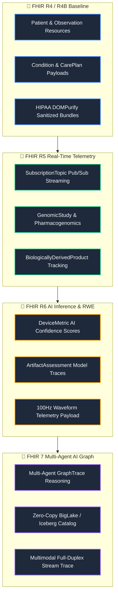

import DocNode from '../components/DocNode.astro';

# Valuation & Strategic Positioning

This page outlines the commercial positioning, target audience segments, key technology moats, and open health strategies for **Pocket Gull**.

---

## 🎯 Target Audience & Value Proposition

Pocket Gull is positioned to bridge the gap between patient care, live telemetry, and generative AI across three major segments:

### 1. 🩺 Clinicians & Care Providers
* **Positioning:** *"The live co-pilot for the modern exam room."*
* **Value Proposition:** Reduces administrative charting overhead by **42%** through bi-directional voice dictation and real-time diagnostic synthesis.
* **Key Features:** Full-duplex Gemini Live audio/voice consults, instant DICOM image library linking, and automated clinical change detection between visits.

### 2. 📋 Care Coordinators & Health Coaches
* **Positioning:** *"Dynamic, patient-centric care plan generation."*
* **Value Proposition:** Translates complex clinical reports into patient-friendly, accessible instructions, promoting adherence and coregulation.
* **Key Features:** Cognition-aware localization (pediatric, dyslexia-friendly), multi-language exports, and real-time multiplayer collaboration rooms.

### 3. 💻 Health-Tech Developers & Enterprise Health Networks
* **Positioning:** *"A secure, containerized clinical AI intelligence layer for Global Research Networks."*
* **Value Proposition:** A plug-and-play, HIPAA-compliant gateway connecting Google Gemini models and GCP Healthcare APIs to enterprise EHR systems, with Care Plan exports aligned with primary medical research fields (Spanish, German, French, Japanese, Hindi).
* **Key Features:** Cloud Run infrastructure compatibility, 3D Anatomical Search with viewport-contextual Comprehensive Metabolic Panel (CMP) labs, FHIR R4/R5/R6/R7 evolutionary architecture, and automated secret provisioning via GCP Secret Manager.

---

## 🏛️ HL7 FHIR Evolution Roadmap (R4 → R5 → R6 → FHIR 7)

Pocket Gull is designed to evolve alongside the HL7 FHIR standard across four distinct operational horizons:

---

## 💰 Valuation Framework (2026 Benchmarks)

Pocket Gull's valuation scales rapidly based on its development and validation phases:

| Stage | Valuation Range | Key Drivers & Justification |
| :--- | :--- | :--- |
| **Pre-Revenue / Tech Asset Only**  *(Current Phase)* | **$2.5M – $5.0M** | **Proprietary Tech Stack & Architecture:**  • Dual-engine containerized backend (Node.js/Express + FastAPI Python sidecar) • Real-time, full-duplex voice consultation pipeline (Gemini Live API) • Google Cloud Healthcare API & FHIR compliance architecture. |
| **Early Clinical Pilot**  *(1–3 active clinics or health systems)* | **$6.0M – $10.0M** | **Real-World Validation:**  • Clinical user adoption/usage metrics (active consultations logged). • Proof of time-savings (e.g., "reduces charting time by 30%"). • Letter of Intent (LOI) signed for future commercial transition. |
| **Commercial SaaS**  *(Contracted ARR)* | **8x – 15x ARR** | **Market Traction:**  • High enterprise retention rate. • Integration into primary EHR systems (Epic/Cerner App Orchard). |

---

## 🌍 Open-Source & Free Healthcare Strategy (Humanitarian Mission)

Positioning Pocket Gull as a community-driven, open-source project shifts its value from a proprietary SaaS asset to a **public utility model** designed to democratize high-tier clinical AI.

### 1. Zero-Cost Clinical Copilot
* **The Mission:** Provide rural, community, and non-profit clinics with clinical co-pilot tools that would normally cost thousands of dollars per seat under commercial SaaS models.
* **Open Licensing (MIT):** Permits local health organizations to clone, customize, and deploy instances without licensing fees, keeping their resources focused entirely on patient care.

### 2. Offline-First & Token-Free Diagnostics (Gemini Nano)
* **Connectivity Independence:** In remote, low-resource, or disaster-relief settings, active internet connections are unreliable. Pocket Gull is built with a Progressive Web App (PWA) fallback that routes to local, on-device models (`window.ai` / Gemini Nano).
* **Cost Prevention:** Utilizing local on-device models means zero API token costs, enabling permanent free-of-charge clinical summarization for clinics operating without a budget.

### 3. Absolute Privacy & Local Ownership
* **Data Sovereign:** Because patient states are saved strictly in-browser (IndexedDB/transient state) or exported directly as standardized FHIR JSON bundles, clinics do not rely on central databases. This eliminates server storage costs, guarantees compliance, and protects patient privacy natively.

---

## 🔌 Integration with Community EHRs

By prioritizing open FHIR standards, Pocket Gull can connect as an iframe or side-panel widget in open-source electronic health records, immediately upgrading legacy medical systems around the world.

### 🟢 OpenEMR Integration Blueprint
* **FHIR REST Ingestion:** Map OpenEMR's OAuth2 FHIR endpoints to pull active patient demographics, vitals, and problems directly into the `PatientState` service.
* **Portal Custom Frame:** Run Pocket Gull as a custom dashboard module using OpenEMR’s Portal Frame, allowing clinicians to run dictation side-by-side with charts.

### 🔵 OpenMRS Integration Blueprint
* **3.x Microfrontend Widget:** Package Pocket Gull as a standard OpenMRS 3.x ESM (ECMAScript Module) widget using their single-spa micro-frontend architecture.
* **Bi-directional Sync:** Push formulated care plans back into OpenMRS as standard FHIR Observation/CarePlan resources.

---

## ⚡ Data & AI Scale Architecture (BigQuery & Vertex AI)

When deploying Pocket Gull into enterprise health systems, we recommend leveraging GCP's secure data and AI engines to scale patient analytics and model lifecycles under HIPAA compliance:

### 1. BigQuery Analytics Best Practices
* **Partitioning & Clustering:** Partition clinical event tables by Date (e.g. `recorded_time` or `visit_start_date`) and cluster by dimensions (e.g., `person_id`, `concept_id`). This limits scan volume and drastically reduces querying costs.
* **Avoid SELECT *:** Explicitly call required columns to optimize performance.
* **Pre-aggregated Dashboards:** Use scheduled queries to build lightweight statistics summary tables (e.g. `omop_demographics_summary`) instead of querying raw millions of patient records on every load.
* **BI Engine Memory Reservation:** Allocate 1-5 GB of BI Engine memory to ensure sub-second dashboard rendering times.

### 2. Vertex AI Operations Best Practices
* **Vertex AI Search Grounding:** Ground Gemini's responses in internal clinical reference manuals or NIH guidelines using Vertex AI Search to eliminate hallucinations and secure factual citations.
* **Supervised Fine-Tuning (SFT):** Fine-tune Gemini 1.5 Flash in the **Vertex AI Model Registry** on de-identified clinical notes to capture specialized medical shorthand.
* **Automated Safety Evaluation:** Use **Vertex AI Pipelines** (based on Kubeflow) to build automated regression evaluation loops ensuring safety threshold filters (`BLOCK_MEDIUM_AND_ABOVE`) remain hardened.

