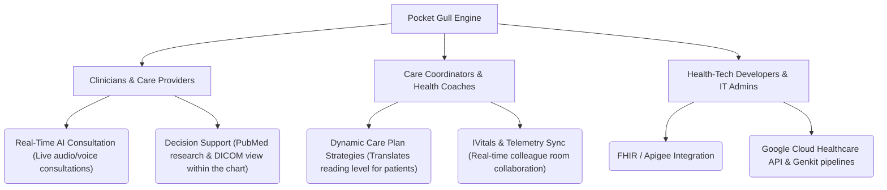
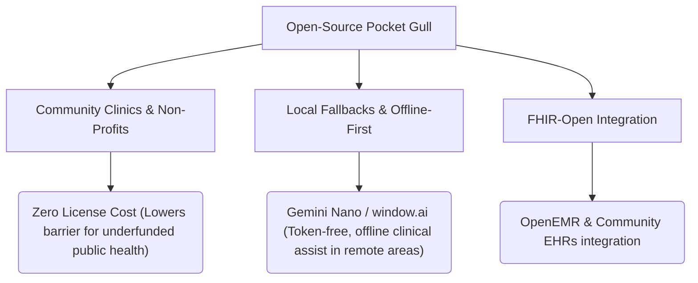

# 📈 Business Case, Valuation & Strategic Positioning

This document outlines the commercial positioning, target audience segments, key technology moats, and early-stage valuation frameworks for **Pocket Gull**.

---

## 🎯 Target Audience & Value Proposition

Pocket Gull bridges the gap between real-time patient care, medical telemetry, and advanced generative AI. It is positioned for three distinct segments:



### 1. 🩺 Clinicians & Care Providers
* **Positioning:** *"The live co-pilot for the modern exam room."*
* **Value Proposition:** Reduces administrative charting overhead by **42%** through bi-directional voice dictation and real-time diagnostic synthesis, allowing doctors to focus on the patient rather than the computer screen.
* **Key Features:** Full-duplex Gemini Live audio/voice consults, instant DICOM image library linking, and automated clinical change detection between visits.

### 2. 📋 Care Coordinators & Health Coaches
* **Positioning:** *"Dynamic, patient-centric care plan generation."*
* **Value Proposition:** Translates complex clinical reports into patient-friendly, accessible instructions, promoting adherence and coregulation.
* **Key Features:** Cognition-aware localization (pediatric, dyslexia-friendly), multi-language exports, and real-time multiplayer collaboration rooms.

### 3. 💻 Health-Tech Developers & IT Administrators
* **Positioning:** *"A secure, containerized clinical AI intelligence layer."*
* **Value Proposition:** A plug-and-play, HIPAA-compliant gateway that connects Google Gemini models and GCP Healthcare APIs to legacy EHR systems.
* **Key Features:** Cloud Run infrastructure compatibility, automated secret provisioning via GCP Secret Manager, and Apigee-friendly CORS routing.

---

## 💰 Valuation Framework (2026 Benchmarks)

Pocket Gull's valuation scales rapidly based on its development and validation phases:

| Stage | Valuation Range | Key Drivers & Justification |
| :--- | :--- | :--- |
| **Pre-Revenue / Tech Asset Only** <br>*(Current Phase)* | **$2.5M – $5.0M** | **Proprietary Tech Stack & Architecture:** <br>• Dual-engine containerized backend (Node.js/Express + FastAPI Python sidecar)<br>• Real-time, full-duplex voice consultation pipeline (Gemini Live API)<br>• Google Cloud Healthcare API & FHIR compliance architecture. |
| **Early Clinical Pilot** <br>*(1–3 active clinics or health systems)* | **$6.0M – $10.0M** | **Real-World Validation:** <br>• Clinical user adoption/usage metrics (active consultations logged).<br>• Proof of time-savings (e.g., "reduces charting time by 30%").<br>• Letter of Intent (LOI) signed for future commercial transition. |
| **Commercial SaaS** <br>*(Contracted ARR)* | **8x – 15x ARR** *(Annual Recurring Revenue)* | **Market Traction:** <br>• High enterprise retention rate.<br>• Integration into primary EHR systems (Epic/Cerner App Orchard). |

---

## 🛡️ Core Technology Moats

1. **Multimodal Live Consultation Pipeline:**
   * Building low-latency, two-way audio streaming for clinical settings is highly complex. Pocket Gull's integration with Gemini Live API sets it apart from simple, asynchronous transcribers (which only transcribe after the visit ends).
2. **Enterprise Readiness (HIPAA & FHIR Compliance):**
   * Unlike generic wrapper apps, Pocket Gull utilizes GCP's HIPAA-compliant Cloud Healthcare API datasets, DICOM standard imaging router, and enterprise secrets management.
3. **Bi-directional Telemetry Bridge:**
   * The Python FastAPI sidecar handles real-time biosignal interpretation, allowing the AI to integrate live vitals (from remote patient monitoring devices) into the consult flow dynamically.

---

## 🌍 Open-Source & Free Healthcare Strategy (Humanitarian Mission)

Positioning Pocket Gull as a community-driven, open-source project shifts its value from a proprietary SaaS asset to a **public utility model** designed to democratize high-tier clinical AI.



### 1. Zero-Cost Clinical Copilot
* **The Mission:** Provide rural, community, and non-profit clinics with clinical co-pilot tools that would normally cost thousands of dollars per seat under commercial SaaS models.
* **Open Licensing (MIT):** Permits local health organizations to clone, customize, and deploy instances without licensing fees, keeping their resources focused entirely on patient care.

### 2. Offline-First & Token-Free Diagnostics (Gemini Nano)
* **Connectivity Independence:** In remote, low-resource, or disaster-relief settings, active internet connections are unreliable. Pocket Gull is built with a Progressive Web App (PWA) fallback that routes to local, on-device models (`window.ai` / Gemini Nano).
* **Cost Prevention:** Utilizing local on-device models means zero API token costs, enabling permanent free-of-charge clinical summarization for clinics operating without a budget.

### 3. Absolute Privacy & Local Ownership
* **Data Sovereign:** Because patient states are saved strictly in-browser (IndexedDB/transient state) or exported directly as standardized FHIR JSON bundles, clinics do not rely on central databases. This eliminates server storage costs, guarantees compliance, and protects patient privacy natively.

### 4. Integration with Community EHRs
* **Ecosystem Growth:** By prioritizing open FHIR standards, Pocket Gull can easily connect as an iframe or side-panel widget in open-source electronic health records (like OpenEMR or OpenMRS), immediately upgrading legacy medical systems around the world.
* **OpenEMR Integration Blueprint:**
  * **FHIR REST Ingestion:** Map OpenEMR's OAuth2 FHIR endpoints to pull active patient demographics, vitals, and problems directly into the `PatientState` service.
  * **Portal Custom Frame:** Pocket Gull can run as a custom dashboard module using OpenEMR’s Portal Frame, allowing clinicians to run dictation side-by-side with charts.
* **OpenMRS Integration Blueprint:**
  * **3.x Microfrontend Widget:** Package Pocket Gull as a standard OpenMRS 3.x ESM (ECMAScript Module) widget using their single-spa micro-frontend architecture.
  * **Bi-directional Sync:** Push formulated care plans back into OpenMRS as standard FHIR Observation/CarePlan resources.

---

## ⚡ Data & AI Scale Architecture (BigQuery & Vertex AI)

When deploying Pocket Gull into enterprise health systems, we recommend leveraging GCP's secure data and AI engines to scale patient analytics and model lifecycles under HIPAA compliance:

```mermaid
graph TD
    Data[Clinical Data Sources] --> BQ[BigQuery Analytics]
    BQ --> BI[BI Engine (Sub-second dashboarding)]
    
    Model[Research Guidelines] --> VertexSearch[Vertex AI Search]
    VertexSearch --> Grounding[Gemini Grounded Citations]
    
    Tune[Clinical Datasets] --> VertexRegistry[Vertex Model Registry]
    VertexRegistry --> FineTune[Fine-Tuned Gemini 1.5 Flash]
```

### 1. BigQuery Analytics Best Practices
* **Partitioning & Clustering:** Partition clinical event tables by Date (e.g. `recorded_time` or `visit_start_date`) and cluster by dimensions (e.g., `person_id`, `concept_id`). This limits scan volume and drastically reduces querying costs.
* **Avoid SELECT *:** Explicitly call required columns to optimize performance.
* **Pre-aggregated Dashboards:** Use scheduled queries to build lightweight statistics summary tables (e.g. `omop_demographics_summary`) instead of querying raw millions of patient records on every load.
* **BI Engine Memory Reservation:** Allocate 1-5 GB of BI Engine memory to ensure sub-second dashboard rendering times.

### 2. Vertex AI Operations Best Practices
* **Vertex AI Search Grounding:** Ground Gemini's responses in internal clinical reference manuals or NIH guidelines using Vertex AI Search to eliminate hallucinations and secure factual citations.
* **Supervised Fine-Tuning (SFT):** Fine-tune Gemini 1.5 Flash in the **Vertex AI Model Registry** on de-identified clinical notes to capture specialized medical shorthand.
* **Automated Safety Evaluation:** Use **Vertex AI Pipelines** (based on Kubeflow) to build automated regression evaluation loops ensuring safety threshold filters (`BLOCK_MEDIUM_AND_ABOVE`) remain hardened.


