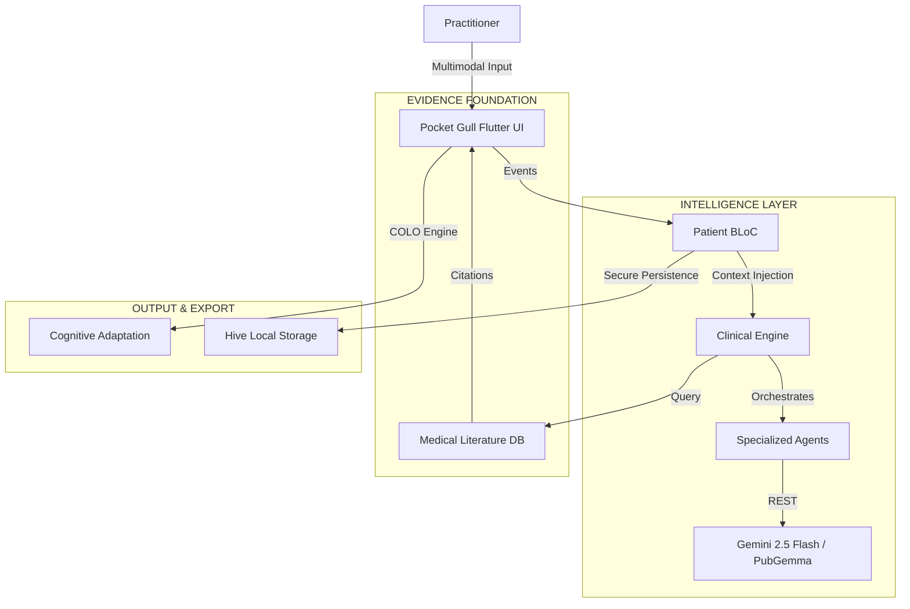

# 🕊️ POCKET GULL (Flutter Edition)
**Aerial Perspective for the Clinical Ocean**

---

### PREPARED FOR
**Google Gemini Live Agent Challenge** / 2026

### CATEGORY
**Live Agents 🗣️** (Multimodal Synthesis & Agent Orchestration)

### VISION
*"To provide practitioners with the 'Gull's Eye View'—the ability to rise above the turbulent sea of medical data and see the clear, actionable patterns beneath."*

---

## 📋 THE STORY OF THE SEAGULL

In modern medicine, practitioners are often drowning in a "Sea of Information"—fragmented vitals, sprawling patient histories, and an ever-shifting tide of clinical literature. **Pocket Gull** was conceived as an aerial navigator. 

Like its namesake, the agent is **agile**, **interruptible**, and **highly observant**. It doesn't just process data; it provides **Uplift**. By synthesizing multimodal inputs (3D spatial data, voice dictation, and biometric telemetry) into a singular, high-integrity strategy, it allows the clinician to maintain perspective without losing sight of the patient.

> **Industrial Grace:** We believe medical tools should be as beautiful as they are functional. Our design language combines the clinical precision of a laboratory with the "Less, but better" philosophy of Dieter Rams.


---

## 🛠️ SCIENTIFIC RIGOR & CORE CAPABILITIES

#### 🧠 EVIDENCE-GROUNDED REASONING (EGR)
Pocket Gull eliminates "Black Box" AI anxiety. Every recommendation is anchored by an **Evidence Trail** generated through real-time integration with local PubGemma and Gemini models. The agent doesn't just suggest; it cites.

#### 🎙️ MULTIMODAL SYNTHESIS & CONTEXTUAL ORCHESTRATION
Powered by Native Flutter Speech-to-Text and contextual pop-out dictation windows. Specialized experts operate in a "Patient BLoC" environment, maintaining **context-aware memory** of report nodes, allowing for fluid, multi-turn reasoning across voice and visual UI.

#### 📐 PRECISION 3D ANATOMICAL MODELING (DRILL-DOWN)
Using `flutter_3d_controller`, we provide a procedurally detailed skeletal and surface model. The new **2D coordinate-based hit detection** allows for micro-level anatomical drill-downs. Severity is visualized through dynamic mesh layers (Orthomolecular, Muscular, Vascular), translating abstract pain descriptions into **spatial clinical data**.

#### 📄 COGNITIVE LOCALIZATION (COLO)
Moving beyond simple translation, the **COLO Engine** adjusts the "Clinical Strategy" to the patient's cognitive state (Standard, Dyslexia-Friendly, Pediatric) without losing clinical accuracy, ensuring **Informed Consent** is truly inclusive.

---

## 🧩 TECHNICAL ARCHITECTURE & FEATURES

**What it does:**
Pocket Gull is a next-generation "Live Agent" orchestrator. By combining real-time human-in-the-loop web speech interaction with a diagnostic 3D surface model and deep reasoning (`gemini-2.5-flash` natively or local PubGemma), it processes a patient's multimodal symptom data to instantly produce synthesized, actionable clinical strategies.

**Core Features (Flutter Migration):**
- **Secure Authentication Gateway:** A secure Splash Screen gateway requiring Biometric (FaceID/Fingerprint) or PIN code unlock, along with secure configuration of API keys and AI models.
- **Triage Dashboard (Macro Drill-Down):** A grid view of all active patients with global 'CLINICAL MESH LAYER' toggles to instantly survey hotspots across the ward.
- **Precise 3D Body Mapping (Micro Drill-Down):** Advanced hit detection on the `NativeBodyViewer` filters clinical intake notes dynamically based on the exact limb or region tapped.
- **Contextual Pop-Out Voice Dictation:** Floating, absolute-positioned voice dictation UI that tracks with the user's cursor for frictionless charting.
- **Patient Management & Local Persistence:** Full CRUD capabilities managed securely via `Hive` NoSQL local storage, ensuring zero PII leakage.
- **Care Plan Recommendation Engine:** Synthesizes structured strategies for patient care, organized by diagnostic lenses (Overview, Interventions, Monitoring, Education).

**Technologies Used:**
- **Framework:** Flutter & Dart
- **State Management:** `flutter_bloc`
- **Visualization:** `flutter_3d_controller`
- **Local Database:** `Hive` NoSQL
- **Intelligence:** Google GenAI SDK (`gemini-2.5-flash`) & PubGemma

---

## 📚 Documentation

Full engineering documentation is available in the [`docs/study/`](./study/) directory.

- **[Overview](./study/src/pages/index.mdx)** — Product introduction, screenshots, and key metrics
- **[Architecture](./study/src/pages/architecture.mdx)** — System diagram, data flow, and technology stack
- **[Features](./study/src/pages/features.mdx)** — Complete feature reference by category
- **[Data & Privacy](./study/src/pages/data.mdx)** — Storage model, PHI handling, and FHIR portability
- **[Responsible AI](./study/src/pages/responsible-ai.mdx)** — Core principles and societal impact
- **[Getting Started](./study/src/pages/getting-started.mdx)** — Installation, development, and deployment
- **[Case Study](../case_study.md)** — Professional engineering case study with benchmark results

---

## 👨💻 Public Code Repository & Spin-Up Instructions

**Developer Profile:** [g.dev/philgear](https://g.dev/philgear)  

To run this project in a local development environment:

1.  **Navigate to flutter app:**
    ```bash
    cd pocketgull_flutter
    ```

2.  **Fetch dependencies:**
    ```bash
    flutter pub get
    ```

3.  **Run the development server:**
    ```bash
    flutter run -d chrome
    ```

---

## 🏗️ Architecture Diagram

Built with a **BLoC Pattern** architecture in Flutter for high performance and deterministic state management.



---

## 📜 RESPONSIBLE AI & ETHICS

Pocket Gull adheres to the **Human-in-the-Loop** (HITL) principle. 
- **Task Bracketing:** Clinicians must manually "bracket" (validate/edit) AI suggestions before they are archived.
- **Explainability:** The agent surfaces its reasoning lens (Intervention, Monitoring, Education) for every output.
- **Privacy Core:** Zero PII persistence to remote databases. All patient state is transient or locally-stored via Hive.

---

## 👨💻 THE CRAFT
**Phil Gear** / [g.dev/philgear](https://g.dev/philgear)  
Engineering with **Kaizen**—the belief that clinical excellence is a journey of continuous refinement.

*© 2026 Pocket Gull. Industrial Grace & Clinical Intelligence.*
